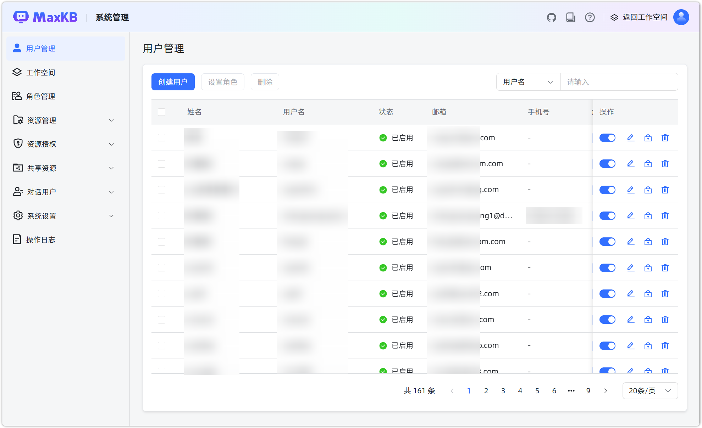
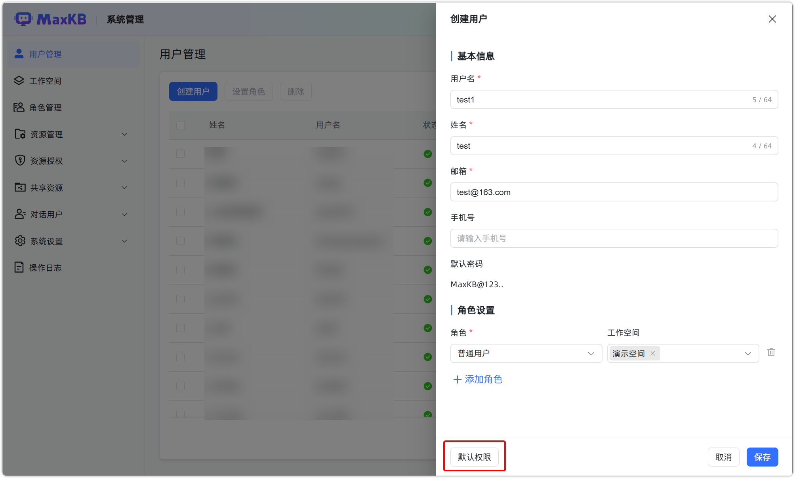
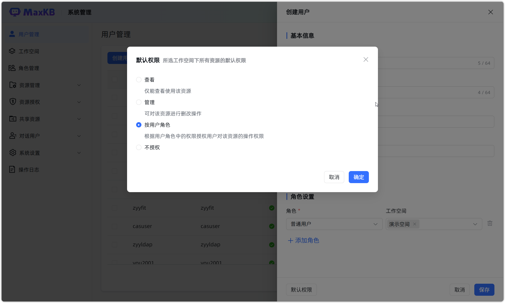
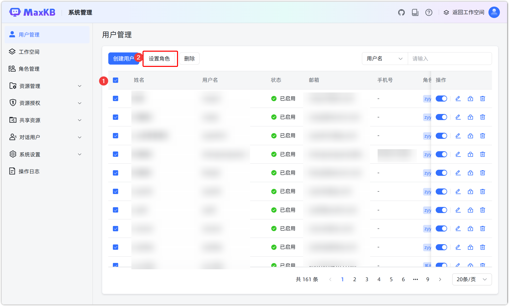
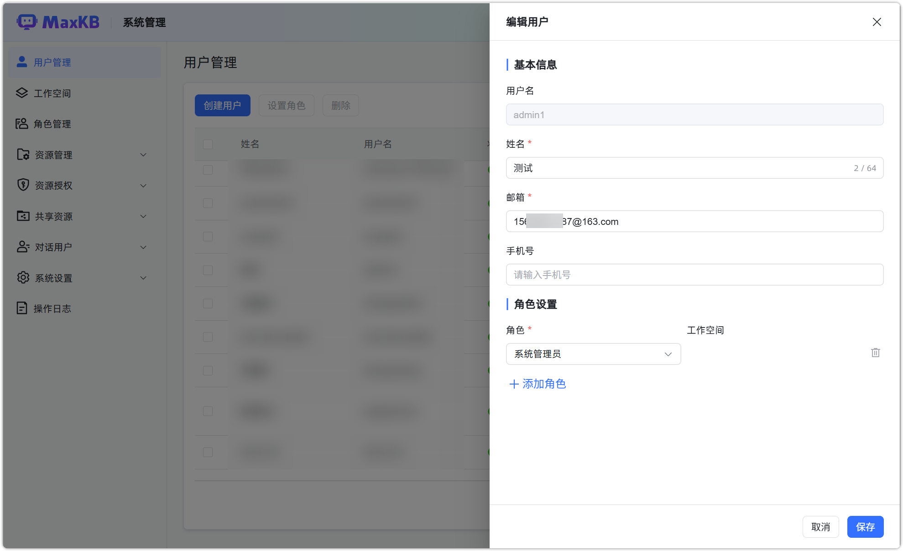
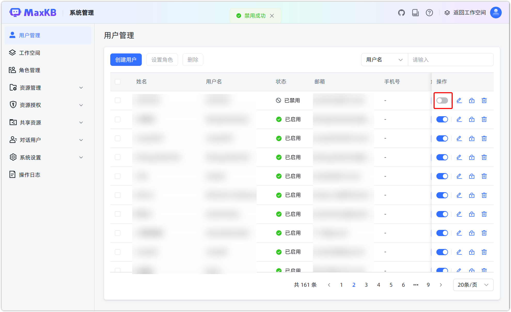
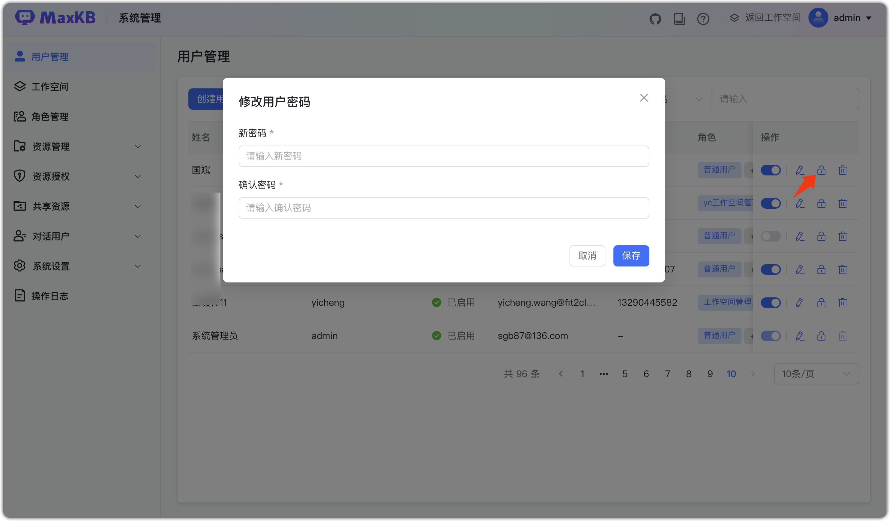
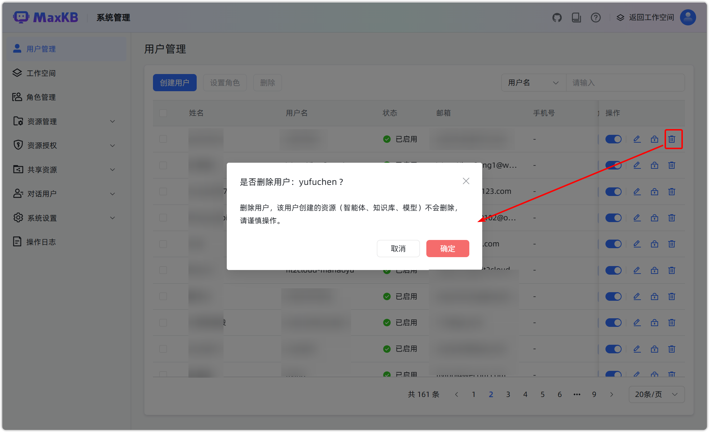
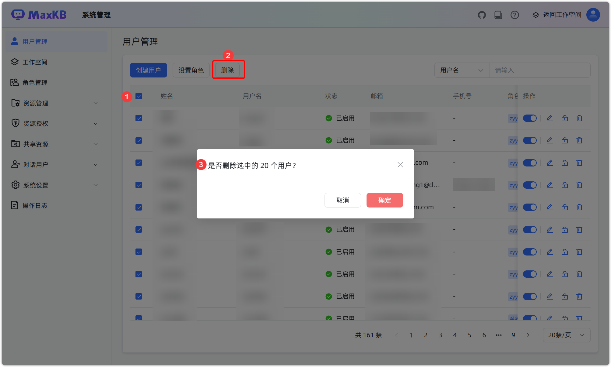
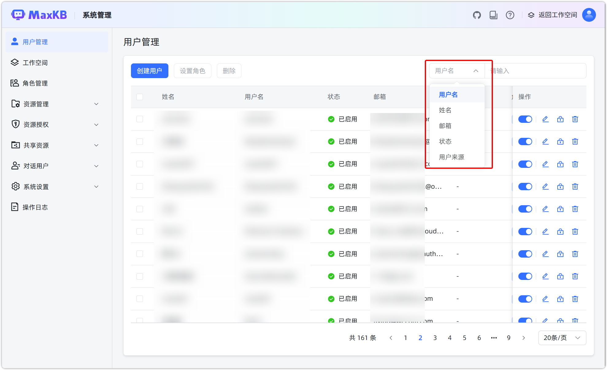

# 用户管理

## 1 用户列表

!!! Abstract ""
    支持多用户体系，系统管理员可以创建及管理用户。

## 2 创建用户

!!! Abstract ""
    支持系统管理员创建用户：

    - 用户名：用户账号信息，不支持修改；
    - 姓名：用户姓名；
    - 邮箱：用户邮箱；
    - 手机号：用户手机号；
    - 默认密码：默认为`MaxKB@123..` ；
    - 角色设置：
        - 用户可以设置多个角色，至少设置 1 个角色；
        - 选择普通用户和工作空间角色时需要设置工作空间；
        - 选择系统管理员角色无工作空间选项。

!!! Abstract ""
    当创建用户为普通用户或继承普通用户的角色时，支持设置默认权限，即对所选工作空间下所有资源的默认权限进行设置。

## 3 设置角色

!!! Abstract ""
    勾选用户，点击【设置角色】，可批量给用户设置角色。

## 4 编辑用户

!!! Abstract ""
    用户名不可以编辑，其他属性均可以编辑。

!!! Abstract ""
    用户状态已禁用，则用户无法登录 MaxKB。

## 5 重置密码

!!! Abstract ""
    系统管理员可以给每个用户修改密码，在用户列表中，点击【修改密码】，弹出修改密码对话框，保存后修改成功。

## 6 删除用户

!!! Abstract ""
    在用户列表中，单独点击【删除】按钮，弹出提示框，确认后仅删除当前用户，不影响其创建的工作空间资源。  
    **注意**：系统内置 admin 用户不能被删除。

!!! Abstract ""
    勾选用户，点击【删除】按钮，弹出提示框，确认可批量删除用户，不影响其创建的工作空间资源。

## 7 查询用户

!!! Abstract ""
    支持通过用户名、姓名、邮箱、状态以及用户来源进行用户搜索。

