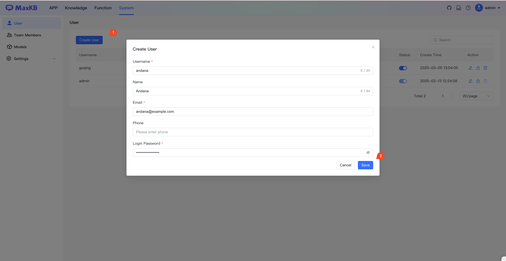

# User Management

!!! Abstract ""
    The administrator can manage users' basic information, including user's name, email, password, enable/disable status, etc.

!!! Abstract ""
    Click the Create button, In the popup dialog, enter the basic information for the new user, such as username (login name, cannot be modified), name, phone number, email, password, etc. After entering the information, click the Save button.

!!! Abstract ""
    When third-party users such as LDAP users log in, the system will automatically create a user with user type LDAP, and the user can login using normal login methods.

    **Note: If a user is deleted, all resources created by that user will be deleted along with the user.**

