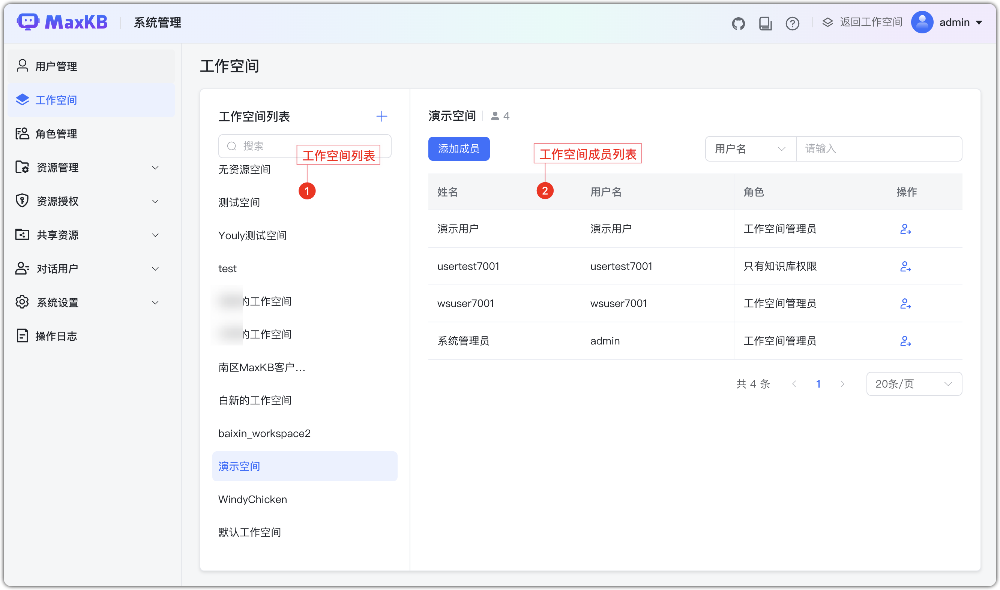
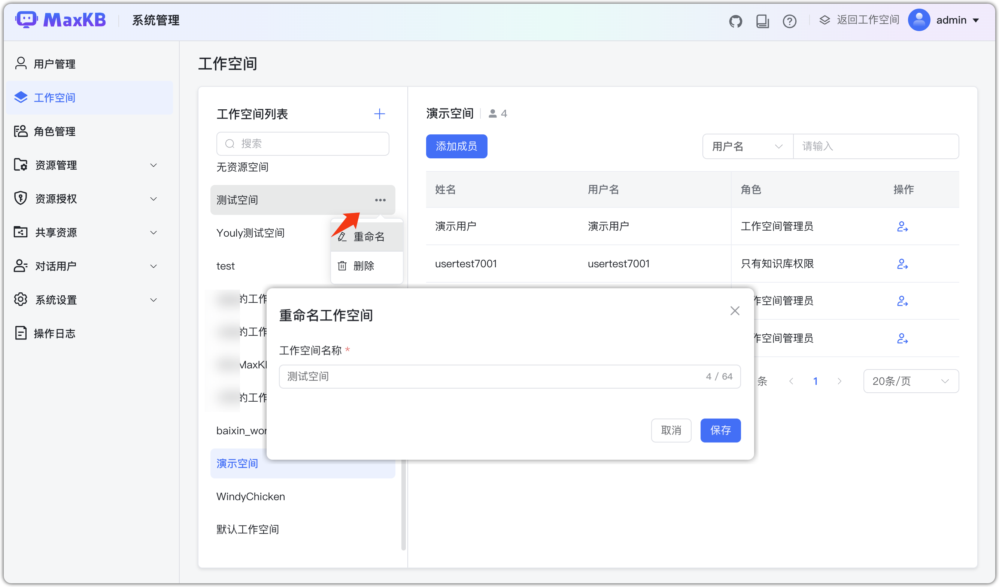
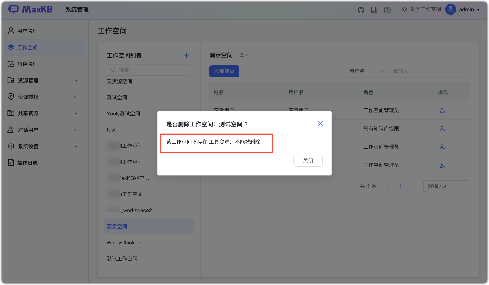
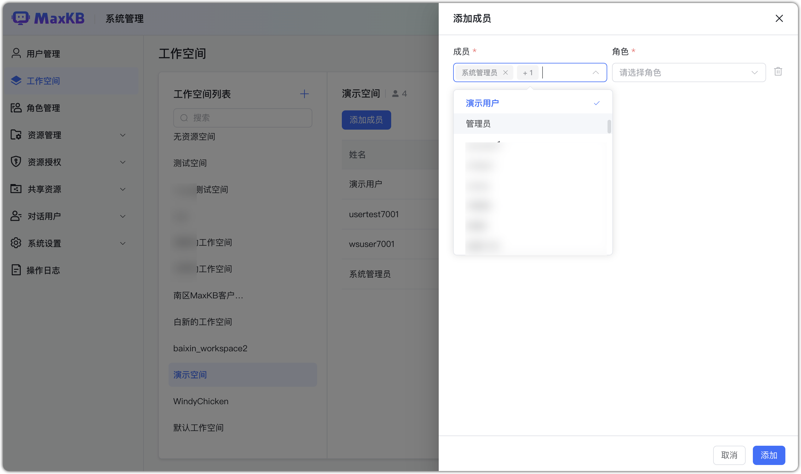
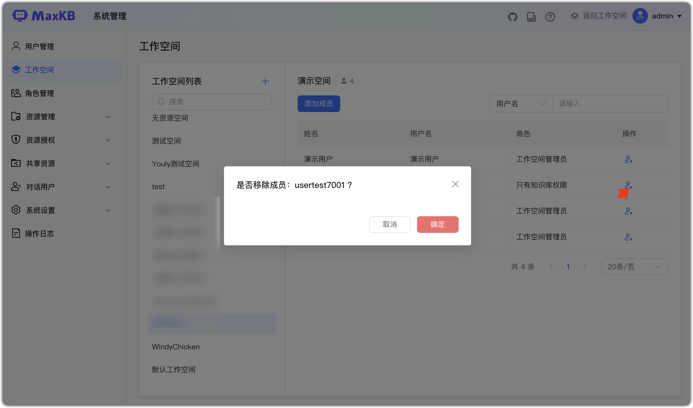

# 工作空间

!!! Abstract ""
    工作空间是 MaxKB 的组织单元，用于将相关的人员、资源、角色等进行集中管理。
    
    - 工作空间之间相互隔离；公共资源可通过共享资源进行分享。
    - 企业版创建工作空间没有数量限制。

## 1 空间管理

!!! Abstract ""
    创建工作空间：打开创建工作空间对话框，填写工作空间名称（必填，1-64 个字符，名称唯一，不能重复）。

!!! Abstract ""
    重命名工作空间：选择目标工作空间，点击【重命名】进行修改。

!!! Abstract ""
    删除工作空间：选择目标工作空间，点击【删除】。 

    - 工作空间下有资源（知识库、应用、工具、模型）时，不允许被删除；无资源时允许被删除。
    - 系统内置的默认工作空间不能删除，可以进行重命名。

## 2 成员管理

!!! Abstract ""
    添加成员时需要选择角色，支持同时添加多个成员和多个角色。

    - 系统管理员支持为所有工作空间添加成员，工作空间管理员仅显示当前用户作为工作空间管理员角色的工作空间。
    - 工作空间管理员的角色列表仅显示普通用户角色和继承普通用户角色的自定义角色。

!!! Abstract ""
    移除成员点击【移除】后，移除成员的当前角色。

