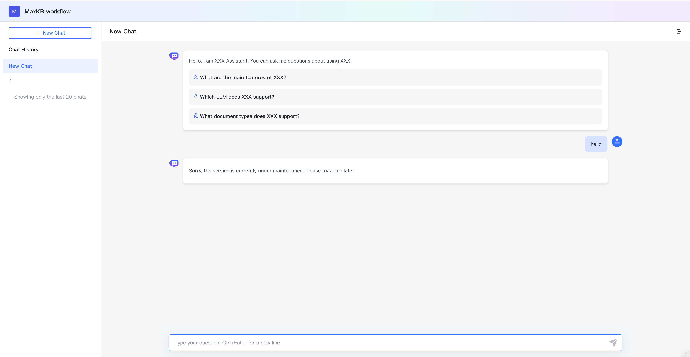

# 应用概览

!!! Abstract ""
    在应用列表页面，点击应用的面板，进入到应用概览页面。     
    在概览页面可以进行演示、启用/禁用/重新生成公开访问链接、嵌入第三方、访问限制设置和 API Key 管理操作。

## 1 公开访问链接

!!! Abstract ""
    用户点击演示或复制公开访问链接至浏览器进入问答页面。

!!! Abstract ""
    公开访问链接支持开关设置和重新生成。  
    关闭/重新生成公开访问链接时，提示：抱歉，当前正在维护，无法提供服务，请稍后再试！

## 2 嵌入第三方

!!! Abstract ""
    MaxKB 应用支持零编码嵌入到企业的第三方系统。     
    当应用设置完成后，在应用概览页面，点击【嵌入第三方】，用户可以复制全屏模式代码或浮窗模式代码嵌入到第三方系统中，嵌入完成后便可在第三方系统中进行用户问答。

## 3 访问限制

!!! Abstract ""
    MaxKB 支持对应用设置每个客户端提问次数限制和嵌入第三方白名单防盗链设置，并且支持设置用户端是否显示知识来源。

## 4 API 访问凭据

!!! Abstract ""
    二开时调用当前应用的 API 文档和 API Key 管理，复制凭证地址可以打开 API 文档，点击 【API Key 】，打开 API Key 的管理对话框。    
    支持创建、启用/禁用、删除 API Key。

## 5 监控统计

!!! Abstract ""
    为了让管理者更加了解应用的使用情况，系统支持统计应用的用户数、提问数、Tokens数和用户满意度。
