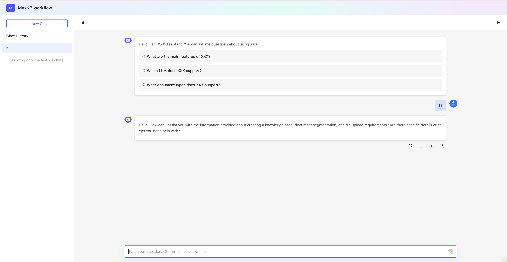

# Application Overview

!!! Abstract ""
    On the application list page, click an application panel to enter the application overview page.     
    On the overview page, you can enable/disable/regenerate public access links, demo the application, embed in third-party systems, set access restrictions and manage API Keys.

## 1 Public Access Link

!!! Abstract ""
    Click Demo or copy the public access link to a browser to enter the Q&A page.

!!! Abstract ""
    Public access links support toggling and regeneration.  
    For active public links, if you disable the current public link or regenerate a new public access link, visitors will see the message: Sorry, the service is currently under maintenance and unavailable. Please try again later!

## 2 Third-party Embedding

!!! Abstract ""
    MaxKB applications support zero-code embedding into third-party web system.     
    On the application overview page, click Embed in website to copy either fullscreen mode code or floating mode code for embedding into third-party web system. Once embedded, you can interact with MaxKB within the third-party system.

## 3 Access Control

!!! Abstract ""
    MaxKB supports setting question limits per client and embedding whitelist hotlink protection for applications, as well as configuring whether to display knowledge sources to end users.

## 4 API Access Credentials

!!! Abstract ""
    If external systems need to interact with MaxKB through API calls, you'll need to check the API documentation and the application's API Key. Click API Key button to open the API Key management dialog, where you can create, enable/disable, and delete API Keys.

