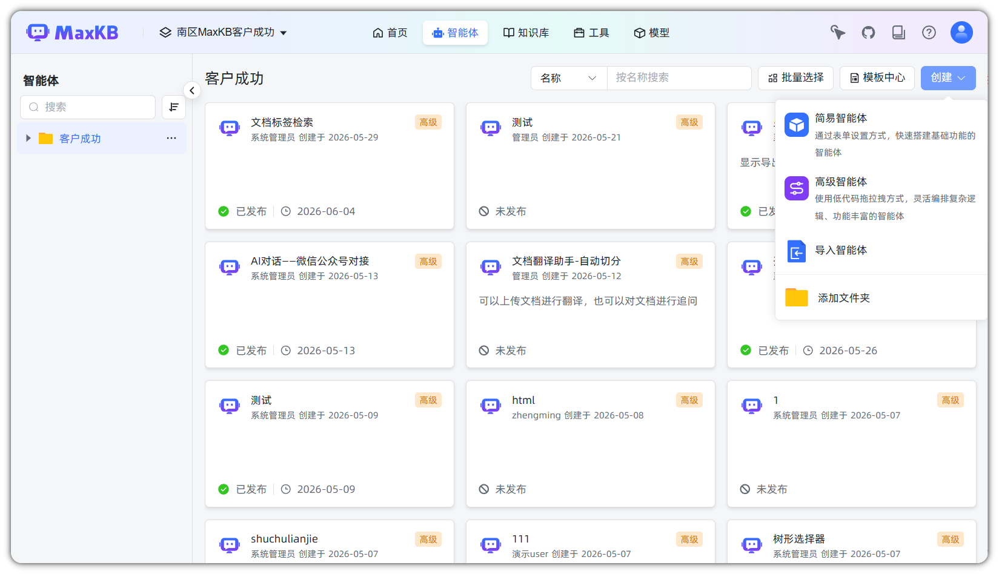
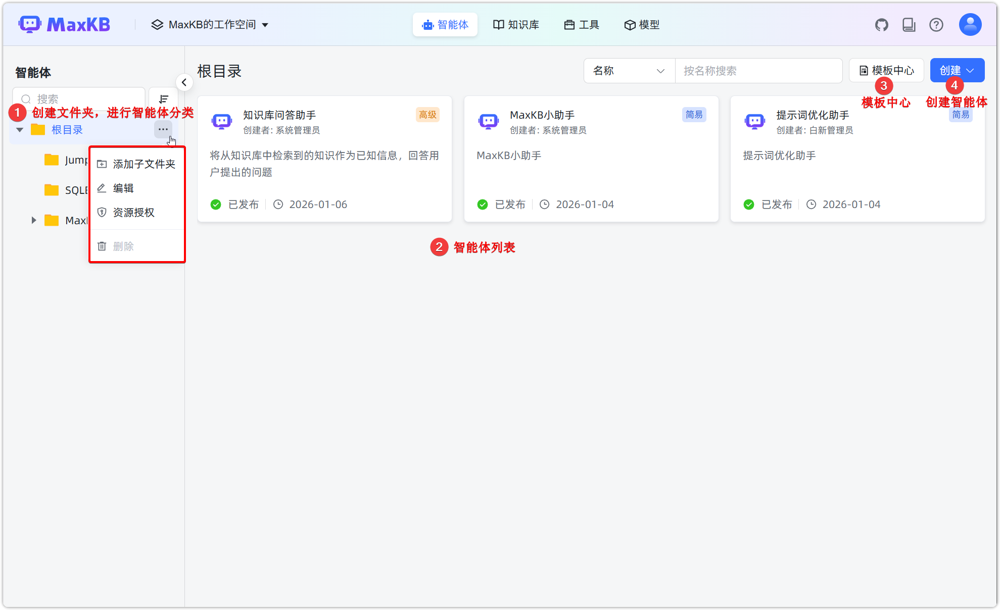
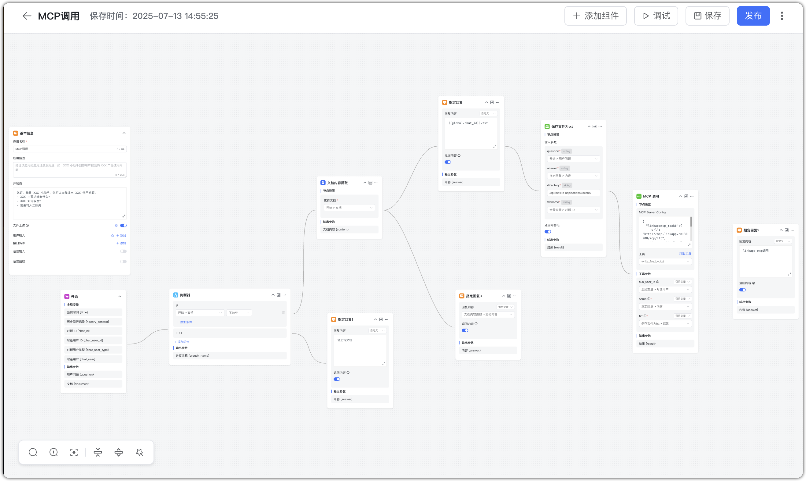

# 应用概述

## 1 功能概述

!!! Abstract ""
    MaxKB 提供预配置模板和组件，可快速创建基础问答应用，或对复杂业务流程进行高级编排，打造专属 AI 助手。

!!! Abstract ""
    
    - 文件夹树形目录展示，点击文件夹即可逐层进入子目录。顶部搜索框支持按名称实时过滤文件夹。
    - 状态功能：应用显示【未发布】或【已发布】状态（首次创建应用是保存未发布，即为未发布状态），以及发布时间。

    
    

## 2 应用类型

!!! Abstract ""

    简单配置：提供了较为基础的功能和设置选项，基本功能完备满足大多数基本的问答需求，适用于需要快速上线智能体应用。

    高级编排：支持用户创建符合业务逻辑的工作流，包括但不限于使用判断器、问题优化、函数库、内置标签等功能，满足用户问题分类、敏感词检索等各类需求，适用于需要复杂逻辑和自定义工作流的场景。

## 3 应用设置

!!! Abstract ""
    应用创建完成，进入到应用页面，查看应用概览以及进行相关设置、对接。

!!! Abstract ""
    **注意**：应用接入以及对话用户为 X-Pack 功能。

!!! Abstract ""
    应用支持导出操作，导出后文件名称为：应用名称.mk。
    对于高级编排类型的应用，导出内容为包括工作流中所有节点的参数设置以及函数内容，流程节点中所选择的知识库和模型信息不导出。

!!! Abstract ""
    在应用页面，点击【导入应用】，即可导入应用文件（文件后缀为.mk）。

