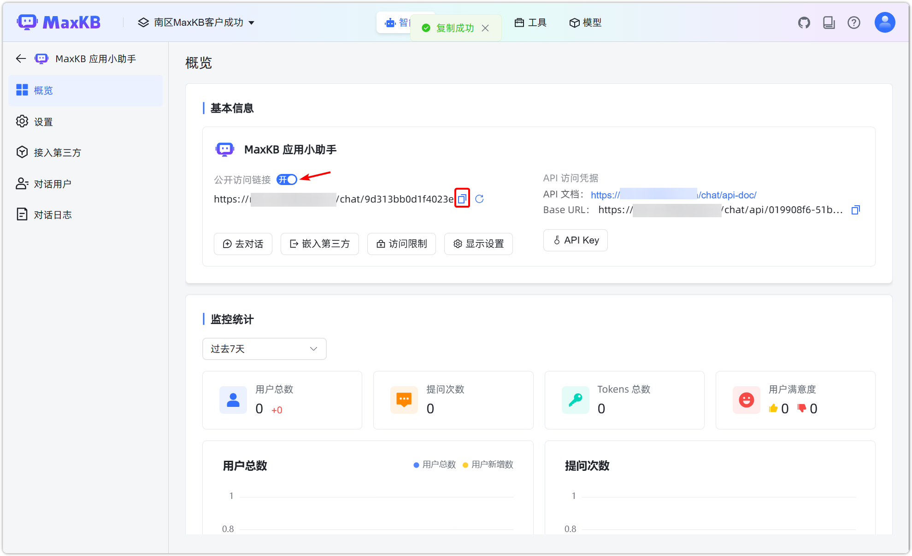
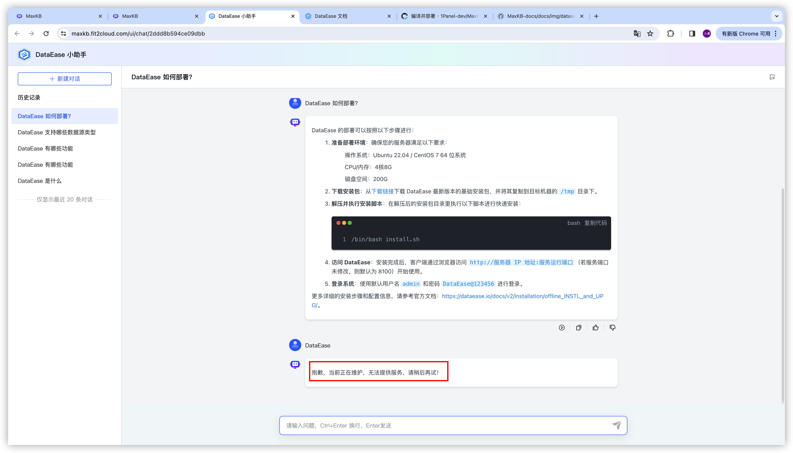
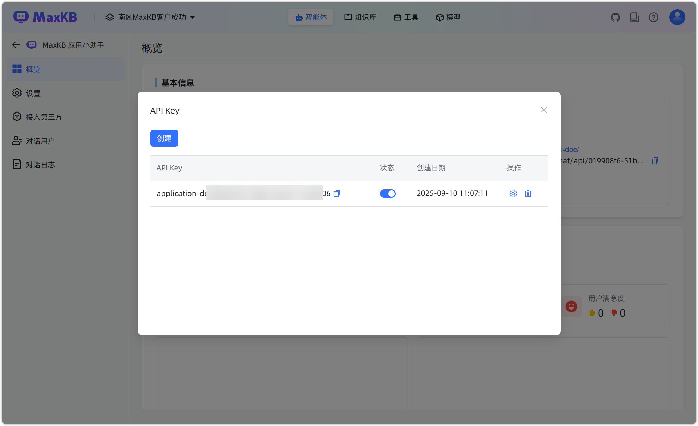

# 应用概述

## 1 功能概述

!!! Abstract ""
    MaxKB 提供预配置模板和组件，可快速创建基础问答应用，或对复杂业务流程进行高级编排，打造专属 AI 助手。创建应用后，点击应用的面板，进入到应用概览页面。

## 2 应用类型

!!! Abstract ""

    简单配置：提供了较为基础的功能和设置选项，基本功能完备满足大多数基本的问答需求，适用于需要快速上线智能体应用。

    高级编排：支持用户创建符合业务逻辑的工作流，包括但不限于使用判断器、问题优化、函数库、内置标签等功能，满足用户问题分类、敏感词检索等各类需求，适用于需要复杂逻辑和自定义工作流的场景。

## 3 应用使用

!!! Abstract ""
    MaxKB 应用支持零编码嵌入到企业的第三方系统。     
    在应用概览页面点击【嵌入第三方】，复制全屏模式、移动端模式或浮窗模式代码嵌入到第三方系统中，即可在第三方系统中进行问答。

## 1 公开访问链接

!!! Abstract ""
点击演示或复制公开访问链接至浏览器进入问答页面。

!!! Abstract ""
公开访问链接支持开关设置和重新生成。  
对于已打开的公开链接，如果此时关闭当前公开链接或重新生成新的公开访问链接，此时访问将提示：抱歉，当前正在维护，无法提供服务，请稍后再试！

## 2 嵌入第三方

!!! Abstract ""
MaxKB 应用支持零编码嵌入到企业的第三方系统。     
在应用概览页面点击【嵌入第三方】，复制全屏模式、移动端模式或浮窗模式代码嵌入到第三方系统中，即可在第三方系统中进行问答。

## 3 访问限制

!!! Abstract ""
MaxKB 支持对应用设置每个客户端提问次数限制和嵌入第三方白名单防盗链设置，并且支持设置用户端是否显示知识来源。

## 4 显示设置

!!! Abstract ""
社区版本应用支持语言以及显示执行详情的设置，专业版本支持更多设置，详情见：[应用显示](../X-Pack/app_logo_settting.md)

{width="500px"}

## 5 API 访问凭据

!!! Abstract ""
如果外部系统需要通过 API 的方式进行调用，需要查看 API 文档和当前应用的 API Key，点击 【API Key 】，打开 API Key 的管理对话框，支持创建、启用/禁用、删除 API Key。

