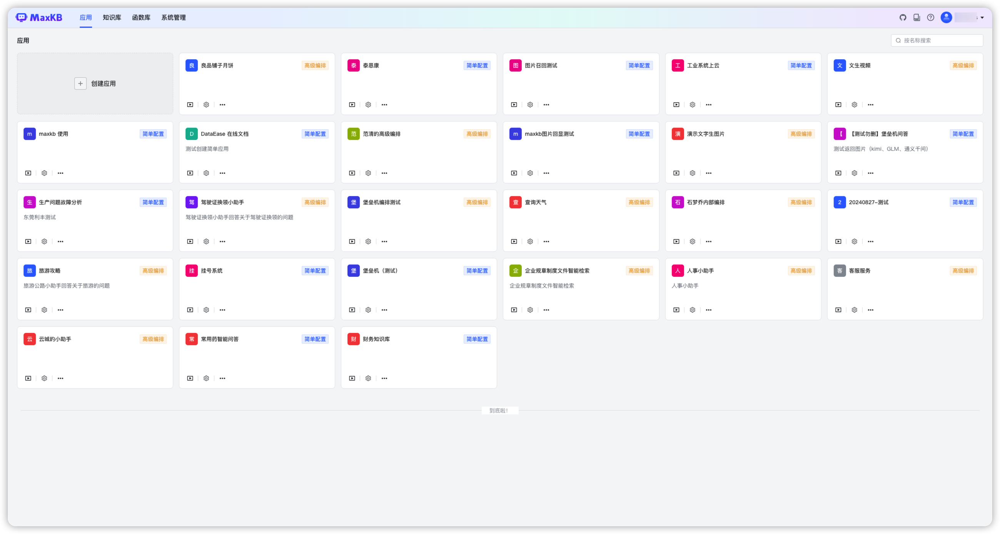
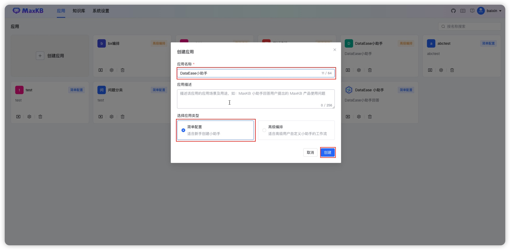
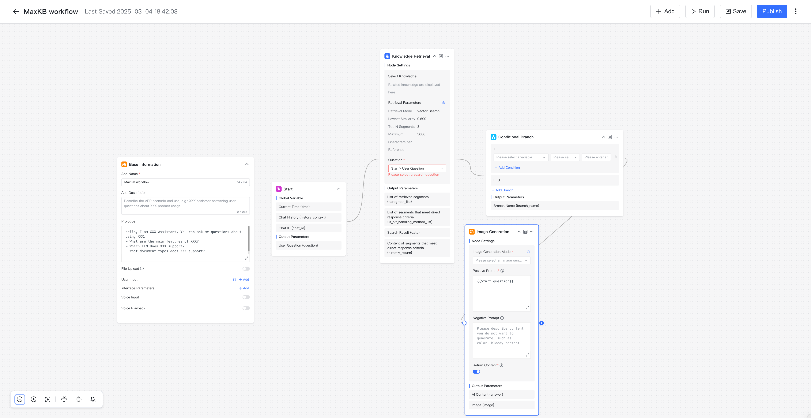
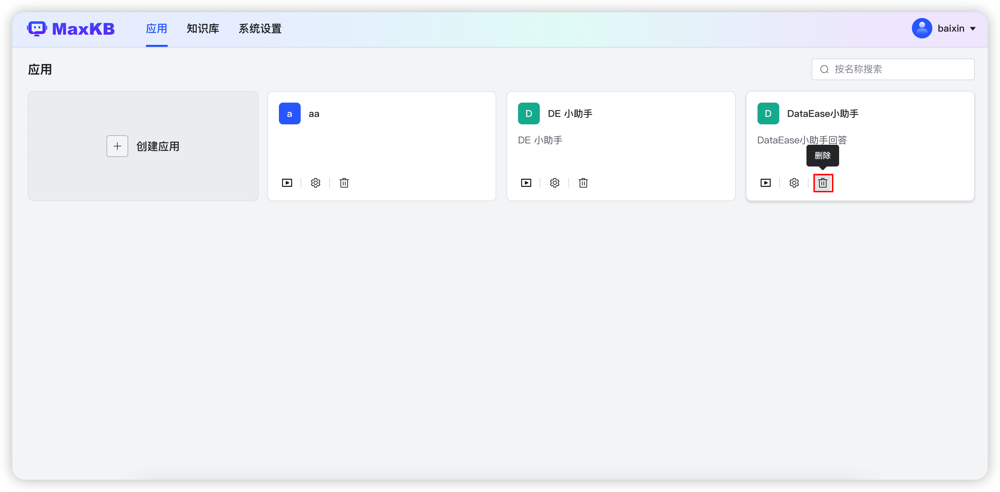

# 应用
!!! Abstract ""
    应用是指基于LLM大语言模型构建的实际场景应用，当前应用支持简易配置和高级编排自定义AI工作流应用。    
    支持全屏模式和浮窗模式嵌入到第三方产品，您可以根据需求为不同产品创建所需的应用。    

!!! Abstract "" 
    点击【应用】菜单，进入应用列表页面，该页面支持应用创建、编辑、删除、查询等功能。

## 1 创建简易配置应用
!!! Abstract ""
    点击【创建应用】，输入应用名称，选择【简易配置】，点击【创建】

!!! Abstract ""
    进入简易配置应用设置页面，左侧为应用信息，右侧为调试预览界面。      
    **应用名称：** 用户提问时对话框的标题和名字。

    **应用描述：** 对应用场景及用途的描述。

    **AI模型：** 在【系统设置】-【模型管理】中添加的大语言模型。  

    **提示词：** 系统默认有智能知识库的提示词，用户可以自定义通过调整提示词内容，可以引导大模型聊天方向，该提示词会被固定在上下文的开头。可以使用变量：{data} 是引用知识库中已知信息；{question}是用户提出的问题。   

    **多轮对话：** 开启时当用户提问携带用户在当前会话中最后3个问题；不开启则仅向大模型提交当前问题题。 

    **关联知识库：** 用户提问会在关联的知识库中检索分段，引用分段生成提示词发送给大模型进行询问。若未关联知识库或未匹配到分段内容，则直接将用户问题发送给大模型进行询问。 

    **参数设置：** 可以设置知识库的相似度，引用分段数量和最大引用字符数。      
    注意：关联的知识库和应用为同一个用户创建。  

    **开场白：** 用户打开对话时，系统弹出的问候语。支持 Markdown 格式；[-]后的内容为快捷问题，一行一个。    
          
    **问题优化：** 对用户提出的问题先进行一次 LLM 优化处理，将优化后的问题在知识库中进行向量化检索，开启后能提高检索知识库的准确度，但由于多一次询问大模型会增加回答问题的时长。   
!!! Abstract ""   
    应用信息设置完成后，可以在右侧调试预览中进行提问预览，调试预览中提问内容不计入对话日志。需要点击保存并发布才可生效。

## 2 创建高级编排应用
!!! Abstract ""
    点击【创建应用】，输入应用名称，选择【高级编排】，点击【创建】

!!! Abstract ""
    进入工作流编排页面，新创建的高级编排应用会默认生成简易配置应该的工作流，用可以根据自己的需求进行自定义编排，点击发布后才会生效。  

### 2.1 添加组件

!!! Abstract ""  
    点击右上角的【添加组件】，用户可以点击或拖拽节点到画布，进行工作流编排。以下是每个节点的用途说明：      
    **基本信息：** 应用的基本信息设置节点，如应用名称、描述、开场白等设置，每个应用只有一个基本信息节点，不能删除和复制。      
    **开始节点：** 工作流程的开始，每个应用只能有一个开始节点，不能删除和复制。    
    **知识库检索：**  关联知识库，检索与问题相关分段的节点，可以有多个，支持复制、删除。     
    **AI对话：**  与AI大模型进行对话的节点，可以有多个，支持复制、删除。    
    **指定回复：** 支持指定输出内容的节点。     
    **判断器：** 根据不同条件执行不同的节点。    

### 2.2 调试

!!! Abstract ""
    点击【调试】后，会先校验流程是否合规，校验通过后可以在当前页面进行对话测试。

### 2.3 执行详情

!!! Abstract ""
    在调试对话框中进行提问，AI回答完成后，会显示【执行详情】，点击【执行详情】后，弹出执行详情对话框，用户可以查看每个流程节点的执行状态、时长和详细的内容。

### 2.3 保存
!!! Abstract ""
    当前画布系统会每分钟进行自动保存到本地，需要用户在校验通过后手动点击发布才会将修改配置同步到线上。
### 2.4 发布
!!! Abstract ""
    高级编排应用的所有修改只有点击【发布】后，才会在问答页面生效。     
    点击发布时会校验当前工作流是否符合规则，符合规则的发布成功，不符合规则的则不会进行发布。  

## 3 删除应用
!!! Abstract ""
    在应用列表，支持对用户创建的应用进行删除操作。
