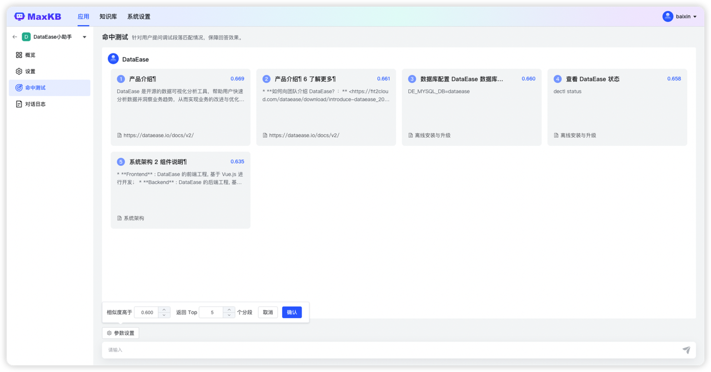

# 命中测试

!!! Abstract ""
    命中测试功能是简易配置类型应用针对用户提问进行一个模拟测试，用来调整分段内容和关联问题从而提高分段内容的匹配度，提高回答效果。输入用户测试问题，系统在当前应用关联的知识库中进行向量检索，检索与问题相关的分段，按照相似度和返回Top 分段数筛选返回满足条件的分段。      
    用户可以根据返回分段对分段进行编辑或添加关联问题。 

