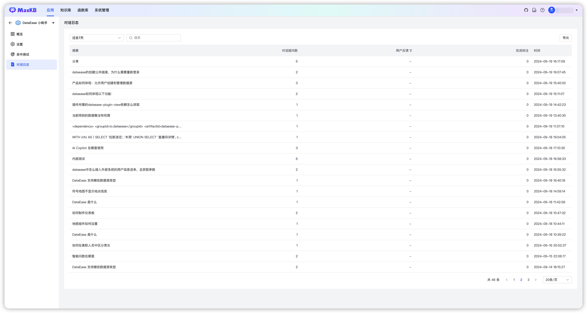
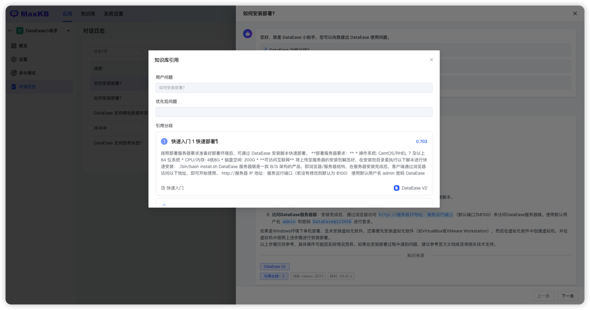
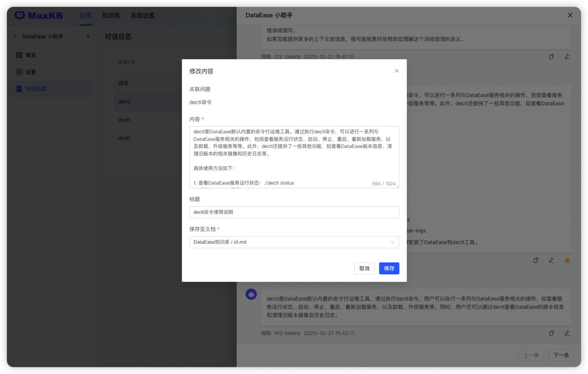

#  对话日志

!!! Abstract ""
    在对话日志记录了所有用户会话中的问答详情，包括用户对AI 回答的反馈信息。      
    维护人员可以通过查看对话日志详情并参考用户反馈来修正答案。       
    支持查询过去 7 天、30 天、90 天、过去半年的对话日志。    
    支持按摘要和用户反馈查询对话日志。

## 1 日志详情

!!! Abstract ""
    日志详情为每个用户真实的问答场景，问答中用户的反馈只能查看不能修改。

!!! Abstract ""
    * 查看引用分段：支持查看 AI 回答时具体引用知识库的分段内容。

!!! Abstract ""
    * 修正答案：维护人员可以根据用户提问和 AI 回答以及用户的反馈来标注答案完善分段内容。
