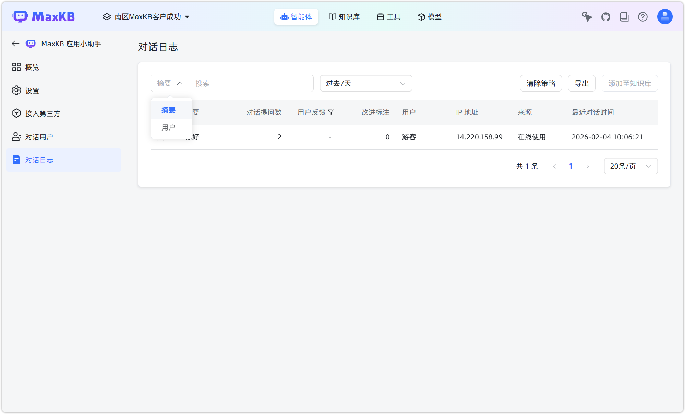
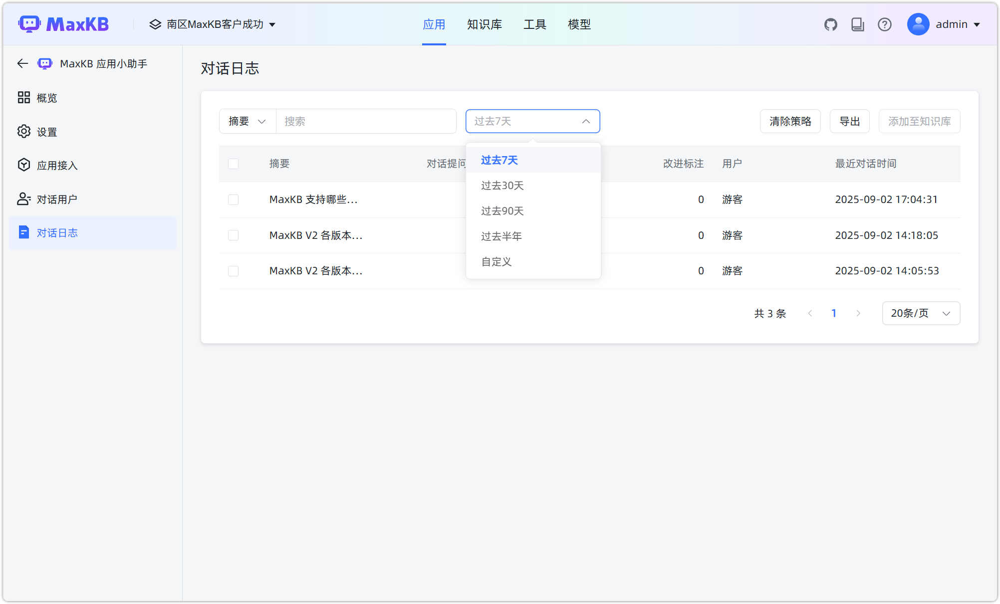
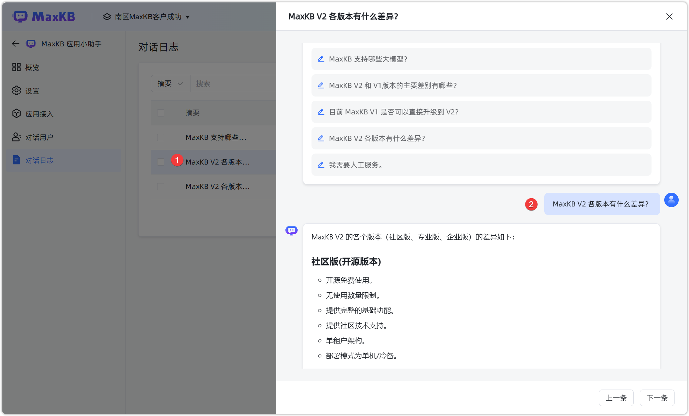
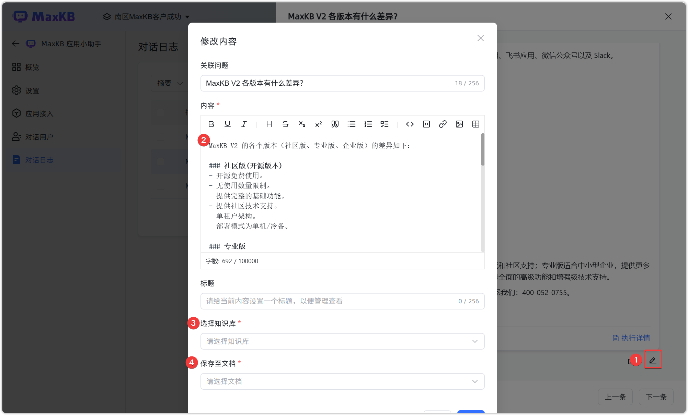
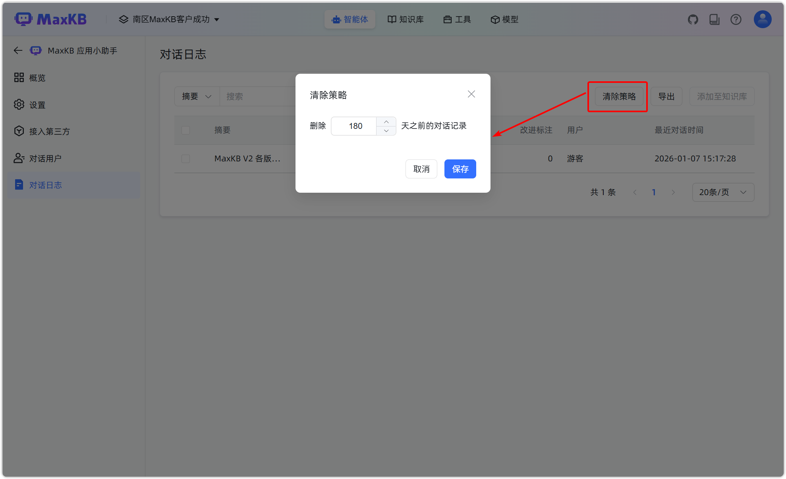
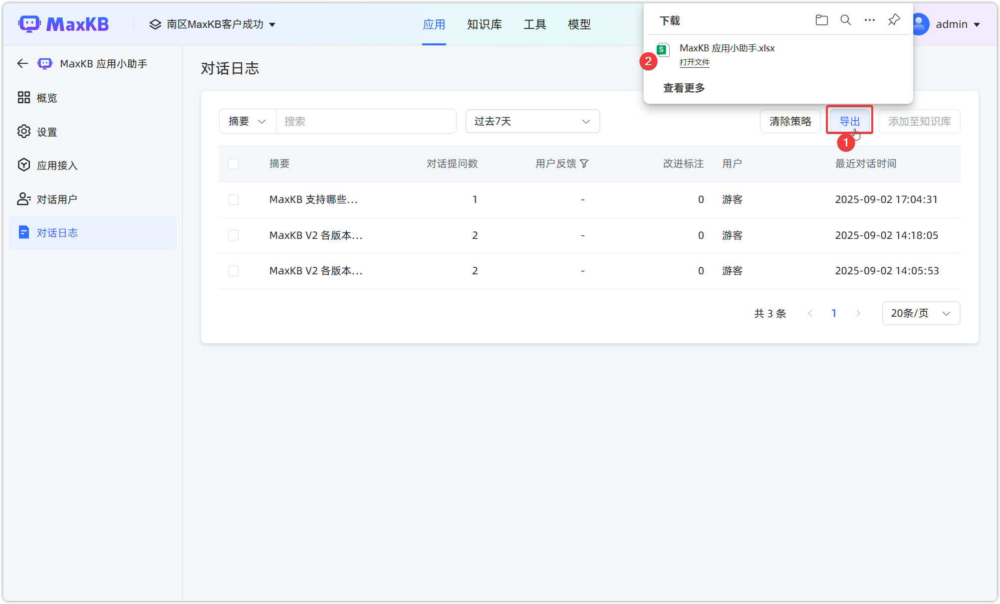

!!! Abstract ""
    在对话日志记录了所有用户会话中的问答详情，包括用户对AI 回答的反馈信息，维护人员可以通过查看对话日志详情并参考用户反馈进一步修正答案。       

!!! Abstract ""
    对话日志中，支持按摘要或用户进行查询，也支持查询过去 7 天、30 天、90 天、过去半年以及自定义时间段的对话内容。

## 1 日志详情

!!! Abstract ""
    日志详情为每个用户真实的问答场景，问答中用户的反馈只能查看不能修改。

    点击日志列表中的摘要，可查看对话详细内容以及用户反馈。

!!! Abstract ""
    运营人员可以根据用户提问、AI 回答以及用户的反馈来编辑和标注，并保存至知识库，进一步完善并提升效果。

## 2 清除策略
!!! Abstract ""
    应用对话记录和对话上传的附件默认保存期限是 180 天，如果要求保留更长时间，需修改此参数。设置清除策略期限后，系统将创建自动清除任务，并在次日 0 点执行。

## 3 日志导出
!!! Abstract ""
    支持将对话日志导出，查看详细的对话情况。
