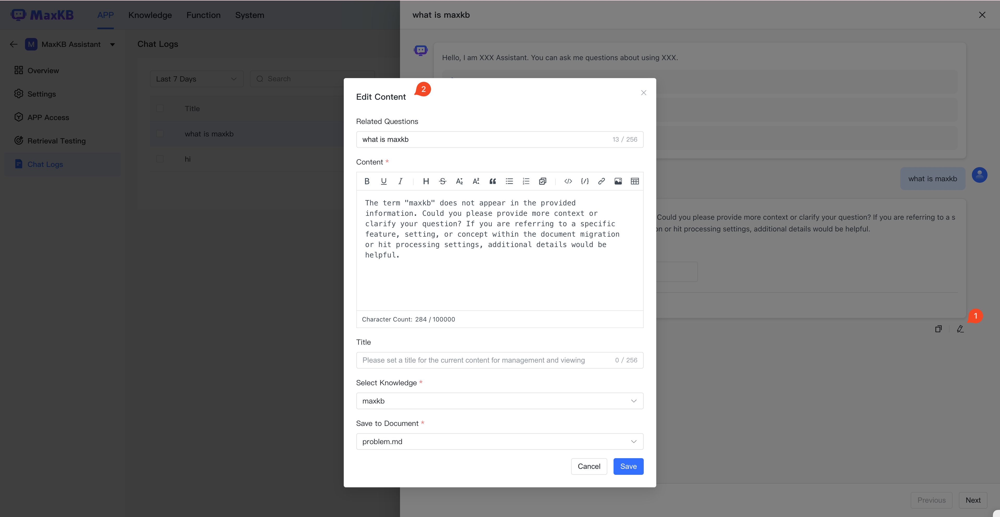

!!! Abstract ""
    The conversation log records all Q&A details from user sessions, including user feedback on AI responses. Maintenance personnel can review conversation log details and refer to user feedback to further improve answers.
    The conversation log supports querying content from the past 7 days, 30 days, 90 days, past 6 months, as well as searching by summary and user feedback.

## 1 Log Details

!!! Abstract ""
    Log details show real Q&A scenarios for each user. User feedback in Q&A can only be viewed and not modified.

!!! Abstract ""
    Click on the summary in the log list to view detailed conversation content.

!!! Abstract ""
    Operations staff can edit and annotate based on chat log details to further improve and enhance effectiveness.
