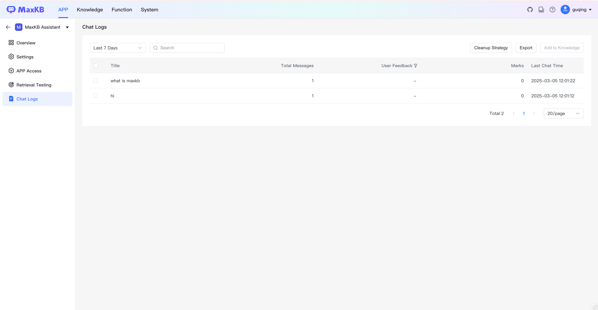
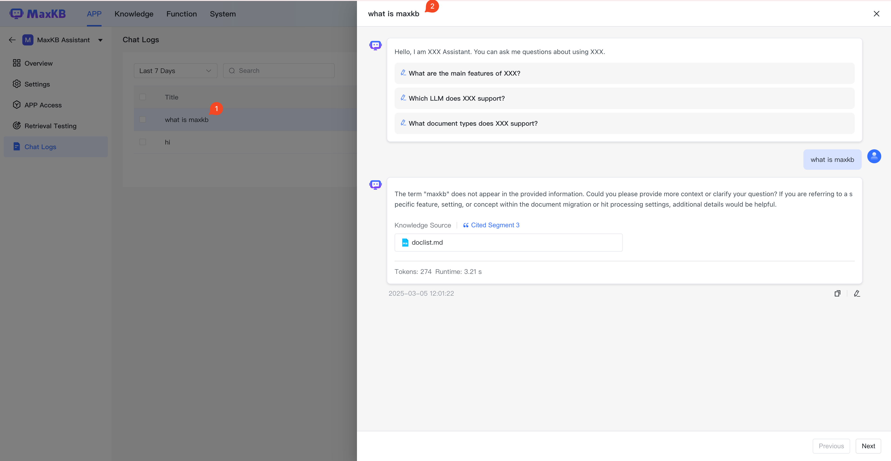

#  对话日志

!!! Abstract ""
    在对话日志记录了所有用户会话中的问答详情，包括用户对AI 回答的反馈信息，维护人员可以通过查看对话日志详情并参考用户反馈进一步修正答案。       
    在对话日志支持查询过去 7 天、30 天、90 天、过去半年的对内容，以及按摘要和用户反馈查询进行查询。

## 1 日志详情

!!! Abstract ""
    日志详情为每个用户真实的问答场景，问答中用户的反馈只能查看不能修改。

!!! Abstract ""
    点击日志列表中的摘要，可查看对话详细内容。

!!! Abstract ""
    运营人员可以根据用户提问、AI 回答以及用户的反馈来编辑和标注，以进一步完善并提升效果。
