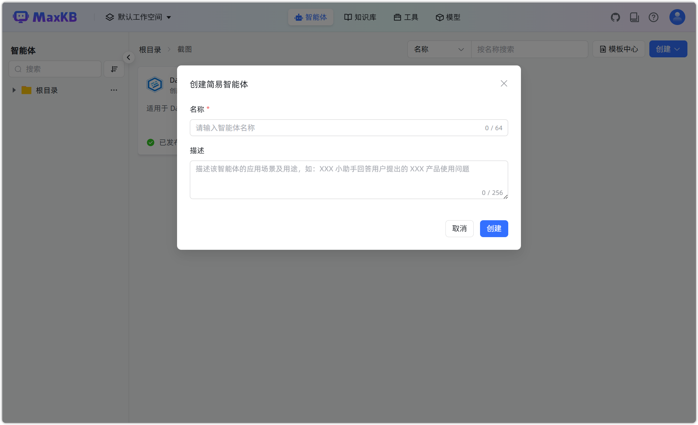
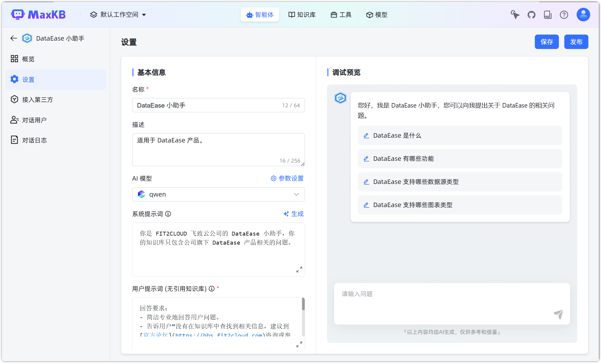
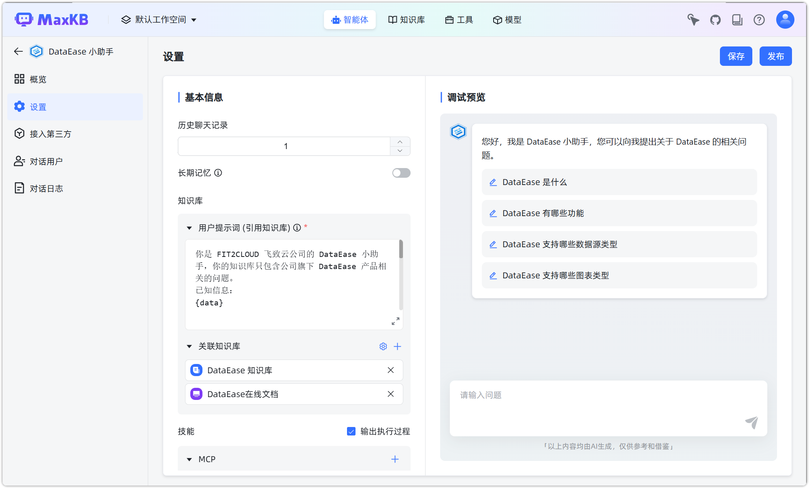
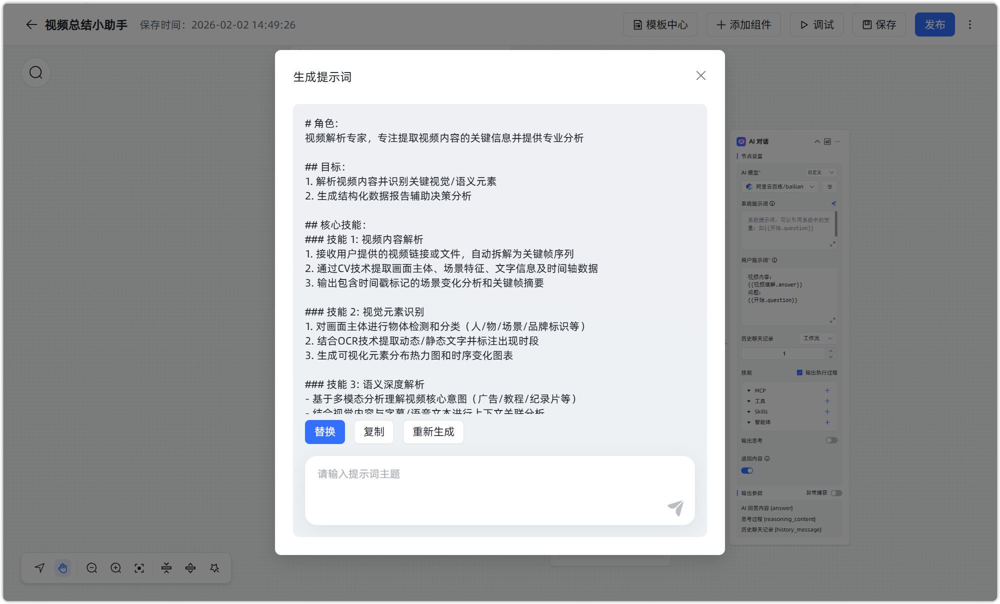
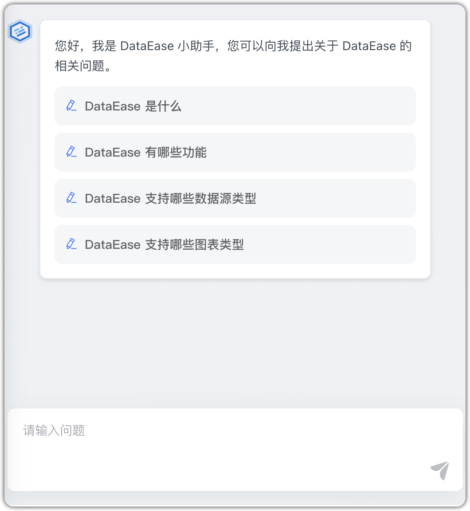
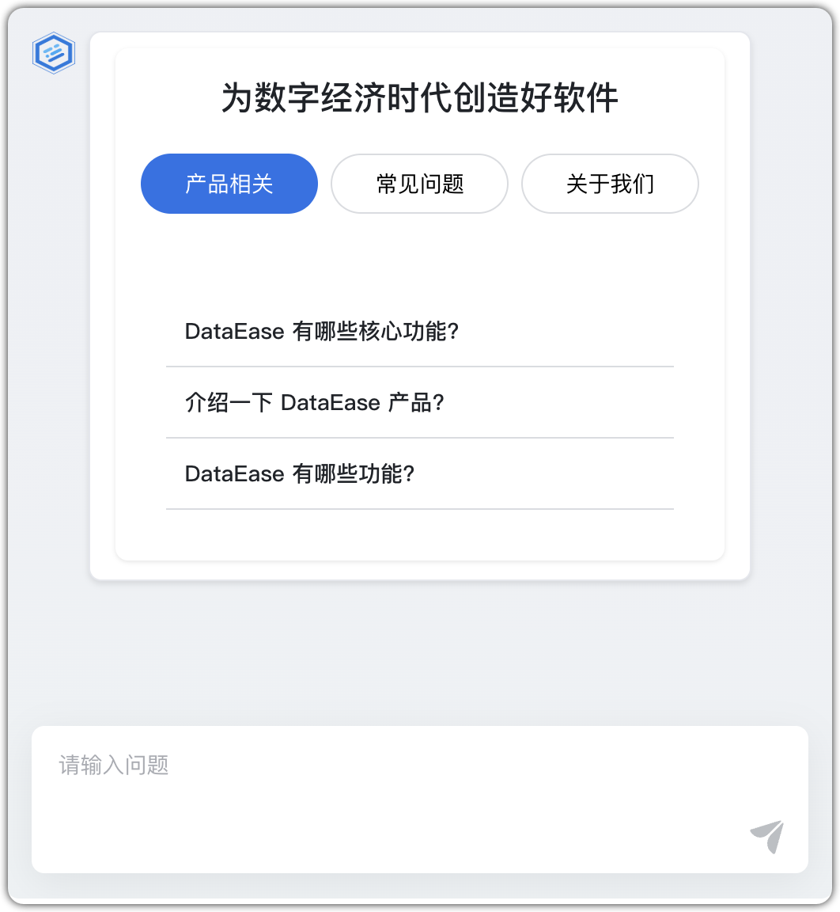
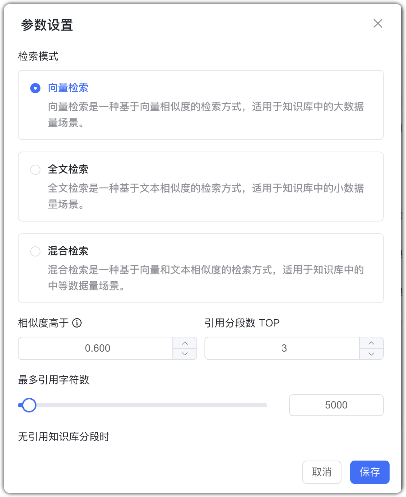
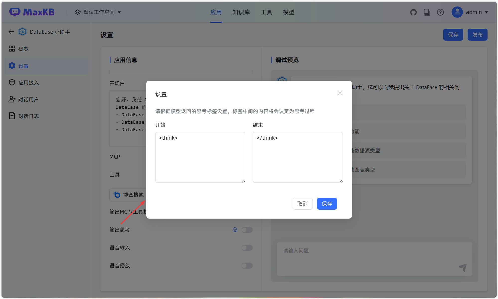

# 简单配置应用

!!! Abstract ""
    点击【创建应用】，输入应用名称以及应用描述，选择【简易配置】，点击【创建】，进入简易配置应用设置页面。

!!! Abstract ""
    左侧为应用信息，右侧为调试预览界面。   

    * 应用名称：提问时对话框的标题和名字。
    * 应用描述：对应用场景及用途的简要描述。
    * AI 模型：可选择在【模型】中添加的大语言模型，也可直接添加。
    * 角色设定：通过给模型指定一个特定的角色或身份，来指导模型的输出更加符合特定的场景或任务需求，可在点击右侧【生成】按钮，生成所需提示词。
    * 提示词：系统默认有智能知识库的提示词，用户可以自定义通过调整提示词内容，可以引导大模型聊天方向，该提示词会被固定在上下文的开头。
    * 历史聊天记录：大模型提交当前会话中最后 N 条对话内容，如果为 0，则仅向大模型提交当前问题。
    * 关联知识库：知识库可设置检索方式、知识库的相似度，引用分段数 Top-N 和最大引用字符数、无引用知识库分段时的回答策略以及是否进行问题优化等。
    * 开场白：打开对话时，系统弹出的默认引导说明。
    * MCP：支持添加多个 MCP，通过引用 MCP 和自定义 MCP Server Config 配置两种方式实现对 MCP 的调用，大模型会根据提示词内容会主动调用合适的工具。
    * 工具：可以根据实际场景灵活选用自定义工具，系统自动将工具能力封装为MCP服务并对接模型，AI 能够根据对话上下文智能判断是否调用工具。
    * 输出 MCP/工具执行过程：开启后，模型在生成最终答案前，会先输出一段置于标签内的推理过程，随后再给出正式回复。
    * 语音输入：在语音输入完成后会转化为文字后再发送提问，需要语音识别模型的支持。
    * 语音播放：将大模型生成的回答内容转换为语音进行播放，需要语音合成模型的支持。

    **应用信息设置完成后，点击【保存并发布】后，应用设置才生效。**

!!! Abstract ""   
    提示词是在每次对话开始时固定注入的上下文指令，用于为模型确立身份、语气、知识边界及输出格式等前置规则，从而确保回复精准、风格一致且可控。

    - 变量支持：如 {data} 自动插入知识库片段，{question} 引用用户问题，实现精准、可控、低幻觉的智能回复。
    
    - 典型配置示例
        - 角色锚定：你是一位专业的数据分析专家，精通 MySQL数据库SQL语言，能够熟练运用 mcp-mysql 工具进行SQL验证和查询，还能使用 quickchart-server 工具绘制图表，并对相关数据进行深入分析和解释。
        - 输出格式：请用 Markdown 表格呈现答案，并在末尾给出 20 字以内的总结。
        - 技能技能：生成并验证SQL、绘制图表、数据的分析和解释
        - 风格语气：保持亲切、简洁，避免使用专业术语。
        - 限制要求：仅围绕与生成SQL、利用工具查询验证、生成图片以及数据的分析和解释相关的内容进行回答，拒绝回答不涉及这些内容的话题。

    通过合理编排提示词，管理员可在不更换模型的前提下，实现多场景、多角色的快速切换，显著降低大模型幻觉风险并提升用户体验。

    MaxKB 系统提示词支持提示词生成功能，可以基于用户输入的主题内容，智能生成高质量、结构完整的系统提示词，辅助用户快速构建适用于当前场景的提示文本。

!!! Abstract ""   
    开场白兼具“自我介绍”与“操作提示”的双重作用，能够在零打扰的前提下，告诉用户“我是谁、能做什么、该怎么问”。合理设计的开场白可显著降低首次使用门槛，提升后续问答效率。
    
    - 支持 Markdown，可插入粗体、链接、换行。
    - 支持使用 <html_rander>  标签编写 HTML 代码。

    可参考 [MaxKB 开场白参考模板（基于 HTML 编写）](https://kb.fit2cloud.com/?p=14db4420-5ed4-4e49-b500-c36c36883c2d)。

{ width="500px" }{ width="500px" }

!!! Abstract ""   
    当用户提问后，系统优先在已关联的知识库中执行分段检索，随后将命中的内容注入提示词，再交由大模型生成答案。应用设置时可以控制检索行为：

    - 检索模式

        - 向量检索：基于向量相似度，适合大数据量、语义匹配场景。
        - 全文检索：基于文本相似度，适合小数据量、关键词匹配场景。
        - 混合检索：同时启用向量 + 全文，兼顾精度与召回，适用于中等数据量。
    - 相似度阈值：仅返回高于设定分值（默认 0.60）的段落，过滤低相关结果。
    - 引用分段数 Top-N：控制最多向大模型提交 N 条高相关段落，避免上下文过长。
    - 最大引用字符数：对入选段落再做字符截断，确保总长度不超过设定上限（默认 5,000 字符）。
    - 无引用时的回答策略：允许大模型基于通用知识作答，或指定统一回复（如暂无相关资料”，拒绝编造）。
    - 问题优化开关：启用后，系统会先将用户问题改写为更利于检索的表述，再执行检索，提高命中率。

{ width="500px" }
!!! Abstract ""
    输出思考：开启后，模型在生成最终答案前，会先输出一段置于标签内的推理过程，随后再给出正式回复。
    
    **注意**：部分模型只输出单标签，无法进行关闭控制，需对模型进行配置优化。如 DeepSeek-R1-Distill-Qwen-32B。

