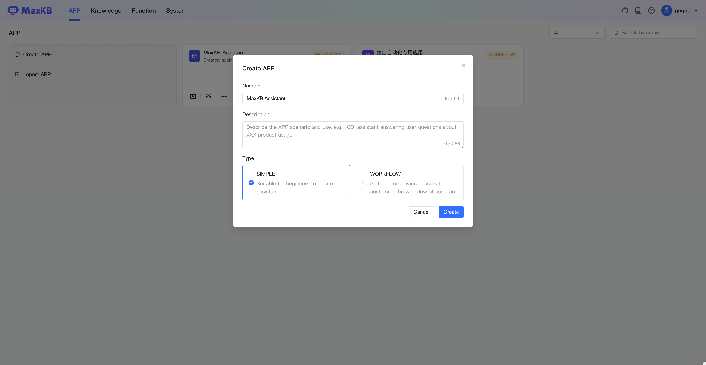

# Simple Application

!!! Abstract ""
    Click Create App, enter the application name and description, select Simple type, click Create button to enter the simple configuration application settings page.

!!! Abstract ""
    * Name: The title and name shown in the chat dialog when asking questions.
    * Description: A brief description of the application scenario and purpose.
    * AI Model: You can select large language models added in [System Settings]-[Model Management], or add them directly.
    * Role Settings: Guide the model's output to better match specific scenarios or task requirements by assigning a specific role or identity to the model.
    * Prompts: The system has default prompts for intelligent knowledge base. Users can customize by adjusting prompt content to guide the large model's chat direction. This prompt will be fixed at the beginning of the context. Variables can be used, for example: {data} references known information in the knowledge base, {question} is the user's question. Different prompts can be set based on whether to reference the knowledge base.
    * Historical chat records: Submit the last N conversation contents from the current session to the large model, otherwise only submit the current question.
    * Related Knowledge: User questions are first searched for segments in associated knowledge bases, and prompts are generated from referenced segments to query the large model. If no knowledge base is associated or no segment content is matched, the user's question will be sent directly to the large model. Knowledge bases can be configured with retrieval methods, similarity thresholds, Top-N referenced segments and maximum reference characters, answer strategy when no knowledge base segments are referenced, and whether to perform question optimization.
    * Prologue: The default guidance message shown when opening the dialog. Supports Markdown format, content after [-] are quick questions, one per line.
    * Voice Input: After voice input is completed, it will be converted to text before sending the question. Requires speech recognition model support.
    * Voice Playback: Convert the large model's generated answers into speech for playback. Requires speech synthesis model support.

!!! Abstract ""
    After completing application settings, you can test questions in the debug preview on the right. Debug process is not recorded in chat logs. 
    Settings only take effect after clicking [Save and Publish].

