# 高级智能体

!!! Abstract ""
    点击【创建】，选择【高级智能体】，输入智能体名称，可以根据需求选择模板，点击【创建】进入工作流编排页面。

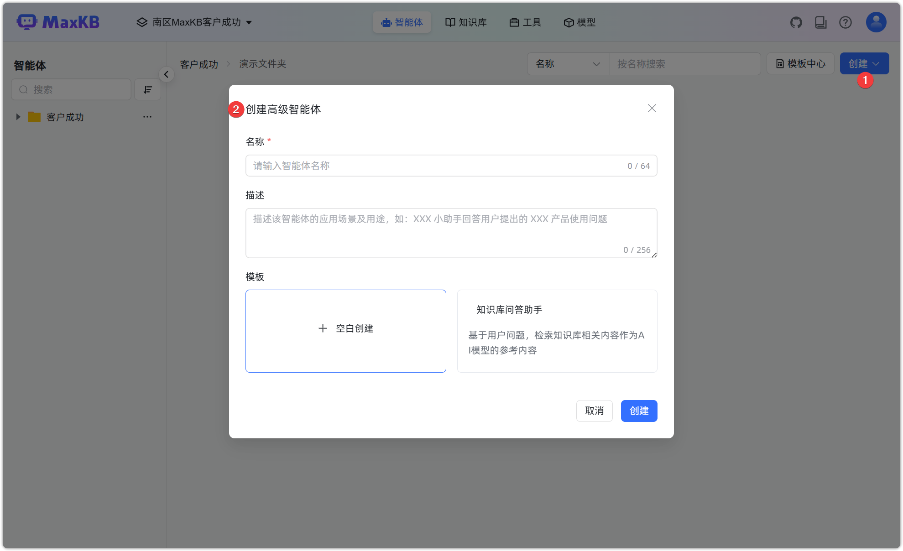

!!! Abstract ""
    高级智能体通过可视化工作流，将 AI 模型、知识库、业务逻辑、外部工具等节点自由组合，进行调试与发布。

    **注意：**

    - 画布上的节点必须在工作流程中，不能有流程外的孤立节点，否则在发布时会校验失败。<br /> 
    - 每个节点可以根据节点的用途进行重命名，双击节点名称即可重命名，但同一个工作流编排中节点名称不能重复。<br /> 
    - 连线的后置节点可以引用前置节点的输出参数，如果节点名称变更，需要重新复制变量，参数引用方式是`{{节点名称.变量名称}}`。

    完成工作流程设计之后，使用左下方的画布控制栏，可以对画布进行整体调整，包括画布缩放、节点收缩以及流程一键优化。


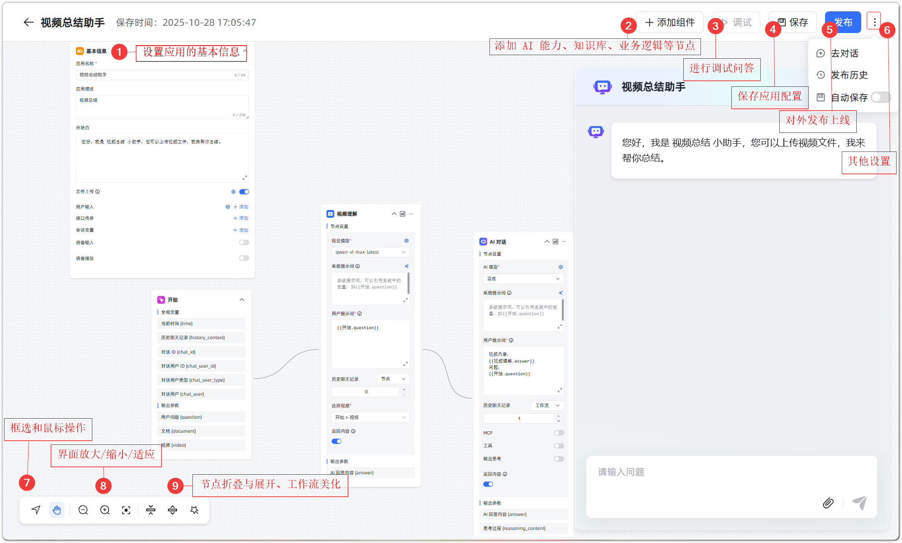

## 1 基础节点

!!! Abstract ""  
    每个工作流由【基本信息】与【开始】两个基础节点构成，且均不可删除、不可复制。

    - 基本信息：用于配置智能体基础数据：智能体名称、智能体描述、开场白、语音开关等。每个智能体仅存在一个该节点。
    - 开始：作流执行的起点，所有后续节点均从此节点开始流转。每个智能体仅存在一个该节点。

#### 1.1 基本信息

!!! Abstract "" 
    节点说明：工作流的开始节点，有且唯一，不能删除和复制，问答页面输入的问题会作为该节点的输出参数 {question}， 后续节点如需引用可以复制输出参数或选择变量：`开始节点->用户问题`。

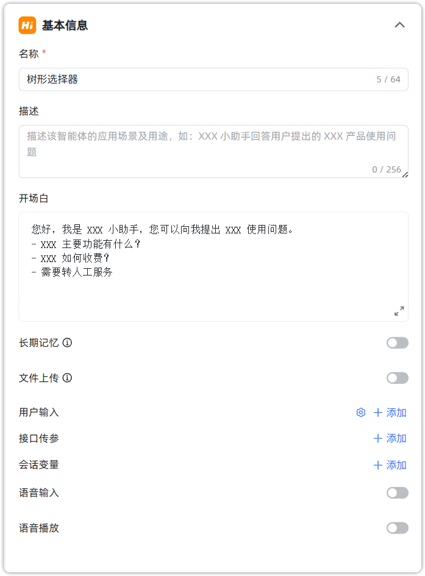{width="500px"}

!!! Abstract ""

     文件上传：开启后智能体将支持在对话时上传文档。

    - 文档：TXT、MD、DOCX、HTML、CSV、XLSX、XLS、PDF；
    - 图片：JPG、JPEG、PNG、GIF；
    - 音频：MP3、WAV、OGG、ACC、M4A； 
    - 视频：MP4、AVI、MKV、MOV、FLV、WMV；
    - 其他文件：其他自定义后缀文件，需自行解析。

    每次最多上传 10 个文件，单个文件不超过 100 MB，在后续节点中可以对上传后的文件进行处理。默认 3 个文件，单个文件不超过 50 MB。
    
    上传方式：支持本地文件上传和 URL 地址上传两种上传方式。

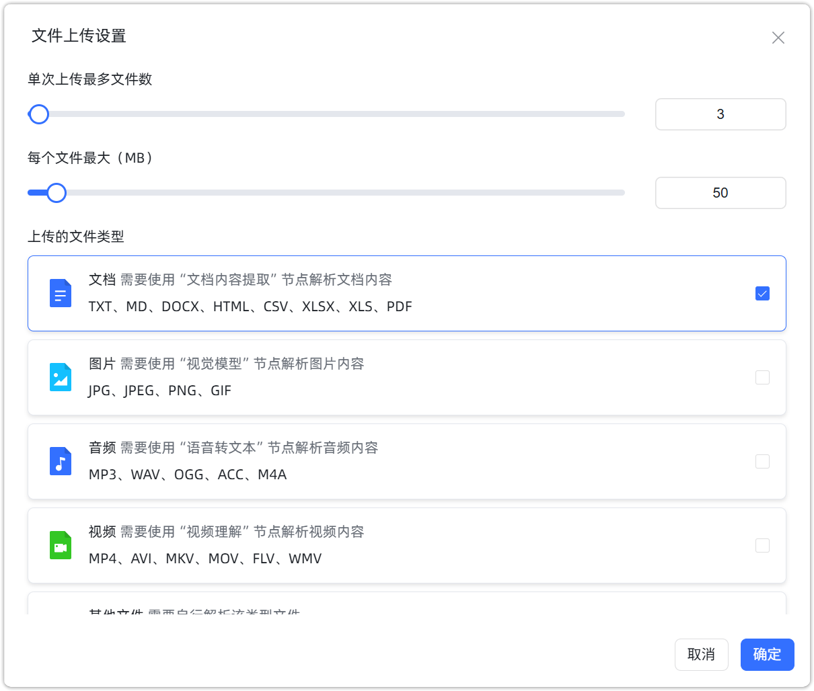{width="500px"}
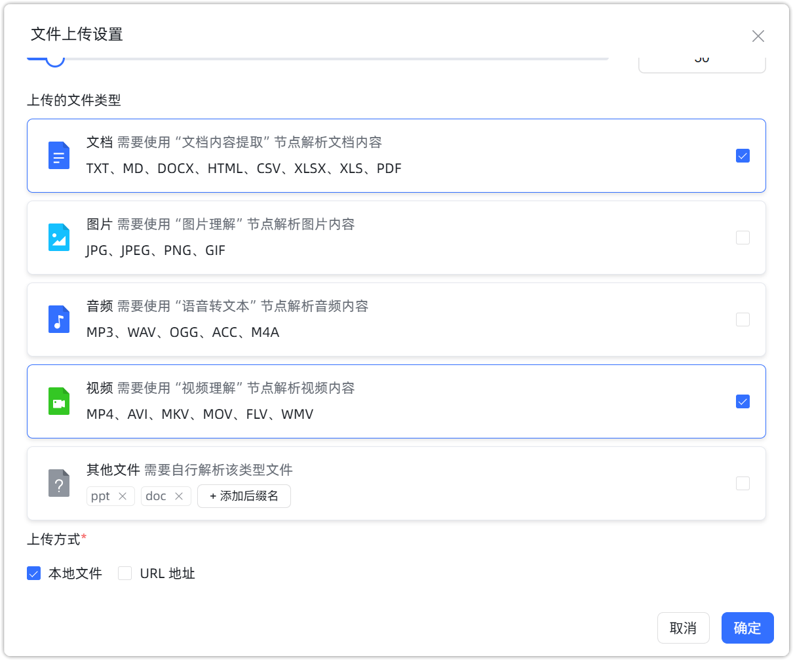{width="500px"}

!!! Abstract "" 
    - 用户输入：在会话开始时，需要在用户端提供的必要信息，例如，岗位角色、模型、知识库等，以便后续流程可以根据不同输入进行不同的流程设计。

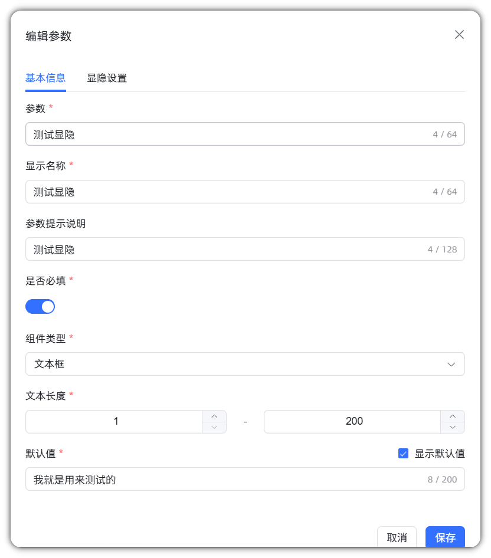{width="500px"}

!!! Abstract ""

    - 接口传参：在通过智能体公开访问链接时可配置的参数。添加接口参数后将会在公开访问 URL 自动增加接口参数，在与第三方系统集成。
        - 注意：token 字段作为内部字段，不能添加为参数。
    - 会话变量：变量在当前对话流程中全程有效，用于实现节点间数据传递与逻辑判断。
    - 语音输入：开启后将支持以语音的方式进行问题的输入，需要使用语音识别模型。   
    - 语音播放：开启后回答内容将以语音的方式进行播放，可以使用浏览器内置的播放，也可以使用语音合成模型进行播放。

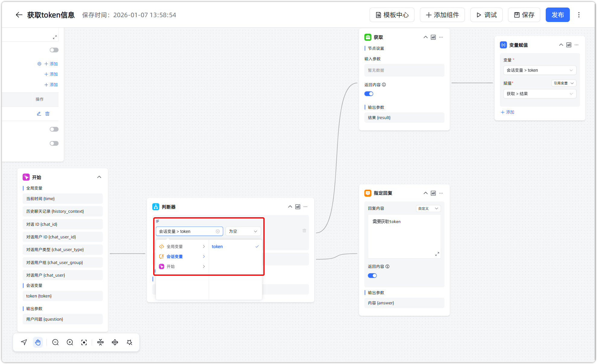

#### 1.2 开始

!!! Abstract ""
    作为工作流执行的起点，所有后续节点均从此节点开始流转。

    全局变量：

    - 当前时间 {time}：当前对话的时间。
    - 历史聊天记录 {history_context}：对话的历史记录。
    - 对话ID {chat_id}：对话标识。
    - 对话用户 ID {chat_user_id}：对话用户标识。
    - 对话用户类型 {chat_user_type}：对话用户类型。
    - 对话用户组 {chat_user_group}：对话用户组。
    - 对话用户 {chat_user}：默认对话用户为游客。根据对话用户名字，在流程中还可以进一步进行逻辑判断。

    会话变量：
    
    - 会话变量名称{会话变量参数}：在基本信息中创建的会话变量。

    参数输出：

    - 用户问题 {question}：客户端输入的提问信息。
    其它参数输出，如果开启了文件上传，还可能输出的参数包括:
    - 文档 {document}：客户端上传的文档文件。
    - 图片{image}：客户端上传的图片文件。
    - 音频{audio}:客户端上传的音频文件。
    - 视频{video}:客户端上传的视频文件。
    - 其它文件{other}：客户端上传的其他文件。


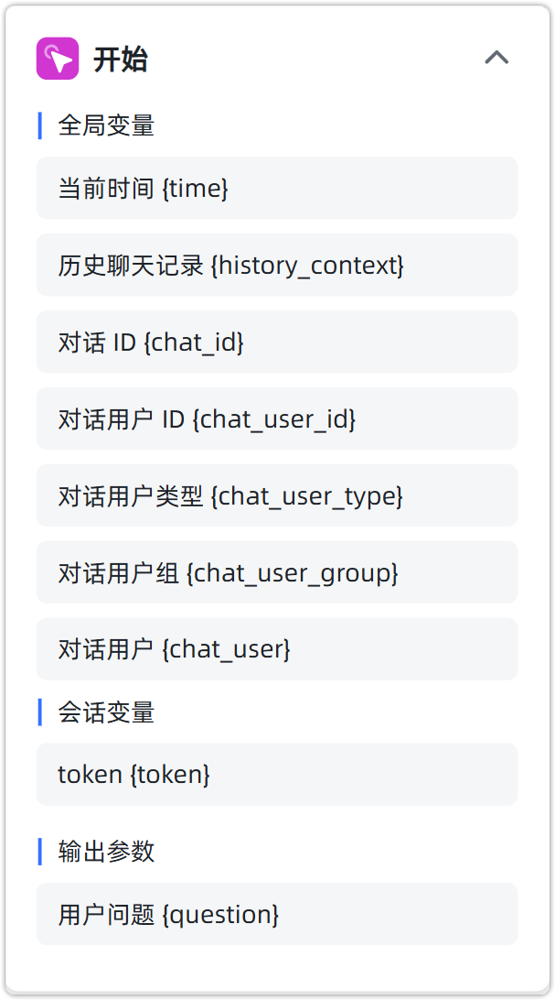{width="300px"}

!!! Abstract ""  
    点击画布右上角【添加组件】，即可通过“点击”或“拖拽”方式将所需节点加入工作流。组件按功能分为三大类，具体说明如下：

    - **基础组件**：覆盖 AI 能力、知识库、业务逻辑等。
    - **工具**：通过函数方式灵活处理复杂需求。
    - **智能体**：一键引入其他已发布的智能体作为子流程，直接复用其问答结果，实现快速拼装与能力复用。

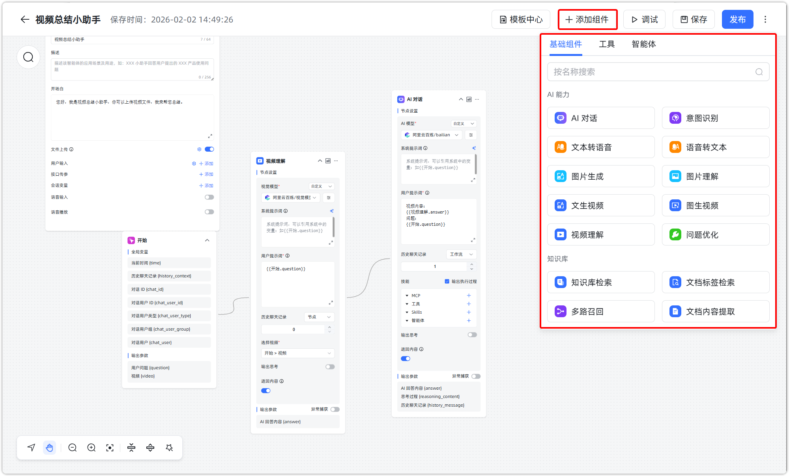

## 2 基本组件

### 2.1 AI 能力

#### 2.1.1  AI 对话

!!! Abstract ""
    节点说明：如果智能体需要与 AI 大模型进行对话，则需要在编排中添加 AI 对话组件。

    节点设置：

    - AI 模型：支持引用变量或自定义选择模型，引用变量来源是用户输入中添加的模型参数。
    - 系统提示词：大语言模型回答的角色或身份设定。
    - 用户提示词：引导模型生成特定输出的详细描述。提示词可以引用前置节点的参数输出，如可以引用前置知识库检索的检索结果和开始节点的问题变量。
    - 历史聊天记录：在当前对话中有关联的历史会话内容。例如，历史聊天记录为 1，表示当前问题以及上一次的对话内容一起输送给大模型。
        
        - 选择节点：会使用当前 AI 对话节点的提示词信息和节点返回的内容作为上下文；
        - 选择工作流：会使用对话框中用户输入的问题和最终回复的内容作为上下文。
    
    - 技能：智能体支持自动调用 MCP、工具、Skills 和智能体，可以选择是否输出技能的执行过程。

        - MCP：支持添加多个 MCP，通过引用 MCP 和自定义 MCP Server Config 配置两种方式实现对 MCP 的调用，大模型会根据提示词内容会主动调用合适的工具。
        - 工具：可以根据实际场景灵活选用自定义工具，系统自动将工具能力封装为 MCP 服务并对接模型，AI 能够根据对话上下文智能判断是否调用工具。
        - Skills：支持基于用户提问意图，自主分析需求并匹配适配 Skills 技能，自动触发 Skills 技能执行
        - 智能体：可以添加其它智能体，直接快速调用子智能体的问答结果。
    - 输出思考：对于模型反馈思考过程的设置与开启，默认开始和结束标签是 `<think>`、`</think>` 。
    - 返回内容：是否在对话中显示该节点返回的内容。

    参数输出：可以选择是否显示异常捕获参数。

    - 回答内容 {answer}：根据角色、提示词等内容大语言模型返回的内容。 
    - 思考过程 {reasoning_content}：AI 模型的思考过程。
    - 历史聊天记录 {history_message}：根据设置的历史聊天记录次数，输出相应历史聊天记录。
    - 异常信息 {exception_message}：支持为异常分支配置专属执行流程，如自动重试、默认值兜底。

    **注意**：MCP 工具的调用需要大语言模型支持函数调用，如果大语言模型不支持，则配置无效。

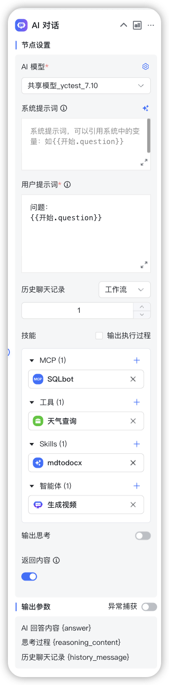{width="300px"}

!!! Abstract ""   
    提示词是在每次对话开始时固定注入的上下文指令，用于为模型确立身份、语气、知识边界及输出格式等前置规则，从而确保回复精准、风格一致且可控。

    - 变量支持：如 {data} 自动插入知识库片段，{question} 引用用户问题，实现精准、可控、低幻觉的智能回复。

    AI 对话节点支持基于用户输入的主题内容，自动生成高质量、结构完整的系统提示词，辅助用户快速构建适用于当前场景的提示文本。通过合理编排提示词，管理员可在不更换模型的前提下，实现多场景、多角色的快速切换，显著降低大模型幻觉风险并提升用户体验。
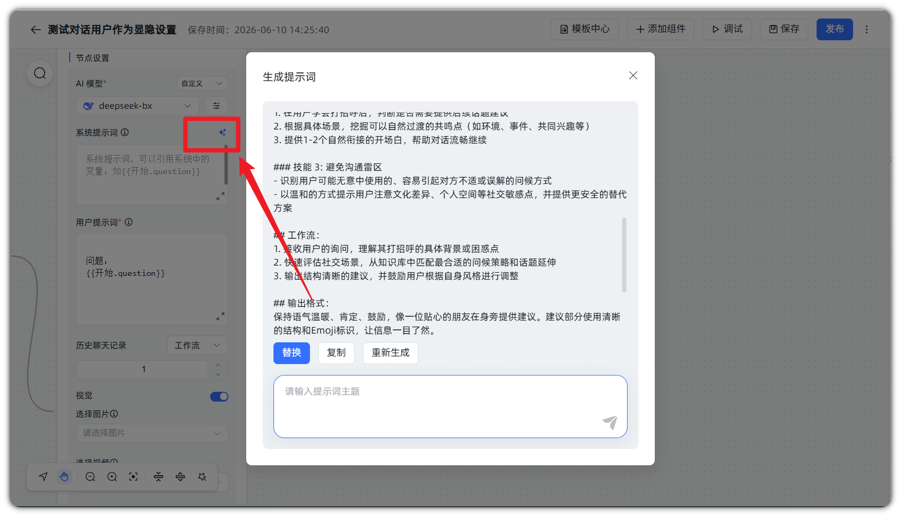

!!! Abstract ""
    MCP：引用 MCP和自定义 MCP Server Config。
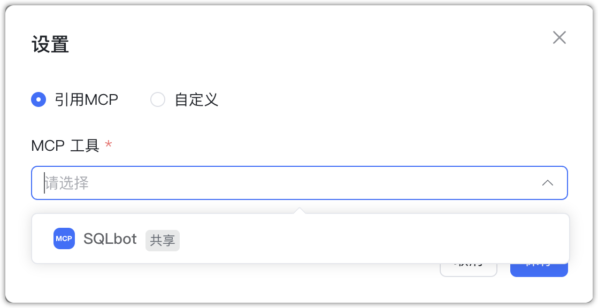{width="500px"}
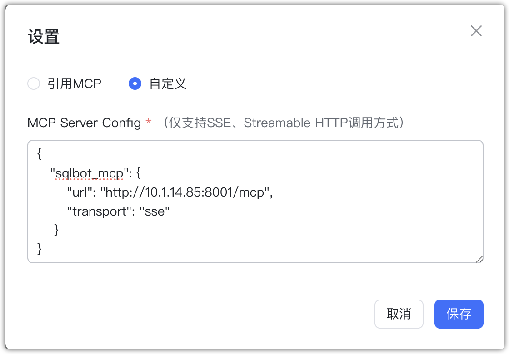{width="500px"}

!!! Abstract ""
    工具：支持添加【工具】中已启用的工具。
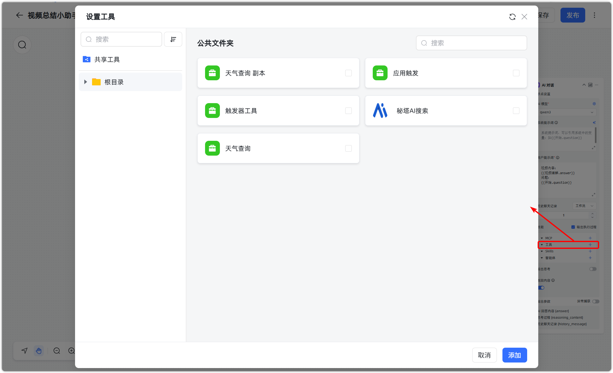

!!! Abstract ""
    Skills：支持添加【工具】中已启用的 Skills。
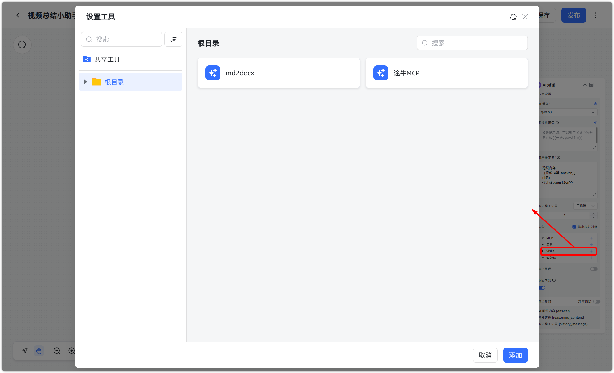

!!! Abstract ""
    智能体：支持添加已创建的其他智能体。
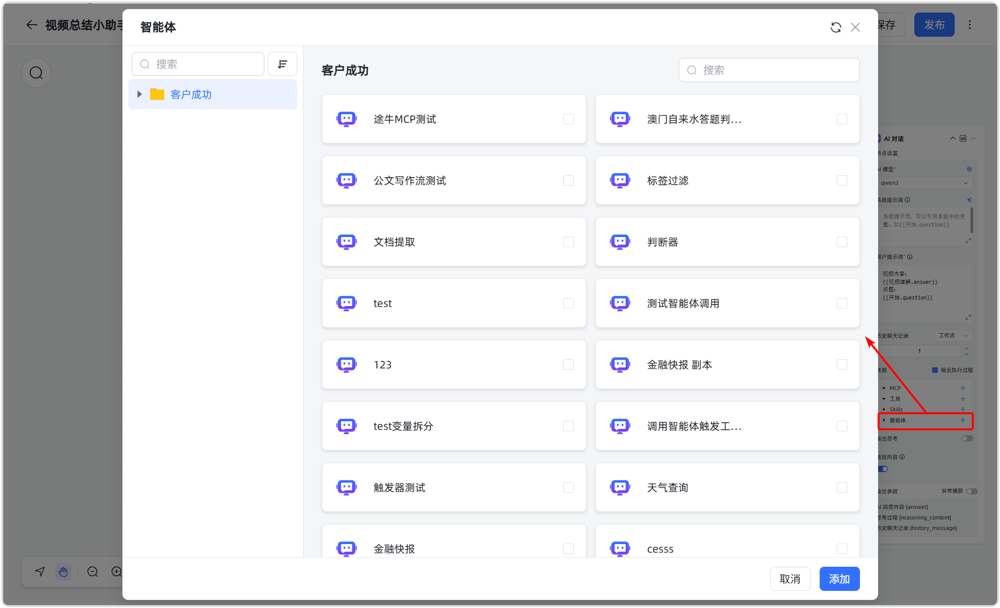


#### 2.1.2 意图识别
!!! Abstract ""
    节点说明：根据输入进行意图的分类识别。
    
     节点设置：
    
    - AI 模型：大语言模型的名称以及参数控制。
    - 输入：待进行意图识别的内容。
    - 历史聊天记录：在当前对话中有关联的历史会话内容。例如，历史聊天记录为 1，表示当前问题以及上一次的对话内容一起输送给大模型。
    - 意图分类：每个意图分类的名称。

    参数输出：
    
    - 分类 {category}：根据意图分类的类型，返回分类名称。 
    - 理由 {reason}：判断意图分类的理由。
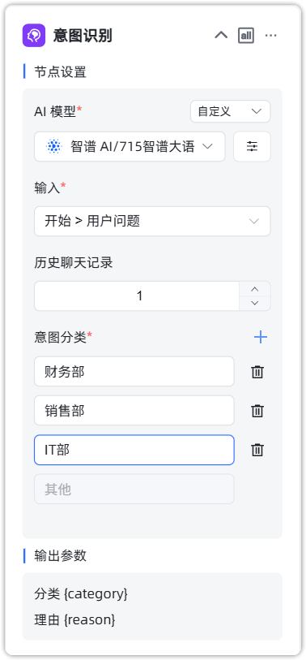{width="300px"}


#### 2.1.3 文本转语音

!!! Abstract ""
    节点说明：将文本转换为音频。

    节点设置：

    - 语音合成模型：选择可用语音合成模型的名称。
    - 文本内容：选择待合成的文本内容。
    - 返回内容：是否在对话中显示该节点返回的内容。


    参数输出：

    - 结果 {result}：将文本转成的音频内容。


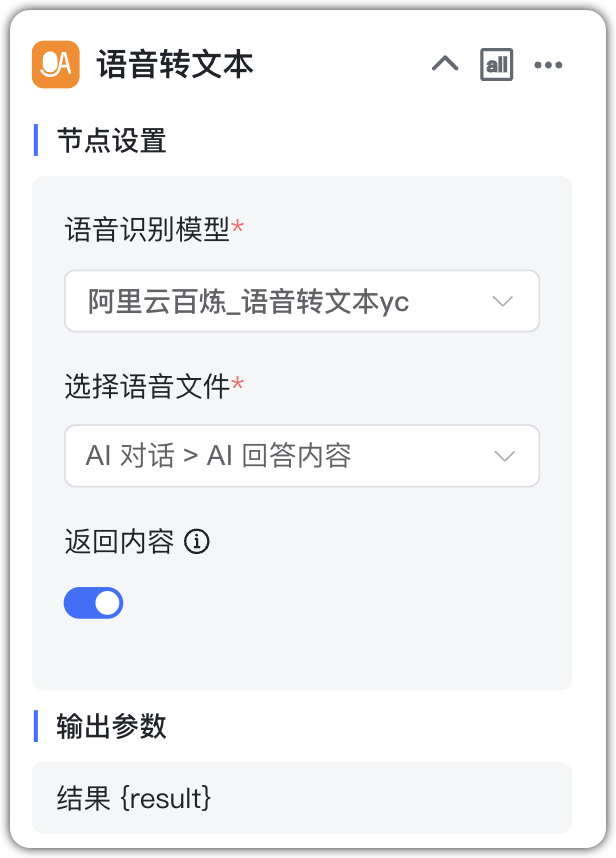{width="300px"}


#### 2.1.4 语音转文本

!!! Abstract ""
    节点说明：将音频文件转换为文本。

    节点设置：

    - 语音识别模型：选择语音识别模型的名称。
    - 语音文件：即上传的音频文件，支持的格式包括：mp3、wav、ogg、acc。
    - 返回内容：是否在对话中显示该节点返回的内容。

    参数输出：

    - 结果 {result}：语音转换后的文本内容。

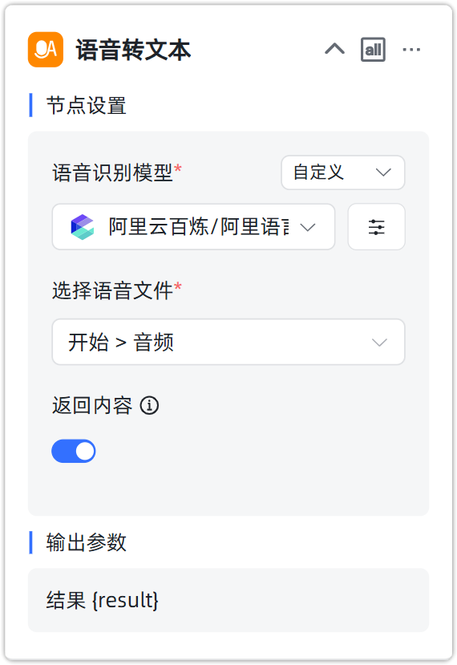{width="300px"}


#### 2.1.5 图片生成

!!! Abstract ""
    节点说明：根据文本描述生成对应的图片。

    节点设置：
    
    - 图片生成模型：图片生成模型名称。
    - 提示词（正向）：引导模型生成积极、建设性输出的文字输入。
    - 提示词（负向）：不应该包含在生成输出中的元素、主题或特征的描述。
    - 返回内容：是否在对话中显示该节点返回的内容。

    参数输出：
    
    - AI 回答内容 {answer}：即图片生成模型根据文本输入生成的图片。
    - 图片 {image}: 生成图片的详细信息。

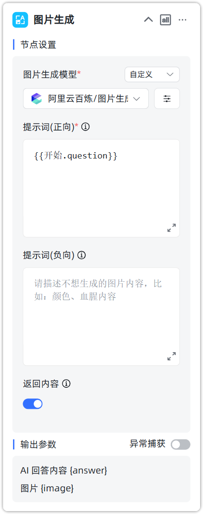{width="300px"}


#### 2.1.6 图片理解

!!! Abstract ""
    节点说明：对用户上传的图片文件进行分析和理解。

    节点设置：

    - 图片理解模型：图片理解模型名称。
    - 角色设定：回答的角色或身份设定。
    - 提示词：引导模型生成特定输出的详细描述。
    - 历史聊天记录：在当前对话中有关联的历史会话内容。
        
        - 选择节点：会使用当前图片理解节点的提示词信息和节点返回的内容作为上下文；
        - 选择工作流：会使用对话框中用户输入的问题和最终回复的内容作为上下文。

    - 选择图片：待理解和分析的图片，可以选择用户上传的图片文件或 URL 地址。
    - 返回内容：是否在对话中显示该节点返回的内容。

    参数输出：

    - AI 回答内容{answer}：根据上传的图片以及角色、提示词等信息图片理解模型返回的内容。

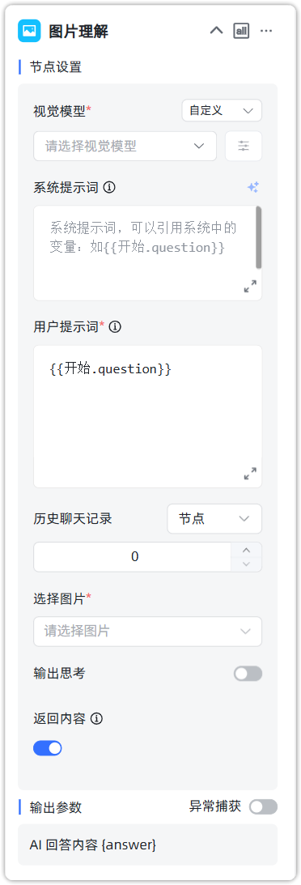{width="300px"}


#### 2.1.7 文生视频

!!! Abstract ""
    节点说明：根据文本描述生成对应的视频。

    节点设置：
    
    - 文生视频模型：选择文生视频模型名称。
    - 提示词（正向）：引导模型生成积极、建设性输出的文字输入。
    - 提示词（负向）：不应该包含在生成输出中的元素、主题或特征的描述。
    - 返回内容：是否在对话中显示该节点返回的内容。

    参数输出：
    
    - 视频 {video}：根据文本生成的视频内容。
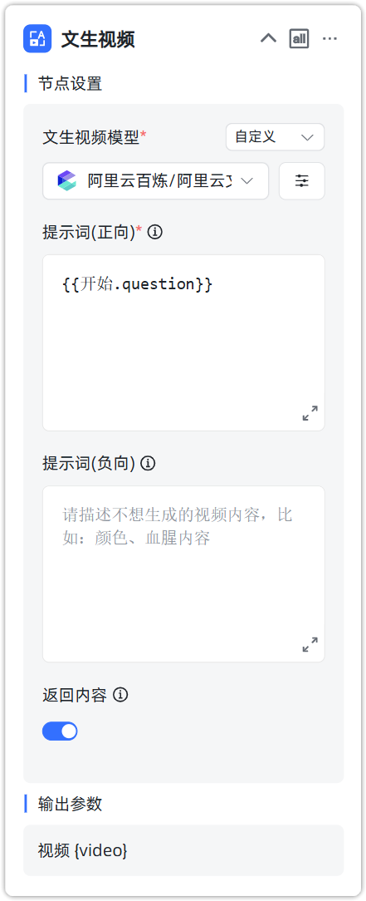{width="300px"}


#### 2.1.8 图生视频

!!! Abstract ""
    节点说明：根据图片生成对应的视频。

    节点设置：
    
    - 图生视频模型：选择图生视频模型名称。
    - 提示词（正向）：引导模型生成积极、建设性输出的文字输入。
    - 提示词（负向）：不应该包含在生成输出中的元素、主题或特征的描述。
    - 首帧图片：必填，待生成视频的图片，可以选择用户上传的图片文件或 URL 地址。
    - 尾帧图片：非必填，图生视频尾帧的图片，可以规范视频的生成 
    - 返回内容：是否在对话中显示该节点返回的内容。

    参数输出：
    
    - 视频 {video}：根据图片生成的视频内容。

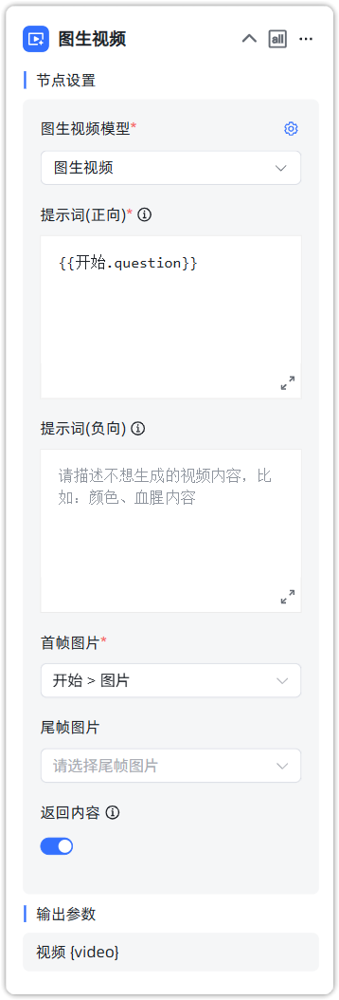{width="300px"}


#### 2.1.9 视频理解

!!! Abstract ""
    节点说明：对用户上传的视频文件进行分析和理解。

    节点设置：

    - 视觉模型：视觉模型名称。
    - 系统提示词：大语言模型回答的角色或身份设定。
    - 用户提示词：引导模型生成特定输出的详细描述。提示词可以引用前置节点的参数输出，如可以引用前置知识库检索的检索结果和开始节点的问题变量。
    - 历史聊天记录：在当前对话中有关联的历史会话内容。
        
        - 选择节点：会使用当前视频理解节点的提示词信息和节点返回的内容作为上下文；
        - 选择工作流：会使用对话框中用户输入的问题和最终回复的内容作为上下文。

    - 选择视频：待理解和分析的视频，可以选择用户上传的视频文件或 URL 地址。
    - 返回内容：是否在对话中显示该节点返回的内容。

    参数输出：

    - AI 回答内容{answer}：根据上传的视频以及角色、提示词等信息视觉模型返回的内容。

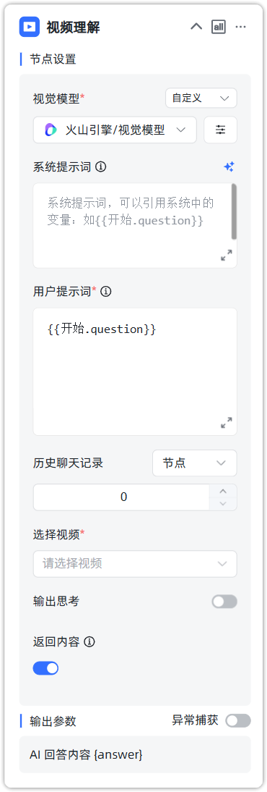{width="300px"}


#### 2.1.10 问题优化

!!! Abstract ""
    节点说明：根据当前会话的历史聊天记录，以及在节点设置的大语言模型和提示词，对当前问题进行智能优化。

    节点设置：

    - AI 模型：大语言模型的名称以及参数控制。
    - 角色设定：大语言模型回答的角色或身份设定。
    - 提示词：引导模型生成特定输出的详细描述。
    - 历史聊天记录：在当前对话中有关联的历史会话内容。例如，历史聊天记录为 1，表示当前问题以及上一次的对话内容一起输送给大模型。
    - 返回内容：是否在对话中显示该节点返回的内容。

    参数输出：

    - 问题优化结果 {answer}：通过大模型优化后的问题。


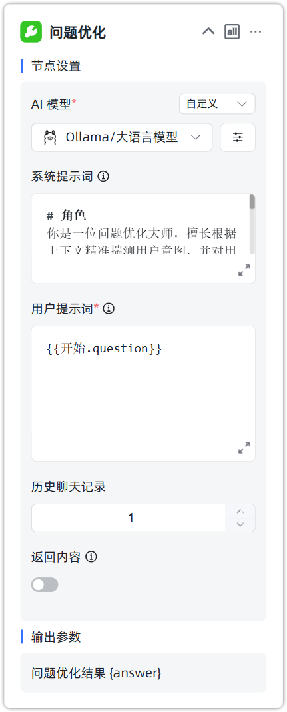{width="300px"}


### 2.2 知识库

#### 2.2.1  知识库检索
  
!!! Abstract "" 
    节点说明：如果智能体需要关联知识库，则需要在编排中添加知识库检索节点，选择知识库、设置检索参数、选择检索的问题。

    节点设置：

    - 检索范围：待检索的知识库或知识库列表范围。
        - 手动：添加关联知识库。
        - 引用变量：选择工作流中已存在的「知识库列表」或「文档列表」变量。
    - 检索参数：包括检索模式、相似度阈值、引用分段数量以及最大引用字符数。
    - 检索问题：一般是开始节点的用户问题。
    - 结果显示在知识来源中：默认关闭，开启后可以在回答结果中显示知识来源。

    参数输出：

    - 检索结果的分段列表 {paragraph_list}：数组类型，指根据检索问题、检索参数进行检索后命中的分段列表，包含了分段的所有属性；       
    - 满足直接回答的分段列表 {is_hit_handling_method_list}：数组类型，指根据检索问题、检索参数进行检索后命中的分段中满足直接回答的所有分段列表，包含了分段的所有属性；       
    - 检索结果 {data}：字符串类型，指根据检索问题、检索参数进行检索后命中的分段内容；       
    - 满足直接回答的分段内容 {directly_return}：字符串类型，指根据检索问题、检索参数进行检索后命中的分段中满足直接回答的所有分段内容。  


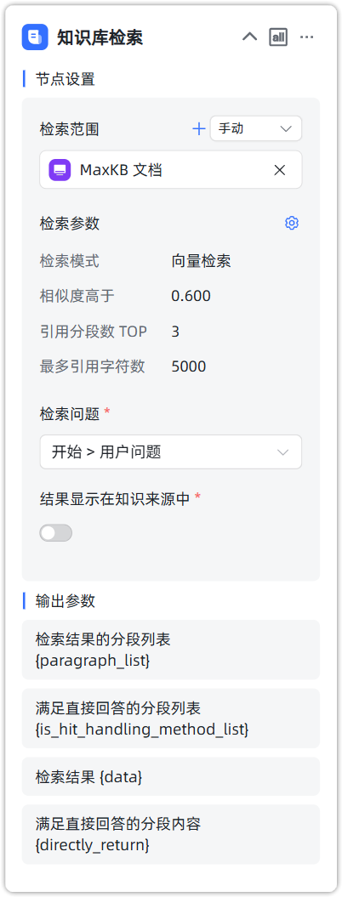{width="300px"}

#### 2.2.2 文档标签检索

!!! Abstract ""
    节点说明：根据设置的文档标签筛选条件检索出符合条件的文档。

    节点设置：
    
    - 检索范围：待检索的知识库或知识库列表范围。
        - 手动：添加关联知识库。
        - 引用变量：选择工作流中已存在的「知识库列表」或「文档列表」变量。
    - 检索设置：
        - 自动：选定检索问题，系统按问题自动匹配文档标签。
        - 手动：添加标签条件作为过滤条件，需添加对应标签内容。

    参数输出：
    
    - 知识库列表 {knowledge_list}：数组类型，指符合标签条件的知识库列表。
    - 文档列表 {document_list}:数组类型，指符合标签条件的文档列表。

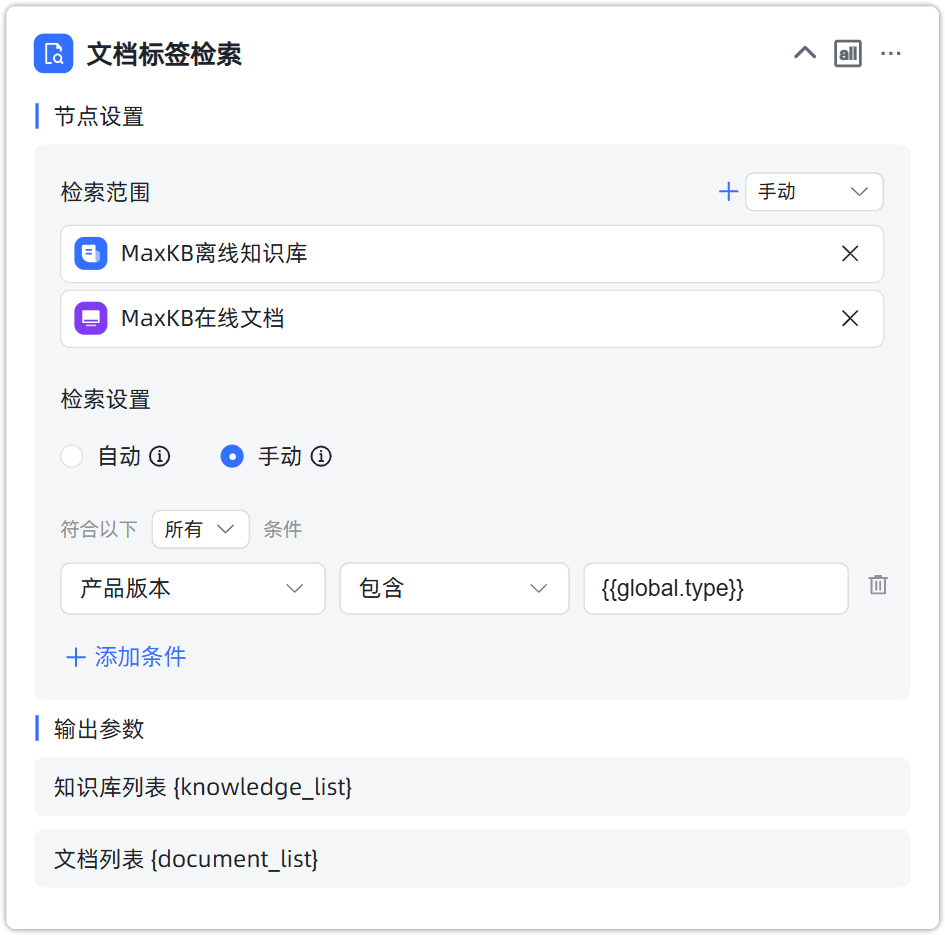{width="500px"}

!!! Abstract ""
    该节点配合【知识库检索】节点进行分段内容检索，进一步缩小检索范围，使检索结果更加准确。

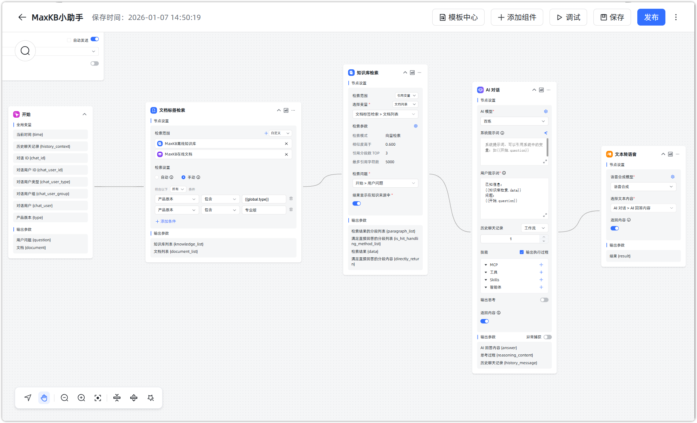

#### 2.2.3 多路召回

!!! Abstract "" 
    节点说明：根据需要重排的内容、检索问题以及检索参数进行多路召回。

    节点设置：

    - 重排内容：待重排的多个内容，一般是多个不同知识库的检索结果。
    - 检索参数：包括 score 阈值、引用分段数以及最大引用字符数。
    - 检索问题：根据检索问题进行重排，一般为用户问题或问题优化后的结果。
    - 重排模型：需要使用的重排模型名称。

    参数输出：

    - 重排结果列表 {result_list}：数组类型，指根据重排后的结果列表。
    - 重排结果 {result}：字符串类型，指根据检索参数后的重排结果。


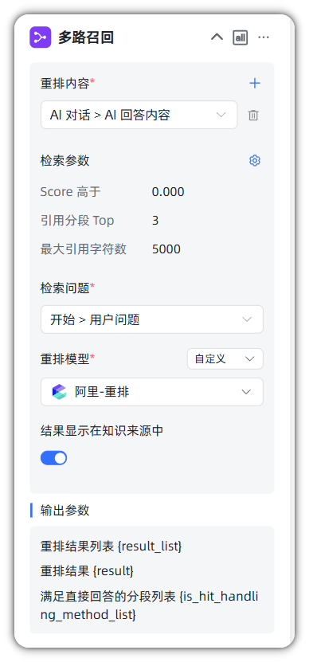{width="300px"}

### 2.3 业务逻辑

#### 2.3.1  判断器

!!! Abstract "" 
    节点说明：根据不同的条件进行逻辑判断，每个判断分支后面必须有后置执行节点。  

    判断器节点输出参数说明：

    - 分支名称{branch_name}：每个判断分支的名称。


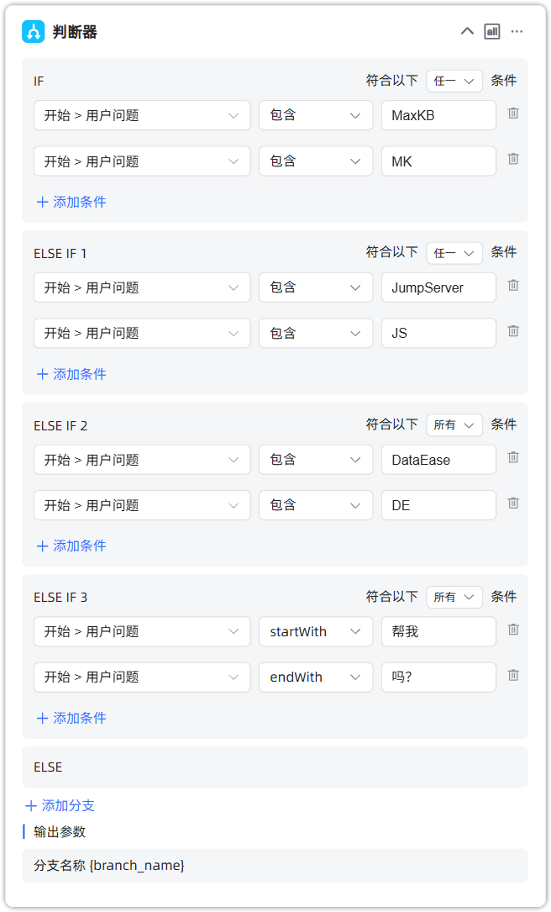{width="450px"}


#### 2.3.2  表单收集

!!! Abstract ""
    节点说明：通过表单的设计，以引导的方式主动获取必要的信息，一般智能体于需要多次询问的应答场景。

    节点设置：

    - 表单输出内容：表单提示说明以及表单内容，可以单项输入，也可以输入多项信息。
    - 表单配置：通过添加不同的组件进行表单的设计。

    参数输出：

    - 表单全部内容{form_data}：表单的全部内容。

    表单全部内容将作为固定的输出，对于各个表单项也都进行参数化输出。

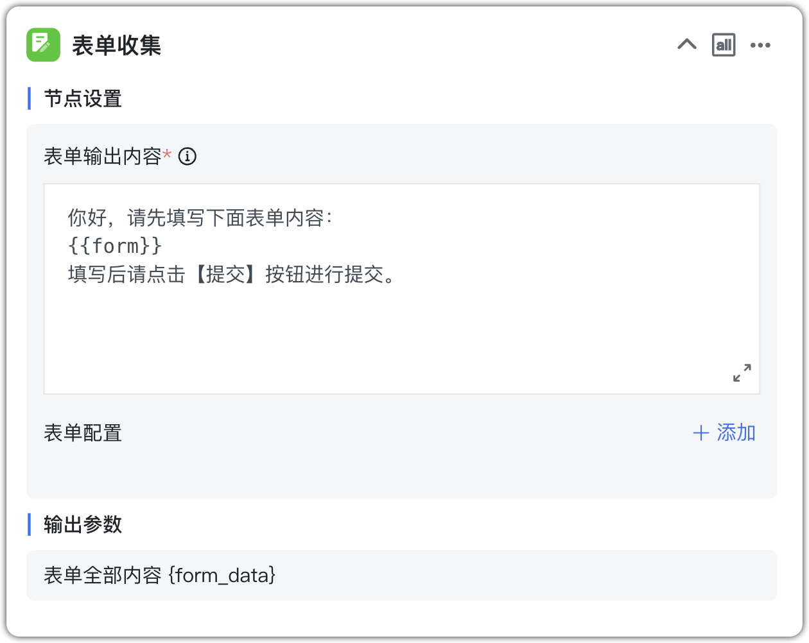{width="500px"}
!!! Abstract ""
    表单添加参数的组件类型支持文本框、多行文本框、JSON 文本框、密码框、单选框、多选框、选项卡、单行选项卡、单行多选卡、滑块、开关、日期和文件上传。

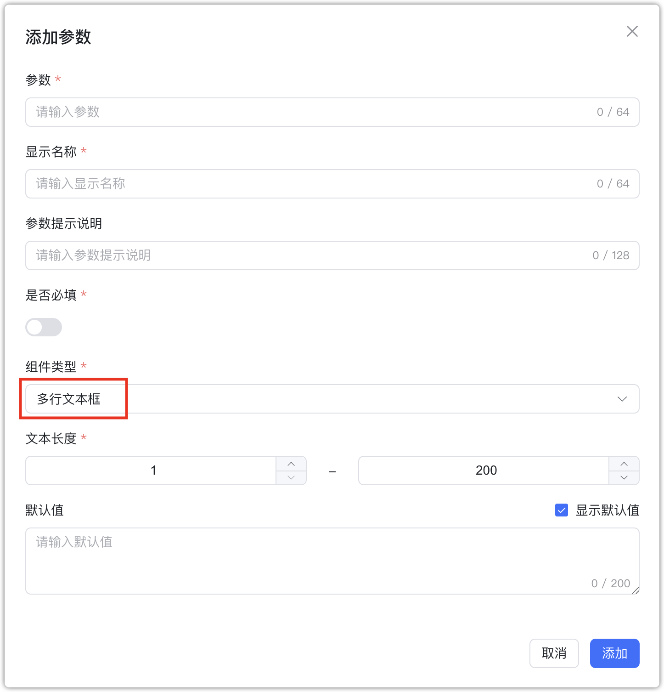{width="500px"}
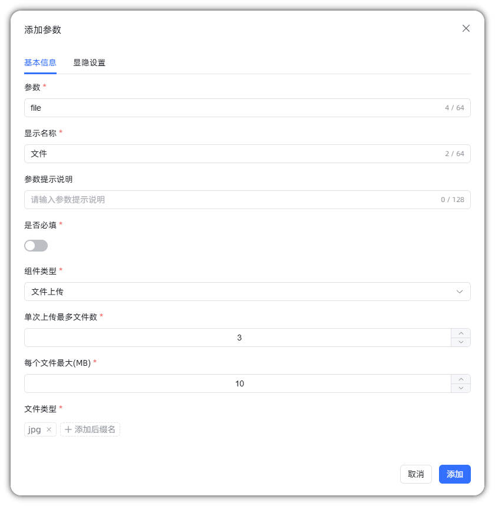{width="500px"}


!!! Abstract ""
    表单参数支持引用变量或参数输入:
    
    * 组件类型为【单选框、多选框、选项卡、单行选项卡、单行多选卡、JSON文本框】时，赋值方式中可选择自定义或引用变量，默认为：自定义。引用变量的格式可参考【引用变量】旁的提示信息。

[//]: # (![表单参数]&#40;../../img/app/form_parameters.png&#41;)
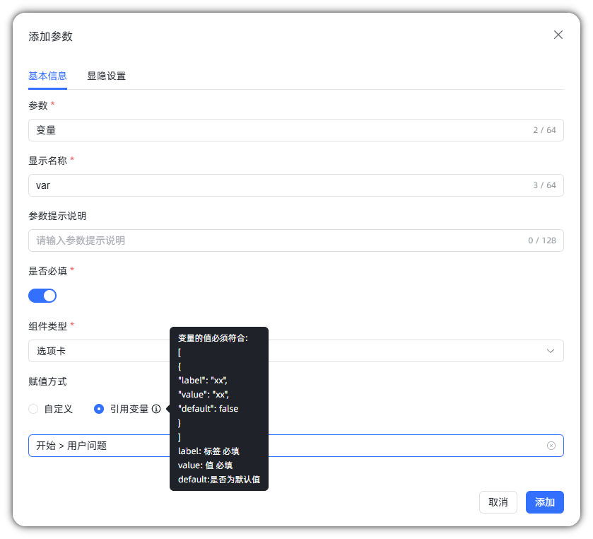{width="500px"}

!!! Abstract ""
    
    * 【文本框、多行文本框、密码框】组件的默认值支持参数输入。参数格式参考：{{开始.question}}

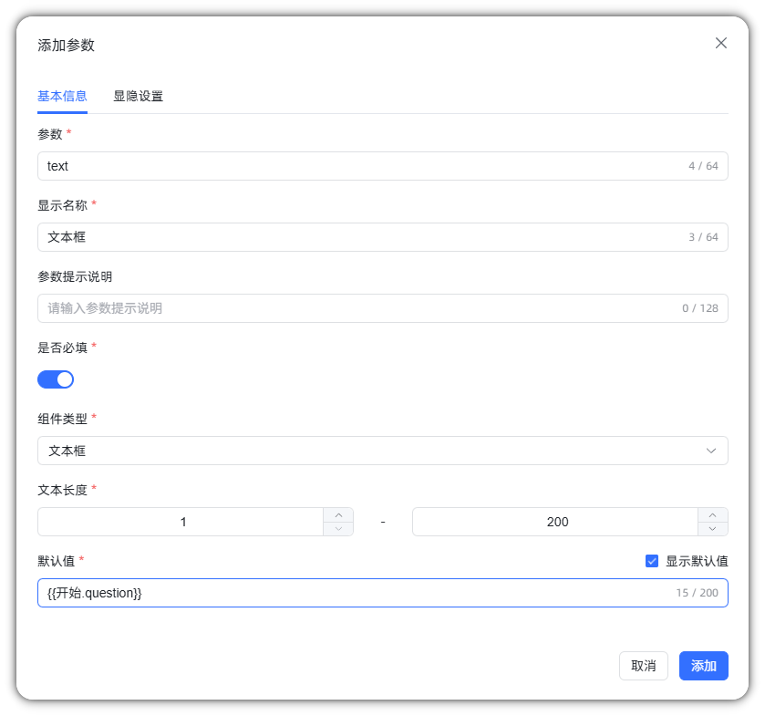{width="500px"}


#### 2.3.3  指定回复

!!! Abstract ""
    节点说明：指定输出文本内容，在知识库查询到的相关内容满足直接回答的要求，可以输出检索内容，也可以在知识库没有查询到关联内容时，指定回复内容。

    输出参数：   

    * 内容{answer}： 指定回复输出的内容。

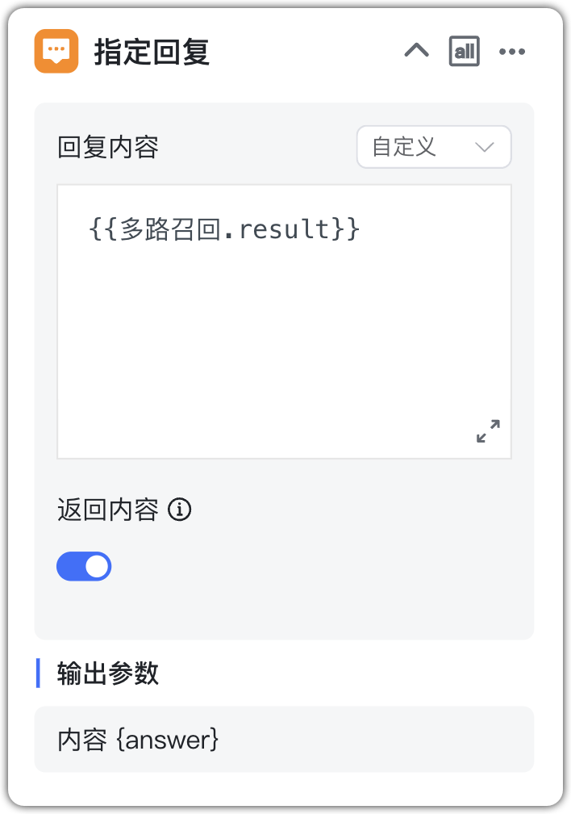{width="300px"}

#### 2.3.4 循环节点
!!! Abstract ""
    节点说明：通过设置循环类型和循环体，在满足特定条件前重复执行任务序列。添加循环节点后，会生成一个循环节点和对应的循环体画布。

    循环类型：循环类型是循环节点的运行模式，支持设置为数组循环、指定次数循环和无限循环。

    * 数组循环：基于数组数据驱动循环，支持遍历数组中的每一项元素，依次执行任务，适用于“按数据量批量处理”的使用场景；
        * 循环数组：选择待进行循环的数组内容。
    * 指定次数循环：按预设固定次数执行循环，用户可以直接设置任务重复运行的具体次数（如循环 5 次、10 次），可以满足“明确次数的重复操作”的使用需求；
        * 循环次数：设置循环次数，如果小于 1，则设置为 1。
    * 无限循环：无固定终止条件，任务将持续重复执行，直至满足停止条件时终止，默认最大循环 500 次，适用于“需长期运行，并等待特定事件触发”的使用场景。
    
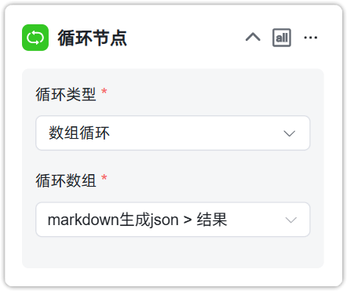{width="300px"}
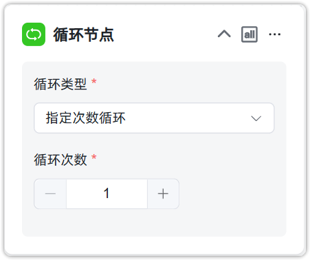{width="300px"}
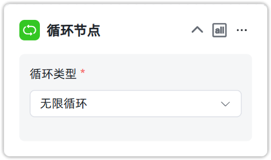{width="300px"}

!!! Abstract ""
    输出参数：在循环体中【循环开始】设置的循环变量，可以作为循环节点的输出参数，供各工作流节点调用。
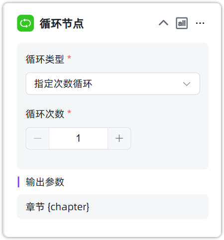{width="300px"}

!!! Abstract ""
    循环体：循环体画布用于编排循环的逻辑，每次循环时，工作流会执行循环体画布中的工作流。
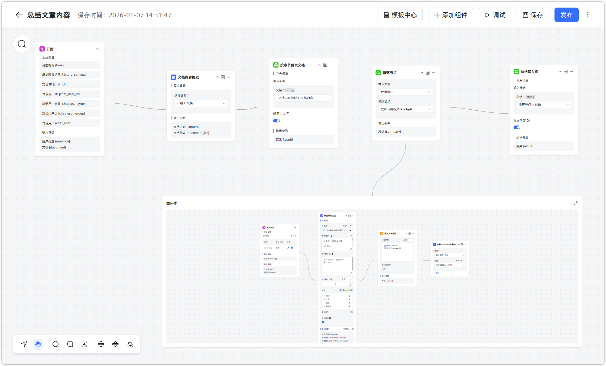

!!! Abstract ""
    **循环开始**：作为循环执行的起点，循环体中所有后续节点均从此节点开始流转。
    
    节点设置：
    
    * 循环变量：循环体中支持设置循环变量，该变量可作用于每一次循环。循环变量通常与变量赋值搭配使用，在每次循环结束后为中间变量设置一个新的值，并在下次循环中使用新的值。循环变量可以作为循环节点的输出参数，供循环体外工作流的节点调用。
    

    循环变量：【节点设置】中添加的循环变量，支持在循环体中引用。
    
    输出参数：

    * 下标{index}：数组中元素的位置。索引从 0 开始计数，表示第一次循环，1 表示第二次循环，2 表示第三次循环，以此类推。最后一次循环的索引为 n-1，其中 n 为循环次数。
    * 循环元素{item}：数组中的单个数据。数组由多个元素组成，每个元素可以是数字、字符、字符串等数据类型。
        
            例如：数组 array=[23,26,37,88,90]，array[0]的 index 是 0，item 为 23； array[4]的 index 是 4，item 为 90。
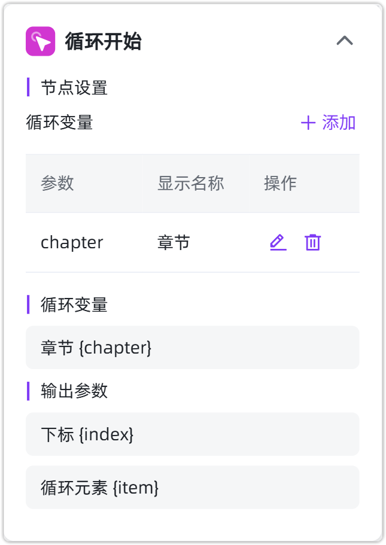{width="300px"}

!!! Abstract ""
    **Continue**：用于终止当前循环，执行下次循环。
    
    添加条件：添加终止当前循环的条件，当满足条件时，终止当前循环，执行下次的循环。

    **注意**：Continue 不能作为结束节点。

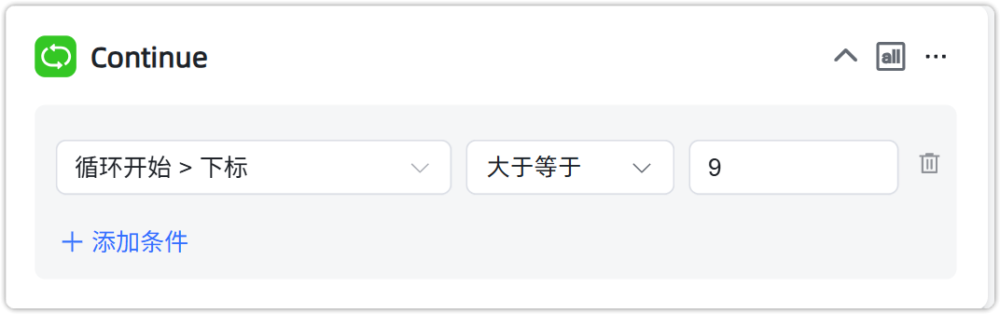{width="500px"}

!!! Abstract ""
    **Break**：终止当前循环，跳出循环体.

    添加条件：添加终止当前循环的条件，当满足条件时，终止当前循环，跳出循环体，继续工作流。

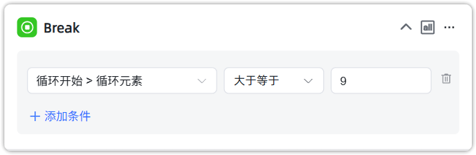{width="500px"}


!!! Abstract ""
    **注意**：
    
    - 循环体内不支持添加循环节点，避免造成死循环；
    - 循环类型为无限循环时，默认最大循环 1000 次，如需修改配置参数，则需要在 ${MAXKB_BASE}/maxkb/.env（默认是 /opt/maxkb/.env）文件中进行修改，并且在修改完后需执行 `mkctl reload` 命令重新加载配置文件。

### 2.4 数据处理

#### 2.4.1 变量赋值

!!! Abstract ""
    节点说明：更新全局变量的值。

    变量：待赋值的目标全局变量。

    赋值：给变量赋值的相关内容，可引用变量或自定义。

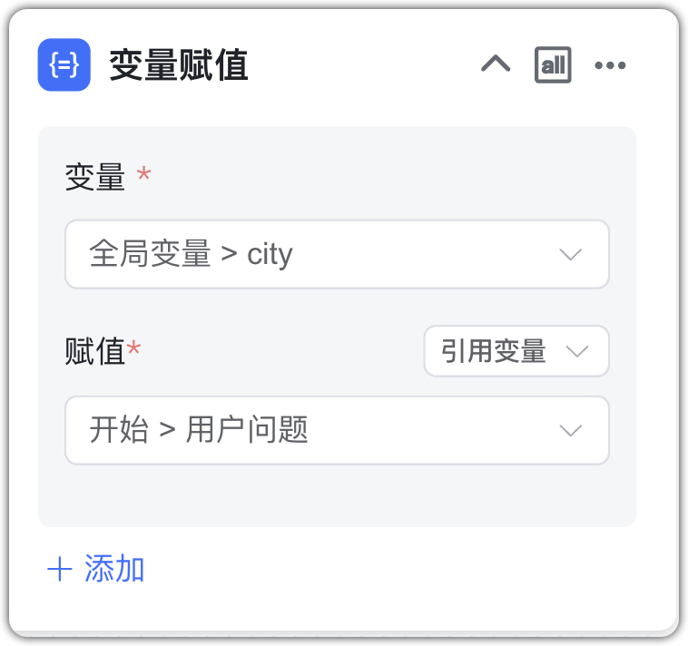{width="300px"}


#### 2.4.2 变量聚合

!!! Abstract ""
    节点说明：将多个变量整合为一个参数进行输出。
    
    节点设置：
    
    * 聚合策略：
        * 返回每组的第一个非空值：取每组首个非空项作为该组结果，其余舍弃。
        * 返回每组变量的数组（Array）：将同组内所有变量按字段名组装，保留完整结构输出。
        * 返回每组变量的字典（Dict）：将同组内所以变量按字典类型组装，需输入 Key 值。
    * 分组：添加需要聚合为同个参数的变量，可修改分组名称，可添加多个分组。
     
    输出参数：

    * 显示名称{变量}：聚合后的参数名称，随聚合变量更新。

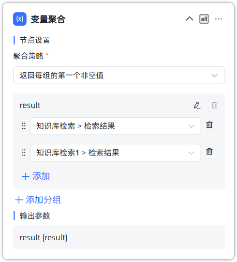{width="500px"}

!!! Abstract ""
    变量聚合的主要功能是将多个变量整合为一个参数进行输出，能减少流程中变量传递的复杂度。

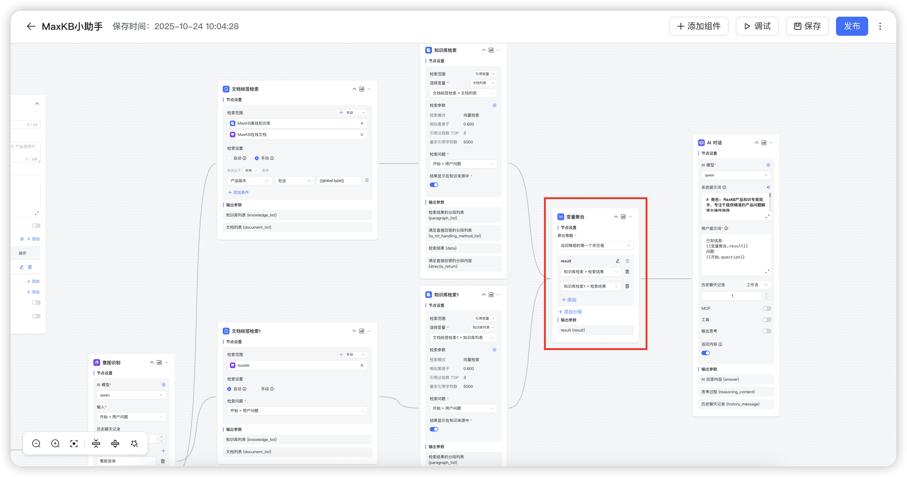


#### 2.4.3 变量拆分

!!! Abstract ""
    节点说明：用 JSON Path 表达式把输入的 JSON 变量一次拆成多个独立变量。

    节点设置：

    * 输入变量：选择工作流中待拆分的 JSON 变量。
    * 拆分变量：设置拆分后的变量名称、显示名称以及 JSON Path 表达式。JSON Path 表达式参考格式：`$.store.book `。
    
    输出参数：

    * 结果{result}：输出所有拆分变量的内容。
    * 显示名称{拆分变量}：单个拆分变量的内容，随拆分变量更新。

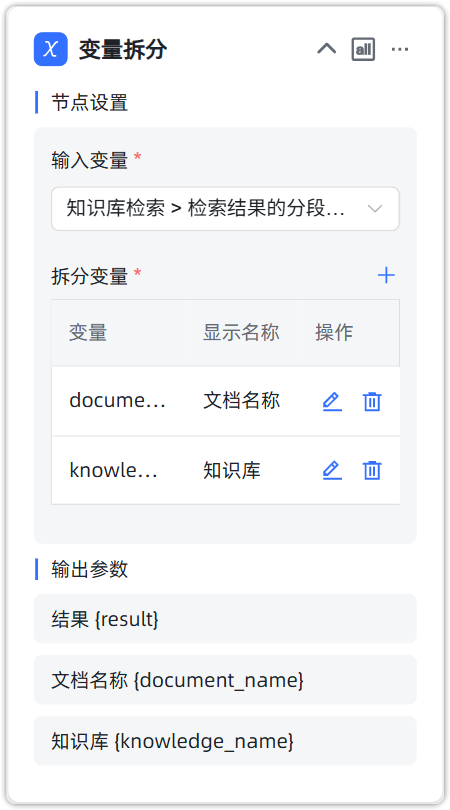{width="300px"}
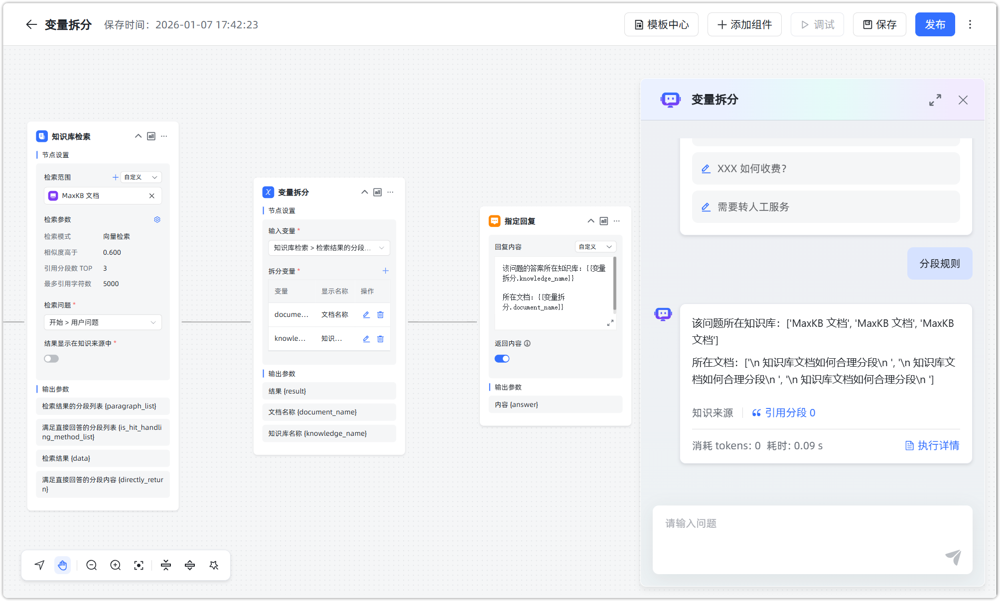


#### 2.4.4 参数提取

!!! Abstract ""
    节点说明：从非结构化文本或半结构化文本中提取结构化参数。

    节点设置：

    * AI 模型：大语言模型，用于提取结构化参数。
    * 输入变量：结构化文本或非结构化文本。
    * 提取参数：设置提取参数、显示名称、参数类型以及描述。
    
    输出参数：

    * 结果{result}：输出所有提取参数的内容。
    * 提取参数{参数名}：单个提取参数的内容，随提取参数更新。

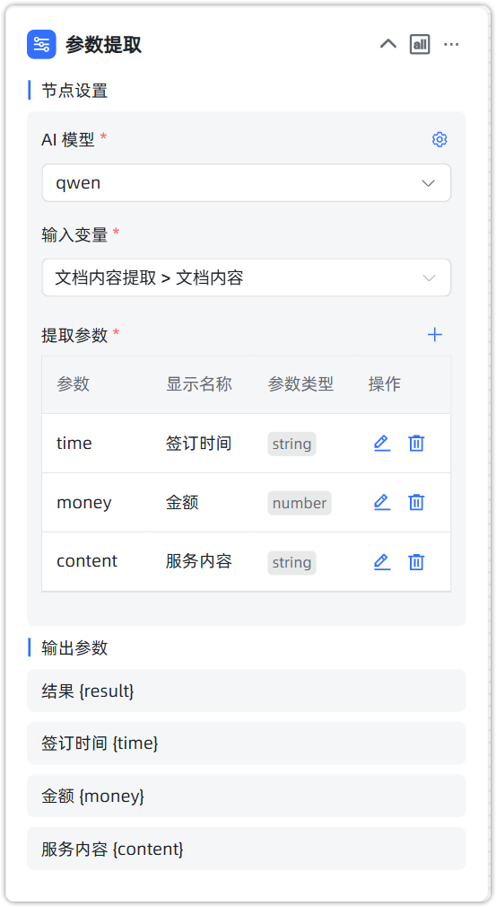{width="300px"}

!!! Abstract ""
    参数提取主要利用 AI 模型，从非结构化文本或半结构化文本中提取结构化参数。使用场景如处理合同文档时，可使用该自动提取 “签订日期”、“合同金额”、”服务内容“ 等关键参数。

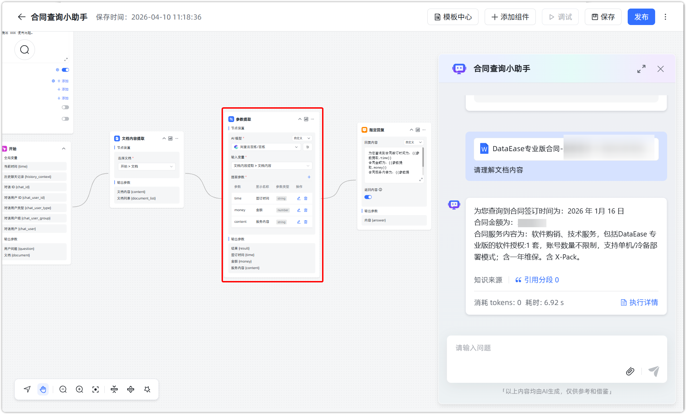

### 2.5 其他

#### 2.5.1 MCP 调用

!!! Abstract "" 
    节点说明：通过 SSE/Streamable_HTTP 协议调用 MCP 服务中的工具。

    节点设置：

    - MCP Server Config：支持引用 MCP，也支持自定义 MCP 服务（使用 JSON 格式填写 MCP Server 配置参数）。
    - 工具：对应 MCP Server下的工具列表。

    工具参数：MCP 工具对应的请求参数，可自定义，也可引用变量。

    参数输出：

    - 结果 {result}：MCP 工具执行返回结果。


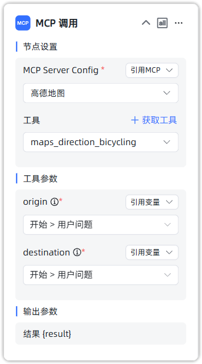{width="300px"}

!!! Abstract ""
    ```
    MCP Server Config 格式参考如下
    {
        "amap-maps": {
          "url": "http://IP:端口/MCPserver名称",
          "transport":"sse"               # 如果使用 Streamable_HTTP 协议，需将"sse"替换成"streamable_http"
        }
    }
    ```

#### 2.5.2 文档内容提取

!!! Abstract ""
    节点说明：对用户上传的文档进行内容总结。

    节点设置：

    - 选择文档：即用户上传的文档，需要在基本信息节点开启对文件上传的支持。

    参数输出：
    
    - 文档输出 {content}：对用户上传文件进行的总结输出。

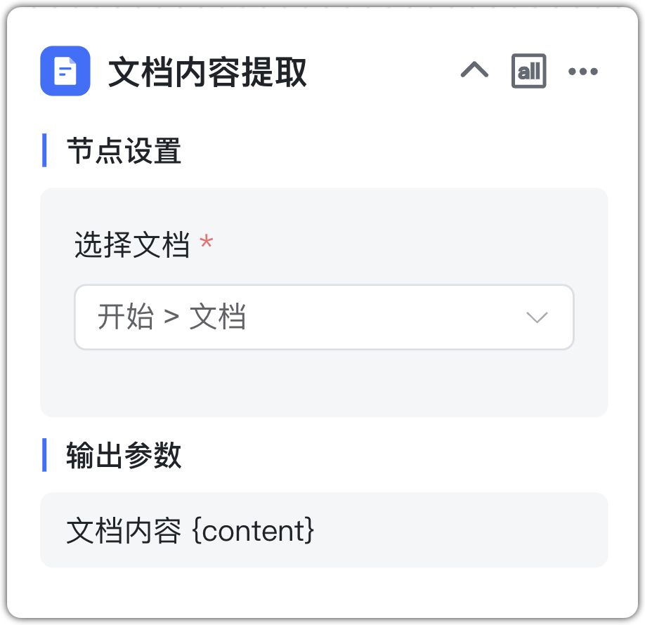{width="300px"}

#### 2.5.3 自定义工具
!!! Abstract ""
    在高级编排流程中，编写 Python 代码和添加参数创建工具数作为流程中的一个处理节点，以灵活处理复杂需求，函数详细说明见：[工具](../tool/tool)。

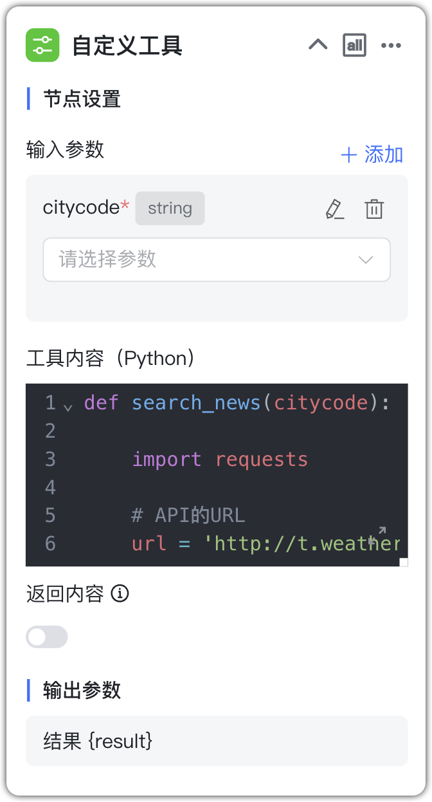{width="300px"}


### 2.6 工具
!!! Abstract ""
    在高级编排流程中，可以添加工具中的一个处理节点，以灵活处理复杂需求，函数详细说明见：[工具](../tool/tool)。

    节点设置：即工具的输入参数。

    参数输出：即工具的返回结果。

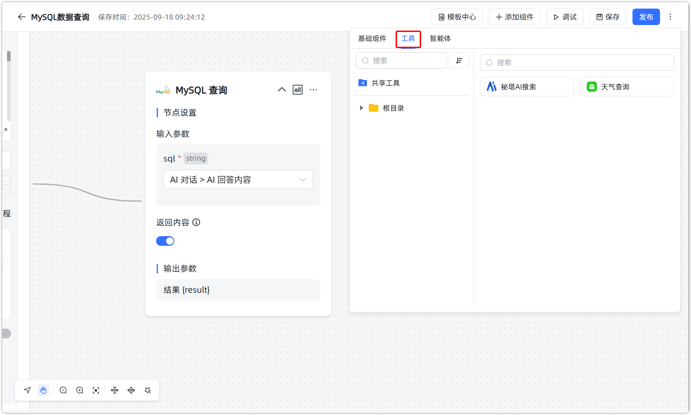

### 2.7 智能体

!!! Abstract "" 
    在高级编排流程中，可以添加其它智能体（简单配置智能体和流程编排智能体）作为流程中的一个处理节点，直接快速利用子智能体的问答结果。

    节点设置：

    - 用户问题：对子智能体的提问信息。
    - 返回内容：开启后在对话过程中将子智能体的返回结果。

    参数输出：
    
    - 结果：即子智能体的返回结果。

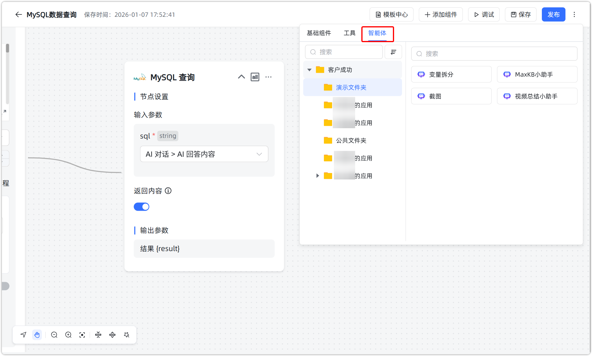

## 3 其它说明

### 3.1 执行条件

!!! Abstract ""
    MaxKB 工作流中支持多出多进，在这个情况下，汇集节点可以根据与前置节点的逻辑关系，选择执行条件。

    - 所有：需要等所有前置连线节点全部执行完成后，才可执行当前节点。
    - 任一：任一前置连线节点执行完成后，即可执行当前节点。

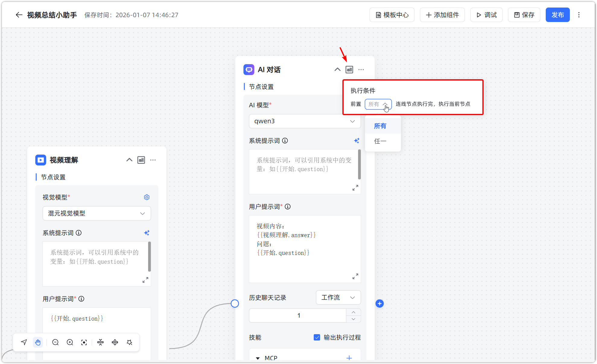

### 3.2 调试

!!! Abstract ""
    完成所有的编排设计后，可点击【调试】后，先校验流程是否合规，校验通过后可在当前页面进行对话测试。

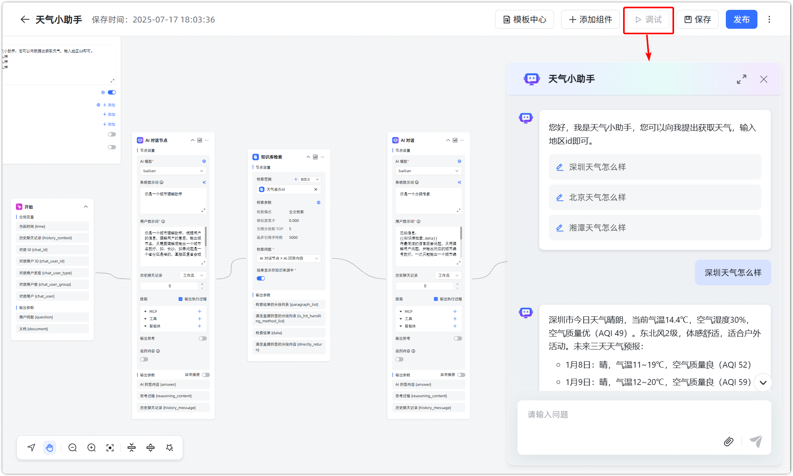

!!! Abstract ""
    在调试对话框中进行提问，AI 回答完成后，会显示【执行详情】，点击【执行详情】后，在弹出执行详情对话框中可以查看每个流程节点的执行状态、耗时以及其它执行信息。

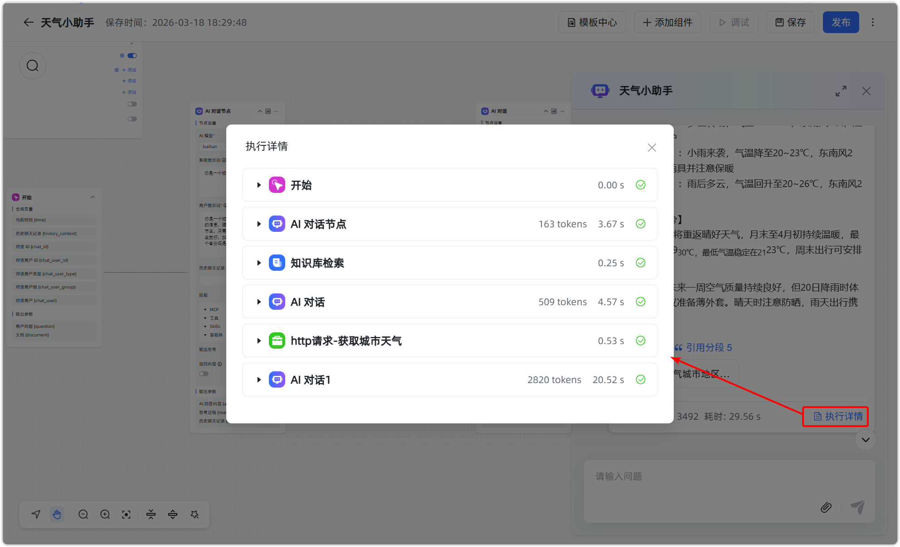

### 3.3 发布历史

!!! Abstract ""
    智能体高级编排中，支持查看发布历史版本的工作流、时间和用户。

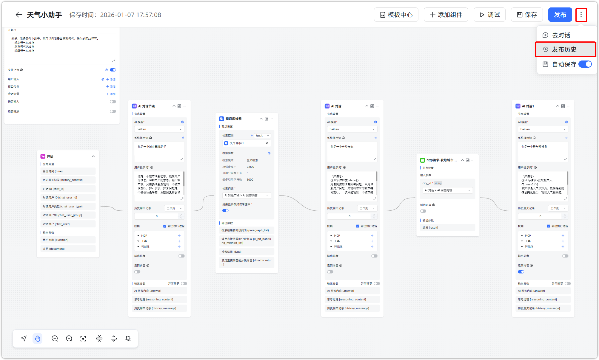

!!! Abstract ""
    智能体支持编辑历史发布版本的名称，默认发布名称为发布的时间，同时支持恢复历史版本的工作流。
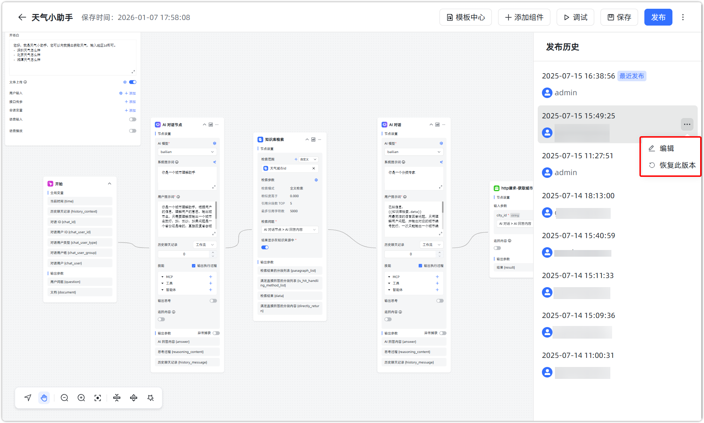


### 3.4 自动保存

!!! Abstract ""
    高级编排流程默认手动保存，也可设置自动保存，开启自动保存后将每隔 1 分钟保存到本地，并在发布成功后将配置同步到后台数据库。


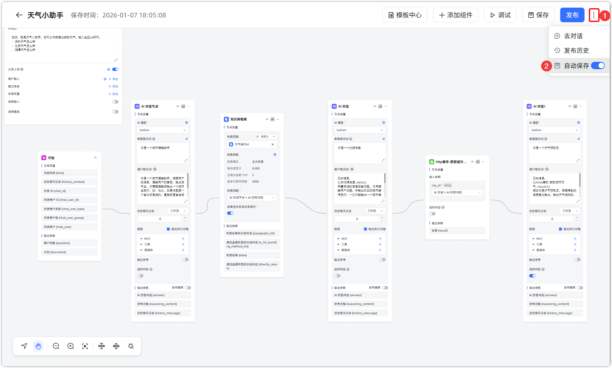

### 3.5 发布

!!! Abstract ""    
    点击【发布】后会先校验当前工作流是否符合规则，如果合规将成功发布，否则发布失败。发布成功后，所有节点配置修改才在问答页面中生效。

    可以点击【去对话】进行 AI 问答，也可以查看发布历史并进行版本恢复。
