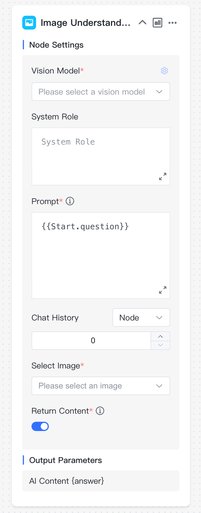
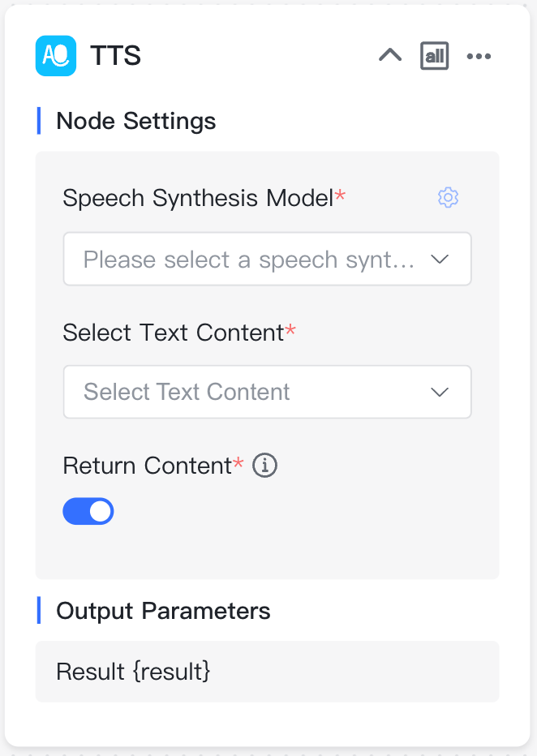
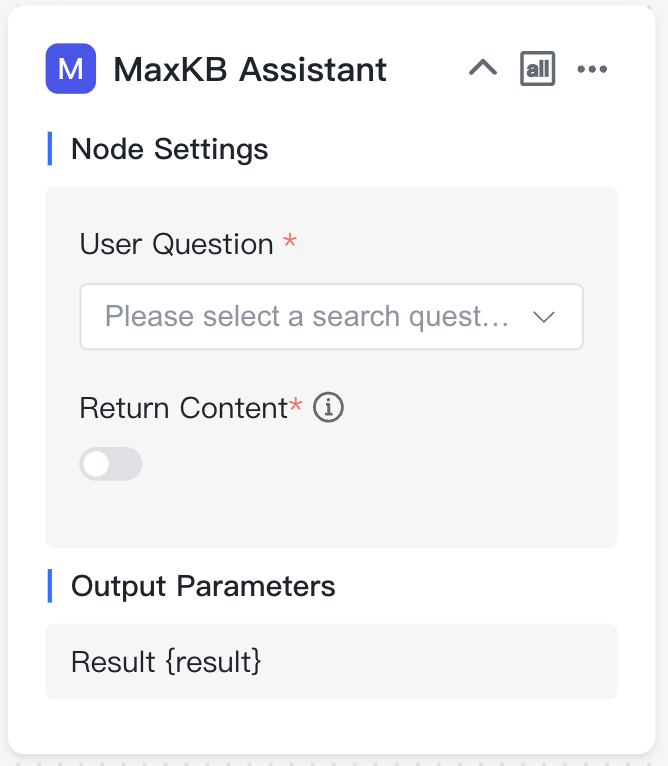
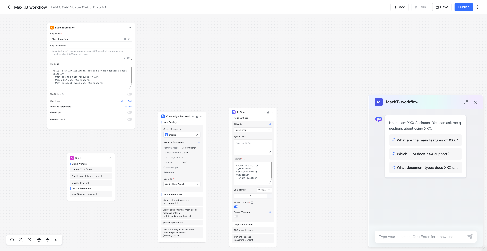

# Workflow Application

!!! Abstract ""
    Click Create App, enter the application name, select WORKFLOW type, and click Create button  to design the workflow.

!!! Abstract ""
    A newly created workflow application will generate a default workflow, which can be customized according to your needs. Click publish to make it effective. 

    **Note:**

    - Nodes on the canvas must be part of the workflow, isolated nodes outside the process are not allowed, otherwise validation will fail during publishing. 
    - Each node can be renamed according to its purpose by double-clicking the node name, but node names cannot be duplicated within the same workflow orchestration. 
    - The subsequent nodes in connections can reference output parameters from preceding nodes. If a node name changes, variables need to be re-copied. The parameter reference format is `{{node_name.variable_name}}`.

!!! Abstract ""
    After completing the workflow design, use the canvas control bar at the bottom left to make overall adjustments to the canvas, including canvas zooming, node collapse, and one-click process optimization.

## 1 Basic Components

!!! Abstract ""
    Every workflow has two initial nodes - Basic and Start:

    * Basic: The node for setting basic application information such as application name, description, opening statement, etc. Each application can only have one Basic Information node, which cannot be deleted or copied.
    * Start: The beginning of the workflow. Each application can only have one Start node, which cannot be deleted or copied.

!!! Abstract ""
    Click Add Component button in the upper right corner to click or drag components onto the canvas for workflow. Here are the purposes of each component:

    * AI Chat: Node for conversing with AI large models.
    * Image Understanding: Recognizes and understands information contained in images.
    * Image Generation: Generates images based on provided text content.
    * Knowledge Retrieval: Node that connects to knowledge bases and retrieves relevant segments for questions.
    * Multi-path Recall: Uses reranking models to perform secondary recall on search results from multiple knowledge bases.
    * Condition Branch: Executes different nodes based on different conditions.
    * Specified Reply: Directly specifies reply content.
    * Form Collection: Collects necessary Q&A information through forms.
    * Question Optimization: A type of AI chat with default roles and prompts to optimize questions based on context.
    * Document Content Extraction: Extracts content from documents.
    * Speech2Text: Converts audio to text through speech recognition model.
    * TTS: Converts text to audio through speech synthesis model.

### 1.1 Basic Information

!!! Abstract ""
    Node description: The starting node of the workflow, which is unique and cannot be deleted or copied. Questions input on the Q&A page will be used as this node's output parameter {question}. Subsequent nodes can reference it by copying the output parameter or selecting the variable: `Start -> User Question`.

{width="500px"}

!!! Abstract ""
    - File Upload: When enabled, the application will support uploading documents, images, and audio files during conversations, which can be parsed in subsequent nodes.
{width="500px"}

!!! Abstract ""
    - User Input: Essential information that needs to be provided on the user side at the start of a conversation, such as job roles, to allow subsequent processes to be designed differently based on different inputs.

{width="600px"}

!!! Abstract ""
    - Parameters: Configurable parameters when accessing the application through public access links. After adding interface parameters, they will automatically be added to the public access URL for integration with third-party systems.
    - Voice Input: When enabled, questions can be input via voice, requiring a speech recognition model.
    - Voice Playback: When enabled, answers will be played back as voice, using either the browser's built-in playback or a voice synthesis model.

### 1.2 Start

!!! Abstract ""
    Global Variables:

    - Current Time {time}: The time of the current conversation.
    - Historical Chat records {history_context}: History of the conversation.
    - Chat ID {chat_id}: Conversation identifier.

!!! Abstract ""
    Parameter Outputs:

    - User Question {question}: Question information input from the client.
    - Documents {document}: Documents uploaded by the client.
    - Image {image}: Image files uploaded by the client.
    - Audio {audio}: Audio files uploaded by the client.

### 1.3 AI Chat

!!! Abstract ""
    Node description: If the application needs to converse with AI large models, an AI Chat component needs to be added to the orchestration. Select the AI model and set prompts, which can reference parameter outputs from preceding nodes, such as search results from a preceding knowledge base retrieval and the question variable from the start node.

!!! Abstract ""
    Node Settings:

    - AI Model: Name and parameter controls of the large language model.
    - Role Settings: Role or identity setting for the large language model's responses.
    - Prompts: Detailed descriptions to guide the model to generate specific outputs.
    - Historical chat records: Related historical conversation content in the current dialogue. For example, a chat history of 1 means the current question and the previous conversation content are sent to the large model together.
    - Return Content: Whether to display this node's returned content in the conversation.

!!! Abstract ""
    Parameter Outputs:

    - AI Answer Content {answer}: Content returned by the large language model based on role, prompts, and other content.

### 1.4 Image Understanding

!!! Abstract ""
    Node description: Analyzes and understands image files uploaded by users.

!!! Abstract ""
    Node Settings:

    - Vision Model: Name of the image understanding model.
    - Role Settings: Role or identity setting for responses.
    - Prompts: Detailed descriptions to guide the model to generate specific outputs.
    - Historical chat records: Historical conversation content.
    - Select Image: Image to be understood and analyzed, defaults to the currently uploaded image file.
    - Return Content: Whether to display this node's returned content in the conversation.

!!! Abstract ""
    Parameter Outputs:

    - AI Answer Content {answer}: Content returned by the image understanding model based on the uploaded image, role, prompts, and other information.

### 1.5 Image Generation

!!! Abstract ""
    Node description: Generates corresponding images based on text descriptions.
{width="300px"}

!!! Abstract ""
    Node Settings:

    - Image Generation Model: Name of the image generation model.
    - Positive Prompt : Text input guiding the model to generate positive, constructive outputs.
    - Negative Prompt: Description of elements, themes, or features that should not be included in the generated output.
    - Return Content: Whether to display this node's returned content in the conversation.

!!! Abstract ""
    Parameter Outputs:

    - AI Answer Content {answer}: The image generated by the image generation model based on text input.
    - Image {image}: Detailed information about the generated image.

### 1.6 Knowledge  Retrieval

!!! Abstract ""
    Node description: If the application needs to connect to a knowledge base, a knowledge base retrieval node needs to be added to the orchestration. Select the knowledge base, set retrieval parameters, and select the retrieval question.

!!! Abstract ""
    Node Settings:

    - Knowledge: The knowledge base to be searched.
    - Retrieval Parameters: Including retrieval mode, similarity threshold, number of quoted segments, and maximum quoted characters.
    - Retrieval Question: Generally the user question from the start node.

!!! Abstract ""
    Parameter Outputs:

    - Retrieved Segments {paragraph_list}: Array type, indicates the list of segments hit after retrieval based on the retrieval question and parameters, including all attributes of the segments.
    - Segments that meet direct answer requirements {is_hit_handling_method_list}: Array type, indicates all segments suitable for direct answers from the retrieved segments, including all segment attributes.
    - Retrieval Results {data}: String type, indicates the content of segments hit after retrieval based on the retrieval question and parameters.
    - Direct Answer Segment Content {directly_return}: String type, indicates all segment content suitable for direct answers from the retrieved segments.

### 1.7 Multi-Path Recall

!!! Abstract ""
    Node description: Performs multi-Path recall based on content to be reranked, retrieval questions, and retrieval parameters.

!!! Abstract ""
    Node Settings:

    - Rerank Content: Multiple contents to be reranked, generally search results from different knowledge bases.
    - Retrieval Parameters: Including score threshold, number of quoted segments, and maximum quoted characters.
    - Retrieval Question: Question for reranking, generally the user question or optimized question.
    - Rerank Model: Name of the reranking model to be used.

!!! Abstract ""
    Parameter Outputs:

    - Reranked Result List {result_list}: Array type, indicates the list of results after reranking.
    - Reranked Result {result}: String type, indicates the reranking result based on retrieval parameters.

### 1.8 Conditional Branch

!!! Abstract ""
    Node description: Performs logical judgments based on different conditions. Each judgment branch must have subsequent execution nodes.

!!! Abstract ""
    Conditional  Branch Node Output Parameters:

    - Branch Name {branch_name}: Name of each judgment branch.

### 1.9 Specified Reply

!!! Abstract ""
    Node description: Specifies output text content. When related content found in the knowledge base meets direct answer requirements, it can output the retrieved content, or specify reply content when no related content is found in the knowledge base.

!!! Abstract ""
    Specified Reply Node Output Parameters:

    * Content {answer}: Content output by the specified reply.

### 1.10 Form Collection

!!! Abstract ""
    Node description: Actively obtains necessary information through form design in a guided way, generally applied to Q&A scenarios requiring multiple inquiries.

!!! Abstract ""
    Node Settings:

    - Form Output Content: Form prompts and content, can be single or multiple input items.
    - Form Configuration: Design forms by adding different components.

!!! Abstract ""
    Parameter Outputs:

    - Form Content {form_data}: All form content.

    The complete form content will be output as fixed, and each form item will also be parameterized for output.

### 1.11 Question Optimization

!!! Abstract ""
    Node description: Intelligently optimizes the current question based on the chat history of the current session and the large language model and prompts set in the node.

!!! Abstract ""
    Node Settings:

    - AI Model: Name and parameter controls of the large language model.
    - Role Setting: Role or identity setting for the large language model's responses.
    - Prompt: Detailed descriptions to guide the model to generate specific outputs.
    - Historical Chat records: Related historical conversation content in the current dialogue. For example, a chat history of 1 means the current question and the previous conversation content are sent to the large model together.
    - Return Content: Whether to display this node's returned content in the conversation.

!!! Abstract ""
    Parameter Outputs:

    - Question Optimization Result {answer}: The optimized question through the large model.

### 1.12 Document Content Extraction

!!! Abstract ""
    Node description: Summarizes content from user-uploaded documents.

!!! Abstract ""
    Node Settings:

    - Select Document: The user uploaded document, requires file upload support to be enabled in the Basic node.

!!! Abstract ""
    Parameter Outputs:

    - Document Output {content}: Summary output of the user-uploaded file.

### 1.13 Speech2Text

!!! Abstract ""
    Node description: Converts audio files to text.
{width="280px"}

!!! Abstract ""
    Node Settings:

    - Speech Recognition Model: Select the name of the speech recognition model.
    - Audio File: The uploaded audio file, supports formats including: mp3, wav, ogg, acc.
    - Return Content: Whether to display this node's returned content in the conversation.

!!! Abstract ""
    Parameter Outputs:

    - Result {result}: The text content converted from speech.

### 1.14 TTS

!!! Abstract ""
    Node description: Converts text to audio.
{width="280px"}

!!! Abstract ""
    Node Settings:

    - Speech Synthesis Model: Select the name of available speech synthesis models.
    - Text Content: Select the text content to be synthesized.
    - Return Content: Whether to display this node's returned content in the conversation.

!!! Abstract ""
    Parameter Outputs:

    - Result {result}: The audio content converted from text.

## 2 Adding Function

!!! Abstract ""
    In workflows, function library functions can be added as processing nodes to flexibly handle complex requirements. For detailed function descriptions, see: [Functions](../fx/fx.md).

!!! Abstract ""
    Node Settings: The function's input parameters.

!!! Abstract ""
    Parameter Outputs: The function's return results.

## 3 Adding App

!!! Abstract ""
    In workflows, other APP (SIMPLE APP and WORKFLOW APP ) can be added as processing nodes to directly and quickly utilize the Q&A results of sub-applications.

!!! Abstract ""
    Node Settings:

    - User Question: Question information for the sub-application.
    - Return Content: When enabled, returns the sub-application's results during conversation.

!!! Abstract ""
    Parameter Output:

    - Result: The return result of the sub-application.

## 4 Execution Conditions

!!! Abstract ""
    MaxKB workflow support multiple inputs and outputs. In this case, convergence nodes can choose execution conditions based on logical relationships with preceding nodes.

    - ALL: The current node can only execute after all preceding connected nodes have completed execution.
    - ANY: The current node can execute after any preceding connected node completes execution.

{width="280px"}

## 5 Debug

!!! Abstract ""
    After completing workflow design, click Debug button to verify if the process complies with rules. After validation passes, you can test conversations on the current page.

!!! Abstract ""
    Ask questions in the debug dialog box. After AI answers, [Execution Details] will be displayed. Click Execution Details to view the execution status, time consumed, and other execution information for each process node in the popup execution details dialog.

## 6 Save

!!! Abstract ""
    Workflows saved by manual default, and it can be set to auto-save. When auto-save is enabled, it will save locally every 1 minute and synchronize configurations to the backend database after successful publishing.

## 7 Publish

!!! Abstract ""
    Click Publish button, it will first verify if the current workflow complies with rules. If compliant, it will publish successfully; otherwise, publishing will fail. After successful publishing, all node configuration modifications will take effect. You can view publishing history and perform version restoration.
