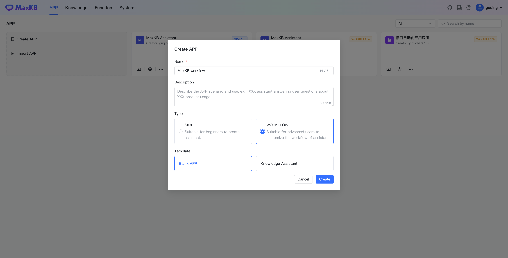
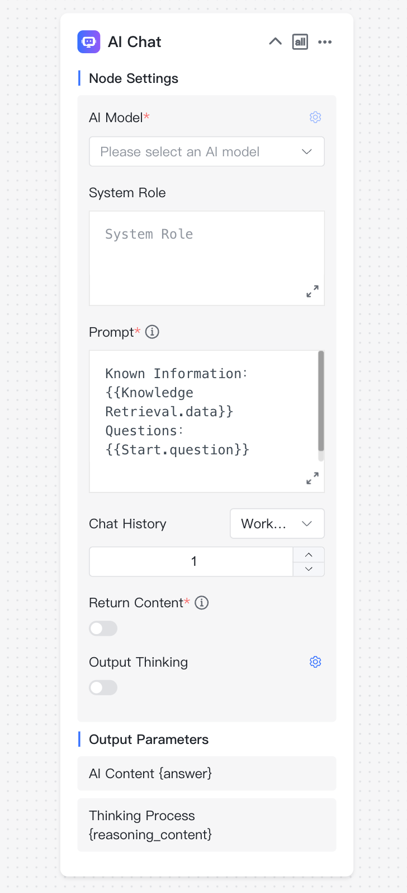
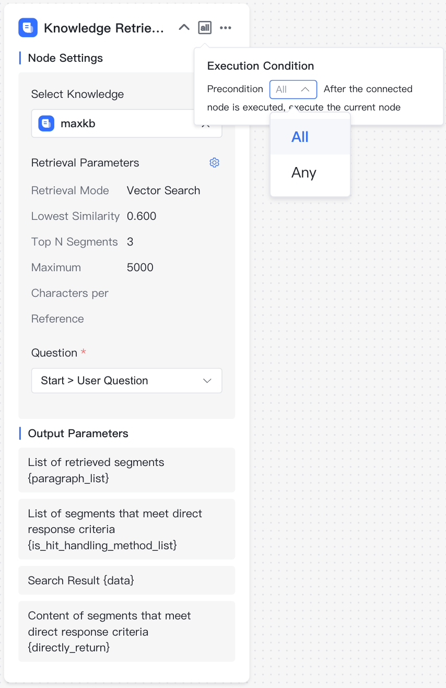

# 高级编排应用

!!! Abstract ""
    点击【创建应用】，输入应用名称，选择【高级编排】，点击【创建】，进入工作流编排页面。

!!! Abstract ""
    新创建的高级编排应用会默认生成简易工作流，可以根据自己的需求进行自定义编排，点击发布后生效。  

    **注意：**

    - 画布上的节点必须在工作流程中，不能有流程外的孤立节点，否则在发布时会校验失败。  
    - 每个节点可以根据节点的用途进行重命名，双击节点名称即可重命名，但同一个工作流编排中节点名称不能重复。  
    - 连线的后置节点可以引用前置节点的输出参数，如果节点名称变更，需要重新复制变量，参数引用方式是`{{节点名称.变量名称}}`。

!!! Abstract "" 
    完成工作流程设计之后，使用左下方的画布控制栏，可以对画布进行整体调整，包括画布缩放、节点收缩以及流程一键优化。

## 1 基础组件

!!! Abstract ""  
    每个工作流都有基本信息与开始两个基础节点：

    * 基本信息：应用的基本信息设置节点，如应用名称、描述、开场白等设置，每个应用只有一个基本信息节点，不能删除和复制。      
    * 开始：工作流程的开始，每个应用只能有一个开始节点，不能删除和复制。

!!! Abstract ""  
    点击右上角的【添加组件】，可以点击或拖拽到画布进行工作流编排。以下是每个组件的用途说明：      

    * AI对话：与AI大模型进行对话节点。  
    * 图片理解：识别并理解图片所包含的信息。
    * 图片生成：根据提供的文本内容生成图片。
    * 知识库检索：关联知识库，检索与问题相关分段的节点。
    * 多路召回：使用重排模型对多个知识库的检索结果进行二次召回。
    * 判断器：根据不同条件执行不同的节点。
    * 指定回复：直接指定回复内容。
    * 表单收集：通过表单的方式收集问答所需要的必要信息。
    * 问题优化：AI对话的一种，设定了默认的角色和提示词，根据上下文优化问题。   
    * 文档内容提取：提取文档中的内容。
    * 语音转文本：将音频转换为文本。
    * 文本转语音：将文本转换为语音。
    * 变量赋值：更新全局变量的值。
    * MCP 调用：通过 SSE 协议调用 MCP 服务中的工具。

### 1.1 基本信息

!!! Abstract "" 
    节点说明：工作流的开始节点，有且唯一，不能删除和复制，问答页面输入的问题会作为该节点的输出参数{question}，后续节点如需引用可以复制输出参数或选择变量：`开始节点->用户问题`。

{width="500px"}

!!! Abstract ""

    - 文件上传： 开启后应用将支持在对话时上传文档（TXT、MD、DOCX、HTML、CSV、XLSX、XLS、PDF）、图片（JPG、JPEG、PNG、GIF）以及音频文件（MP3、WAV、OGG、ACC、M4A），每次最多上传 10 个文件，单个文件不超过 100 MB，在后续节点中可以对上传后的文件进行处理。

{width="500px"}

!!! Abstract "" 
    - 用户输入：在会话开始时，需要在用户端提供的必要信息，例如，岗位角色等，以便后续流程可以根据不同输入进行不同的流程设计。

{width="600px"}

!!! Abstract ""

    - 接口传参：在通过应用公开访问链接时可配置的参数。添加接口参数后将会在公开访 URL 自动增加接口参数，在与第三方系统集成。   
    - 语音输入：开启后将支持以语音的方式进行问题的输入，需要使用语音识别模型。   
    - 语音播放：开启后回答内容将以语音的方式进行播放，可以使用浏览器内置的播放，也可以使用语音合成模型进行播放。

### 1.2 开始

!!! Abstract "" 
    全局变量：

    - 当前时间 {time}：当前对话的时间。
    - 历史聊天记录 {history_context}：对话的历史记录。
    - 对话id {chat_id}：对话标识。

!!! Abstract "" 
    参数输出：
    
    - 用户问题 {question}：客户端输入的提问信息。
    - 文档 {document}：客户端上传的文档。
    - 图片 {image}: 客户端上传的图片文件。
    - 音频 {audio}: 客户端上传的音频文件。

### 1.3 AI 对话
  
!!! Abstract "" 
    节点说明：如果应用需要与AI大模型进行对话，则需要在编排中添加 AI 对话组件，选择 AI 模型，设置提示词，提示词可以引用前置节点的参数输出，如：可以引用前置知识库检索的检索结果和开始节点的问题变量。

!!! Abstract "" 
    节点设置：

    - AI 模型：大语言模型的名称以及参数控制。
    - 角色设定：大语言模型回答的角色或身份设定。
    - 提示词：引导模型生成特定输出的详细描述。
    - 历史聊天记录：在当前对话中有关联的历史会话内容。例如，历史聊天记录为1，表示当前问题以及上一次的对话内容一起输送给大模型。
    - 工具：开启并配置 MCP Server Config 之后，大模型会根据提示词内容会主动调用合适的工具。
    - 输出思考：对于模型反馈思考过程的设置与开启，默认开始和结束标签是 `<think>`、`</think>`
    - 返回内容：是否在对话中显示该节点返回的内容。
    
    **注意**：MCP工具的调用需要大语言模型支持函数调用，如果大语言模型不支持，这个配置无效。

!!! Abstract ""
    参数输出：

    - AI回答内容 {answer}：根据角色、提示词等内容大语言模型返回的内容。

### 1.4 图片理解

!!! Abstract ""
    节点说明：对用户上传的图片文件进行分析和理解。

!!! Abstract "" 
    节点设置：

    - 图片理解模型：图片理解模型名称。
    - 角色设定：回答的角色或身份设定。
    - 提示词：引导模型生成特定输出的详细描述。
    - 历史聊天记录：
    - 选择图片：待理解和分析的图片，默认为当前用户上传的图片文件。
    - 返回内容：是否在对话中显示该节点返回的内容。

!!! Abstract "" 
    参数输出：

    - AI回答内容{answer}：根据上传的图片以及角色、提示词等信息图片理解模型返回的内容。

### 1.5 图片生成

!!! Abstract "" 
    节点说明：根据文本描述生成对应的图片。
{width="300px"}

!!! Abstract "" 
    节点设置：
    
    - 图片生成模型：图片生成模型名称。
    - 提示词（正向）：引导模型生成积极、建设性输出的文字输入。
    - 提示词（负向）：不应该包含在生成输出中的元素、主题或特征的描述。
    - 返回内容：是否在对话中显示该节点返回的内容。

!!! Abstract "" 
    参数输出：
    
    - AI回答内容 {answer}：即图片生成模型根据文本输入生成的图片。
    - 图片 {image}: 生成图片的详细信息。

### 1.6 知识库检索
  
!!! Abstract "" 
    节点说明：如果应用需要关联知识库，则需要在编排中添加知识库检索节点，选择知识库、设置检索参数、选择检索的问题。
    

!!! Abstract "" 
    节点设置：

    - 知识库：待检索的知识库。
    - 检索参数：包括检索模式、相似度阈值、引用分段数量以及最大引用字符数。
    - 检索问题：一般是开始节点的用户问题。

!!! Abstract "" 
    参数输出：

    - 检索结果的分段列表 {paragraph_list}：数组类型，指根据检索问题、检索参数进行检索后命中的分段列表，包含了分段的所有属性；       
    - 满足直接回答的分段列表 {is_hit_handling_method_list}：数组类型，指根据检索问题、检索参数进行检索后命中的分段中满足直接回答的所有分段列表，包含了分段的所有属性；       
    - 检索结果 {data}：字符串类型，指根据检索问题、检索参数进行检索后命中的分段内容；       
    - 满足直接回答的分段内容 {directly_return}：字符串类型，指根据检索问题、检索参数进行检索后命中的分段中满足直接回答的所有分段内容。     

### 1.7 多路召回

!!! Abstract "" 
    节点说明：根据需要重排的内容、检索问题以及检索参数进行多路召回。 

!!! Abstract "" 
    节点设置：

    - 重排内容：待重排的多个内容，一般是多个不同知识库的检索结果。
    - 检索参数：包括 score 阈值、引用分段数以及最大引用字符数。
    - 检索问题：根据检索问题进行重排，一般为用户问题或问题优化后的结果。
    - 重排模型：需要使用的重排模型名称。

!!! Abstract "" 
    参数输出：

    - 重排结果列表 {result_list}：数组类型，指根据重排后的结果列表。
    - 重排结果 {result}：字符串类型，指根据检索参数后的重排结果。

### 1.8 判断器
  
!!! Abstract "" 
    节点说明：根据不同的条件进行逻辑判断，每个判断分支后面必须有后置执行节点。  

!!! Abstract "" 
    判断器节点输出参数说明：

    - 分支名称{branch_name}：每个判断分支的名称。

### 1.9 指定回复
  
!!! Abstract "" 
    节点说明：指定输出文本内容，在知识库查询到的相关内容满足直接回答的要求，可以输出检索内容，也可以在知识库没有查询到关联内容时，指定回复内容。

!!! Abstract "" 
    指定回复节点输出参数说明：   

    * 内容{answer}： 指定回复输出的内容。

### 1.10 表单收集

!!! Abstract ""
    节点说明：通过表单的设计，以引导的方式主动获取必要的信息，一般应用于需要多次询问的应答场景。

!!! Abstract ""
    节点设置：

    - 表单输出内容：表单提示说明以及表单内容，可以单项输入，也可以输入多项信息。
    - 表单配置：通过添加不同的组件进行表单的设计。

!!! Abstract ""
    参数输出：

    - 表单全部内容{form_data}：表单的全部内容。

    表单全部内容将作为固定的输出，对于各个表单项也都进行参数化输出。

### 1.11 问题优化

!!! Abstract "" 
    节点说明：根据当前会话的历史聊天记录，以及在节点设置的大预言模型和提示词，对当前问题进行智能优化。
  

!!! Abstract "" 
    节点设置：

    - AI 模型：大语言模型的名称以及参数控制。
    - 角色设定：大语言模型回答的角色或身份设定。
    - 提示词：引导模型生成特定输出的详细描述。
    - 历史聊天记录：在当前对话中有关联的历史会话内容。例如，历史聊天记录为1，表示当前问题以及上一次的对话内容一起输送给大模型。
    - 返回内容：是否在对话中显示该节点返回的内容。。

!!! Abstract "" 
    参数输出：
    
    - 问题优化结果 {answer}：通过大模型优化后的问题。

### 1.12 文档内容提取

!!! Abstract "" 
    节点说明：对用户上传的文档进行内容总结。

!!! Abstract "" 
    节点设置：

    - 选择文档：即用户上传的文档，需要在基本信息节点开启对文件上传的支持。

!!! Abstract "" 
    参数输出：
    
    - 文档输出 {content}：对用户上传文件进行的总结输出。

### 1.13 语音转文本

!!! Abstract "" 
    节点说明：将音频文件转换为文本。
{width="280px"}

!!! Abstract "" 
    节点设置：
    
    - 语音识别模型：选择语音识别模型的名称。
    - 语音文件：即上传的音频文件，支持的格式包括：mp3、wav、ogg、acc。
    - 返回内容：是否在对话中显示该节点返回的内容。

!!! Abstract "" 
    参数输出：

    - 结果 {result}：语音转换后的文本内容。

### 1.14 文本转语音

!!! Abstract "" 
    节点说明：将文本转换为音频。
{width="280px"}

!!! Abstract "" 
    节点设置：

    - 语音合成模型：选择可用语音合成模型的名称。
    - 文本内容：选择待合成的文本内容。
    - 返回内容：是否在对话中显示该节点返回的内容。

!!! Abstract "" 
    参数输出：

    - 结果 {result}：将文本转成的音频内容。

### 1.15 变量赋值

!!! Abstract "" 
    节点说明：更新全局变量的值。

{width="280px"}

### 1.16 MCP 调用

!!! Abstract "" 
    节点说明：通过 SSE 协议调用 MCP 服务中的工具。

{width="280px"}

!!! Abstract "" 
    节点设置：

    - MCP Server Config：MCP Server 配置参数，使用 json 格式表示。
    - 工具：对应 MCP Server下单的工具列表。

!!! Abstract "" 
    工具参数：MCP 工具对应的请求参数，可自定义，也可引用变量。

!!! Abstract "" 
    参数输出：

    - 结果 {result}：MCP 工具执行返回结果。

## 2 添加函数

!!! Abstract "" 
    在高级编排流程中，可以添加函数库函数作为流程中的一个处理节点，以灵活处理复杂需求，函数详细说明见：[函数 ](../fx/fx.md)。

!!! Abstract ""
    节点设置：即函数的输入参数。

!!! Abstract ""
    参数输出：即函数的返回结果。

## 3 添加应用

!!! Abstract "" 
    在高级编排流程中，可以添加其它应用（简单配置应用和流程编排应用）作为流程中的一个处理节点，直接快速利用子应用的问答结果。

!!! Abstract ""
    节点设置：

    - 用户问题：对子应用的提问信息。
    - 返回内容：开启后在对话过程中将子应用的返回结果。

!!! Abstract ""
    参数输出：
    
    - 结果：即子应用的返回结果。

## 4 执行条件

!!! Abstract ""
    MaxKB 工作流中支持多出多进，在这个情况下，汇集节点可以根据与前置节点的逻辑关系，选择执行条件。

    - ALL：需要等所有前置连线节点全部执行完成后，才可执行当前节点。
    - ANY：任一前置连线节点执行完成后，即可执行当前节点。

{width="280px"}

## 5 调试

!!! Abstract ""
    完成所有的编排设计后，可点击【调试】后，先校验流程是否合规，校验通过后可在当前页面进行对话测试。

!!! Abstract ""
    在调试对话框中进行提问，AI回答完成后，会显示【执行详情】，点击【执行详情】后，在弹出执行详情对话框中可以查看每个流程节点的执行状态、耗时以及其它执行信息。

## 6 保存

!!! Abstract ""
    高级编排流程默认手动保存，也可设置自动保存，开启自动保存后将每隔 1 分钟保存到本地，并在发布成功后将配置同步到后台数据库。

## 7 发布

!!! Abstract ""    
    点击【发布】后会先校验当前工作流是否符合规则，如果合规将成功发布，否则发布失败。发布成功后，所有节点配置修改才在问答页面中生效。可以查看发布历史并进行版本恢复。
