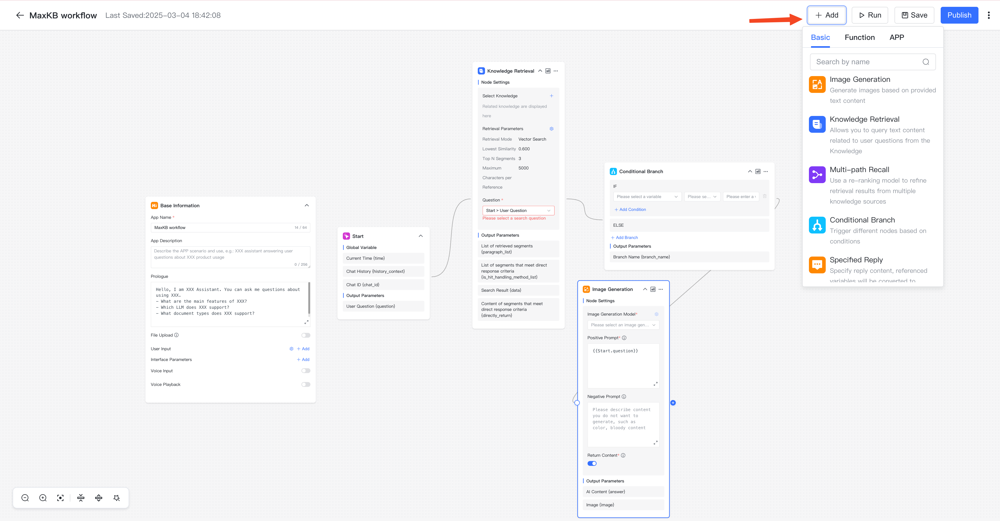

# 高级编排应用

## 1 创建高级编排应用

!!! Abstract ""
    点击【创建应用】，输入应用名称，选择【高级编排】，点击【创建】，进入工作流编排页面。

!!! Abstract ""
    新创建的高级编排应用会默认生成简易工作流，可以根据自己的需求进行自定义编排，点击发布后生效。  

    **注意：**

    - 画布上的节点必须在工作流程中，不能有流程外的孤立节点，否则在发布时会校验失败。  
    - 每个节点可以根据节点的用途进行重命名，双击节点名称即可重命名，但同一个工作流编排中节点名称不能重复。  
    - 连线的后置节点可以引用前置节点的输出参数，如果节点名称变更，需要重新复制变量，参数引用方式是`{{节点名称.变量名称}}`。

!!! Abstract "" 
    完成工作流程设计之后，使用左下方的画布控制栏，可以对画布进行整体调整，包括画布缩放、节点收缩以及流程一键优化。

### 1.1 基础组件

!!! Abstract ""  
    每个工作流都有基本信息与开始两个基础节点：

    * 基本信息：应用的基本信息设置节点，如应用名称、描述、开场白等设置，每个应用只有一个基本信息节点，不能删除和复制。      
    * 开始：工作流程的开始，每个应用只能有一个开始节点，不能删除和复制。

!!! Abstract ""  
    点击右上角的【添加组件】，可以点击或拖拽到画布进行工作流编排。以下是每个组件的用途说明：      

    * AI对话：与AI大模型进行对话节点，可以有多个。  
    * 知识库检索：关联知识库，检索与问题相关分段的节点。
    * 问题优化：AI对话的一种，设定了默认的角色和提示词，根据上下文优化问题。     
    * 判断器：根据不同条件执行不同的节点。
    * 指定回复：直接指定回复内容。   
    * 多路召回：使用重排模型队多个知识库的检索结果进行二次召回。

#### 1.1.1 开始
  
!!! Abstract "" 
    节点说明：工作流的开始节点，有且唯一，不能删除和复制，问答页面输入的问题会作为该节点的输出参数{question}，后续节点如需引用可以复制输出参数或选择变量：`开始节点->用户问题`。

#### 1.1.2 知识库检索节点
  
!!! Abstract "" 
    节点说明：如果应用需要关联知识库，则需要在编排中添加知识库检索节点，选择知识库、设置检索参数、选择检索的问题。

    

!!! Abstract "" 
    知识库检索节点输出参数说明：

    * 检索结果的分段列表 {paragraph_list}：数组类型，指根据检索问题、检索参数进行检索后命中的分段列表，包含了分段的所有属性；       
    * 满足直接回答的分段列表 {is_hit_handling_method_list}：数组类型，指根据检索问题、检索参数进行检索后命中的分段中满足直接回答的所有分段列表，包含了分段的所有属性；       
    * 检索结果 {data}：字符串类型，指根据检索问题、检索参数进行检索后命中的分段内容；       
    * 满足直接回答的分段内容 {directly_return}：字符串类型，指根据检索问题、检索参数进行检索后命中的分段中满足直接回答的所有分段内容。     

#### 1.1.3 AI 对话节点
  
!!! Abstract "" 
    节点说明：如果应用需要与AI大模型进行对话，则需要在编排中添加 AI 对话组件，选择 AI 模型，设置提示词，提示词可以引用前置节点的参数输出，如：可以引用前置知识库检索的检索结果和开始节点的问题变量。

!!! Abstract ""  
    AI 对话节点输出参数说明：

    * AI回答内容 {answer}：AI模型返回的内容。   

#### 1.1.3 指定回复节点
  
!!! Abstract "" 
    节点说明：指定输出文本内容，如没有在知识库查询到关联内容时，可以指定回复内容；支持指定输出变量，如在知识库查询到的相关内容满足直接回答的要求，可以直接选择该变量，系统会自动转化成字符串进行输出。

!!! Abstract "" 
    指定回复节点输出参数说明：   

    * 内容{answer}： 指定回复输出的内容。   

#### 1.1.4 判断器节点
  
!!! Abstract "" 
    节点说明：根据不同的条件判断执行不同的分支，每个分支一个输出，每个分支必须有后置执行节点。  

   

!!! Abstract "" 
    判断器节点输出参数说明：

    * 分支名称{branch_name}：根据条件判断执行分支的分支名称。

#### 1.1.5 多路召回节点

!!! Abstract "" 
    节点说明：根据需要重排的内容、检索问题以及检索参数进行多路召回。 

!!! Abstract "" 
    多路召回节点输出参数说明：

    * 重排结果列表 {result_list}：数组类型，指根据重排后的结果列表。
    * 重排结果 {result}：字符串类型，指根据检索参数后的重排结果。

### 1.2 添加函数

!!! Abstract "" 
    在高级编排流程中，可以添加函数库函数作为流程中的一个处理节点，以灵活处理复杂需求。

### 1.3 添加应用

!!! Abstract "" 
    在高级编排流程中，可以添加其它应用（简单配置应用和流程编排应用）作为流程中的一个处理节点，直接快速利用子应用的问答结果。

### 1.4 调试

!!! Abstract ""
    完成所有的编排设计后，可点击【调试】后，先校验流程是否合规，校验通过后可在当前页面进行对话测试。

!!! Abstract ""
    在调试对话框中进行提问，AI回答完成后，会显示【执行详情】，点击【执行详情】后，在弹出执行详情对话框中可以查看每个流程节点的执行状态、耗时以及其它执行信息。

### 1.5 保存

!!! Abstract ""
    当前系统每隔 1 分钟自动保存到本地，发布成功后将配置同步到后台数据库。

### 1.6 发布

!!! Abstract ""    
    点击【发布】后会校验当前工作流是否符合规则，符合规则将成功发布，否则发布失败。发布成功后，所有节点配置修改才在问答页面中生效。

## 3 复制应用

!!! Abstract ""
    在应用列表，点击【...】在弹出的菜单中，点击【复制】子菜单，对应用进行复制。

## 4 删除应用

!!! Abstract ""
    在应用列表，点击【...】在弹出的菜单中，点击【删除】子菜单，对应用进行删除。

    **注意：** 应用删除后不可恢复，请谨慎操作。
