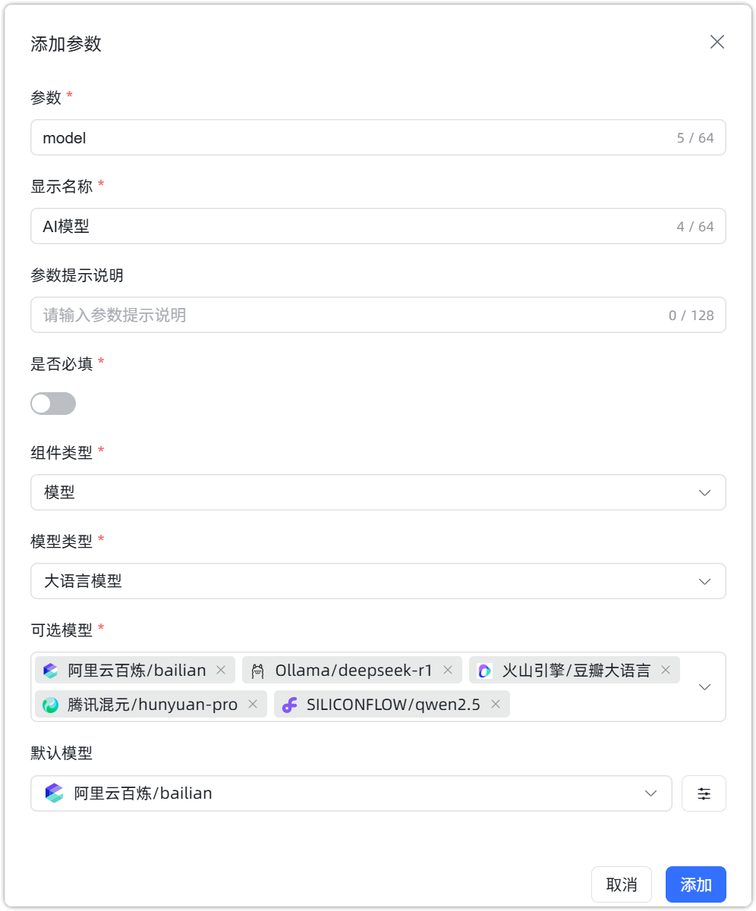
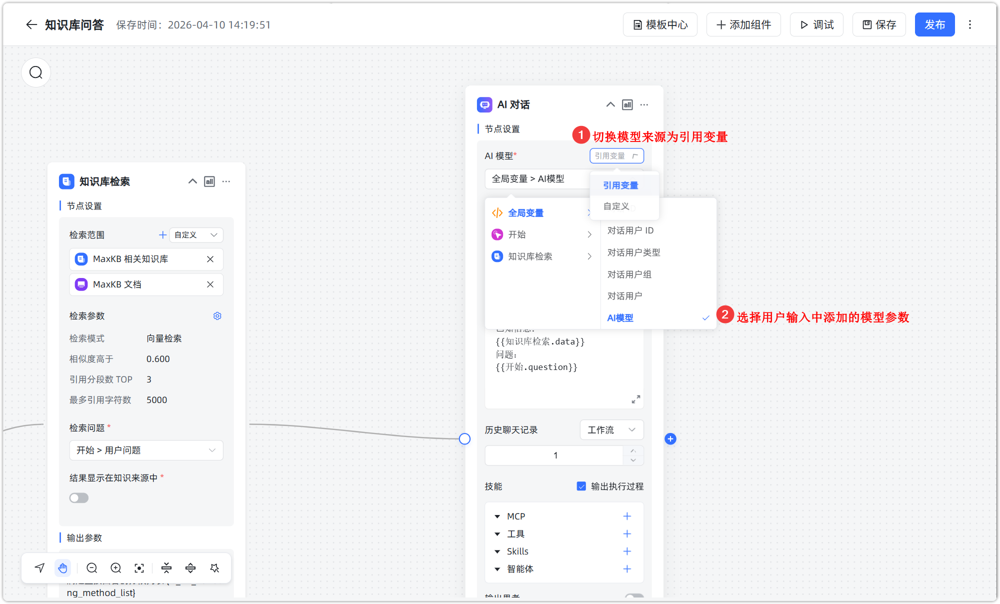
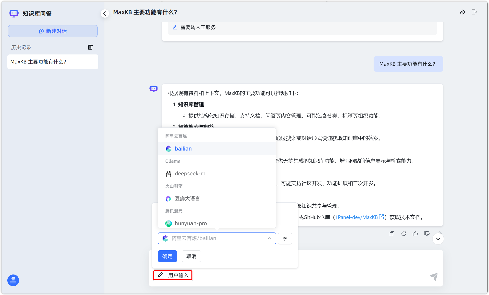
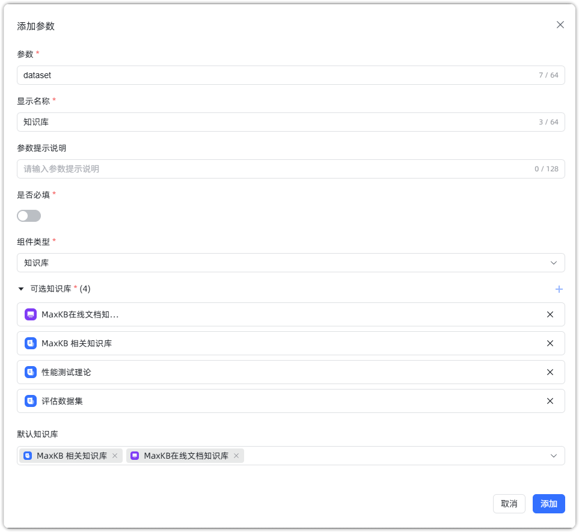
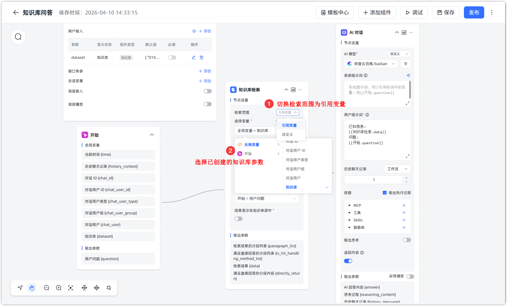
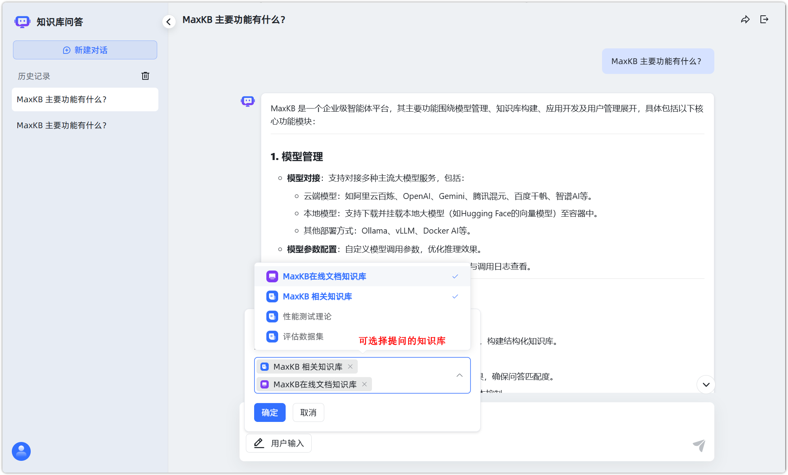

# 问答页面自主选择模型或知识库

!!! Abstract ""
    在 MaxKB v2.8.0 及以上版本，高级智能体的用户输入功能中新增模型与知识库组件。用户在问答页面对话时，可以自主选择配置的模型及待检索的知识库，从而有效提升对话的精准度与灵活性。

## 模型切换配置

!!! Abstract ""
    在高级智能体工作流中，在基本信息中添加用户输入参数，选择组件类型为模型，设置模型类型后，配置可选择的模型和默认模型。

{width="500px"}

!!! Abstract ""
    可在 AI 对话或其他需要添加模型的组件中，切换 AI 模型为引用变量，选择全局变量中已创建的用户输入参数。

!!! Abstract ""
    保存工作流后，在问答页面中，用户可以随时切换不同模型进行问答。

## 知识库切换配置

!!! Abstract ""
    在高级智能体工作流中，在基本信息中添加用户输入参数，选择组件类型为知识库，设置可选知识库和默认知识库（可多选）。

{width="600px"}

!!! Abstract ""
    可在文档标签检索、知识库检索组件中，切换知识库为引用变量，选择用户全局变量中已创建的用户输入参数。

!!! Abstract ""
    保存工作流后，在问答页面中，用户可以随时切换不同知识库进行问答。

