# 知识库

!!! Abstract ""
    企业私有的专业知识库，包含各种类型的数据， 创建和管理级知识库，为问答对话提供知识来源，对知识进行统一管理，并助力智能问答。

    - 共享知识库：系统管理员在【共享资源】中创建共享后，可以授权给指定工作空间。
    - 全部知识库：用户可以创建知识库，其他用户[**资源授权**](../../user_manual/X-Pack/authorization_resources.md)后可以查看、使用和维护。

    **注意**：共享资源为企业版 X-Pack 功能。

## 1 创建知识库

!!! Abstract ""
    打开【知识库】页面，点击【创建知识库】，进入创建知识库页面。   
    知识库类型：

    * 通用型知识库：对离线文档上传管理，支持的文本文档格式包括 Markdown、TXT、PDF、DOCX、HTML，以及 Excel、CSV 格式的 QA 问答对。。   
    * Web 站点知识库：用于获取在线静态文本数据管理，输入 Web 根地址后自动同步根地址及子级地址的文本数据。
    * 飞书知识库：支持对接飞书的云文档和表格文档，将飞书文档内容导入到 MaxKB 中进行管理。

    **注意**：飞书知识库 X-Pack 功能，具体使用可参考[**飞书文档**](../../user_manual/X-Pack/feishu_doc/)。
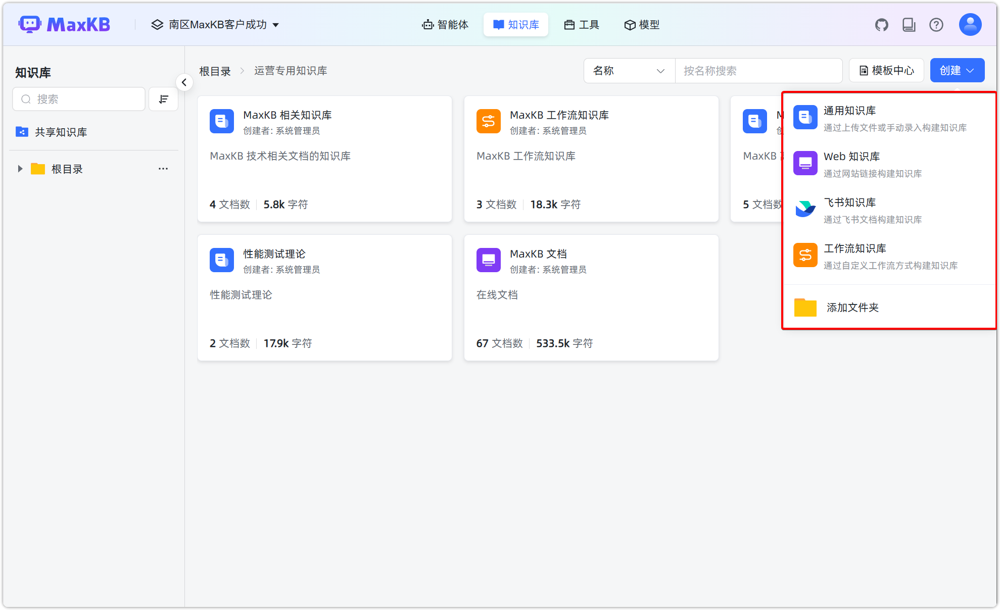

###  1.1 通用型知识库

!!! Abstract ""
    选择知识库类型为通用型，输入知识库名称、知识库描述，选择向量模型。

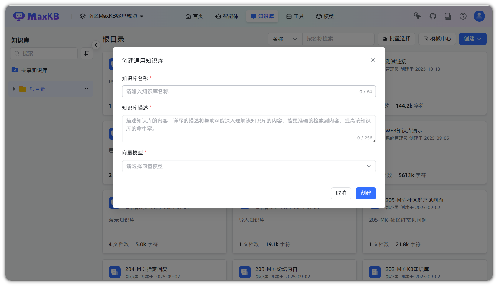

!!! Abstract ""
    创建知识库后，支持新建文档和上传离线文档通。

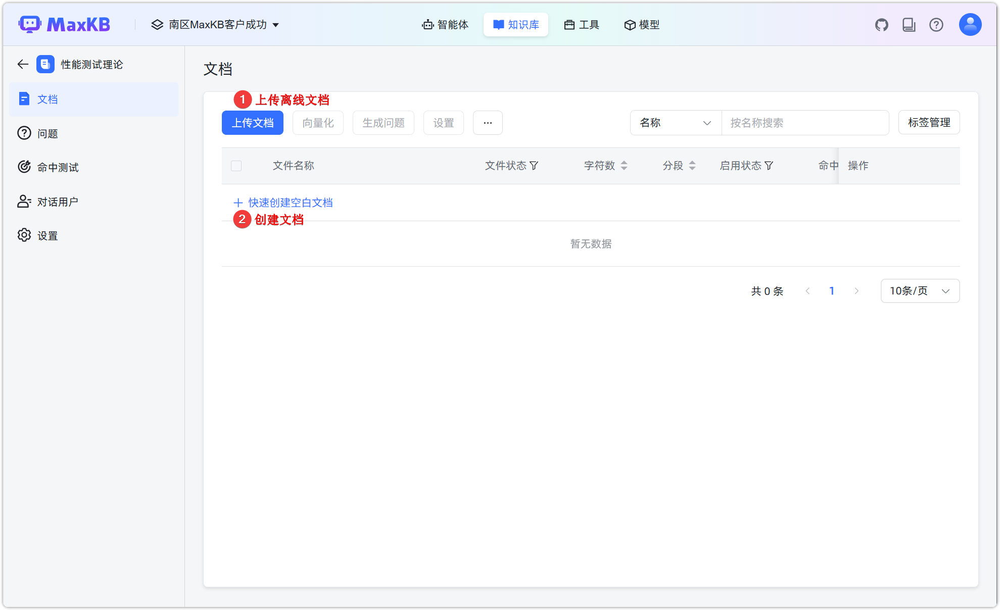

!!! Abstract ""
    可离线文档通过拖拽或选择文件方式进行上传。 上传文档要求：

    * 文本文件：Markdown、TXT、PDF、DOCX、HTML、XLS、XLSX、CSV、ZIP；
    * 表格：XLS、XLSX、CSV、ZIP;
    * QA 问答对：XLS、XLSX、CSV、ZIP；  
    * 每次最多上传 50 个文件；   
    * 每个文件不超过 100 MB；
    * 支持选择文件夹，上传文件夹下符合要求的文件。
    * ZIP 文件包括两种形式：

        *  MarkDown 文档 + 图片文件，MarkDown 文档中引入对应的图片，并将两者打包在 ZIP 中。
        *  XLS/XLSX 文件 + 图片文件，XLS/XLSX 文件中引入对应的图片，并将两者打包在 ZIP 中。

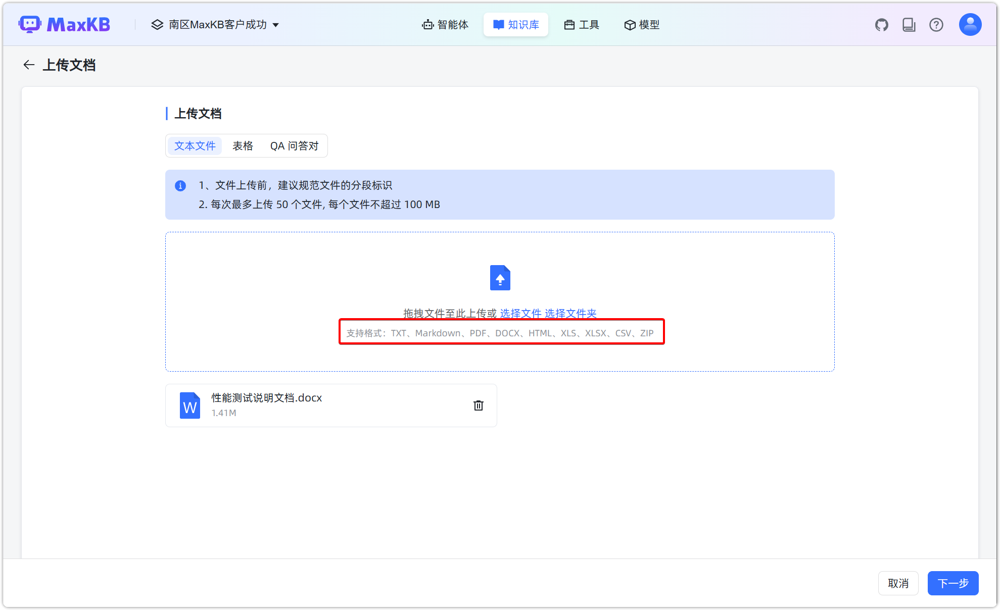

    
!!! Abstract ""
    文档分段：
    
    - **选择分段规则**，支持智能分段以及高级分段两种方式：
        - 智能分段：按照 Markdown 格式进行逐级下钻式分段（最多支持 6 级标题），每段最大字符数为 4096 个；
        - 高级分段：支持自定义设置分段标识符、分段长度及自动清洗。分段标识还支持使用正则表达式处理复杂结构文档。

    - **导入时添加分段标题为关联问题**：勾选后会把所有分段的标题设置为分段的关联问题。

    - **分段预览**：根据分段规则和设置，查看分段效果。
    - **分段操作**：在分段预览中对不合理的分段进行再次编辑以及删除无意义分段。
    - **步骤操作**：可返回上一步重新上传文档，或者确认上传开始向量化。

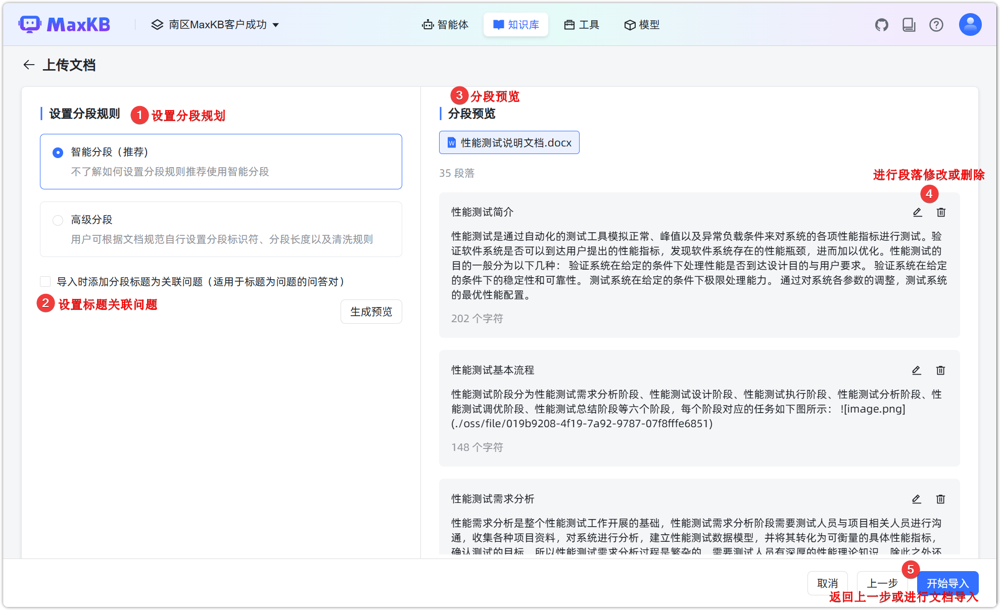

!!! Abstract ""
    **智能分段与高级分段**：

    **智能分段**：

    - MarkDown 类型文件智能分段规则 

        * 根据标题逐级下钻式分段（最多支持 6 级标题），每个段落最多 4096 个字符；   
        * 当最后一级的文本段落字符数超过设置的分段长度时，会查找分段长度以内的回车进行截取。

    - HTML、DOCX 类型智能分段规则

        * 识别标题格式转换成 markdown 的标题样式；
        * 逐级下钻进行分段（最多支持 6 级标题），每个段落最多 4096 个字符。

    - TXT和 PDF 类型文件智能分段规则

        * 按照标题# 进行分段，若没有#标题的则按照字符数 4096 个字符进行分段；
        * 查找分段长度以内的回车进行截取。  
    **高级分段**：

     * 分段标识支持：#、##、###、####、#####、######、-、空行、回车、空格、分号、逗号、句号，并支持手动输入其它分段标识符或[**正则表达式**](https://kb.fit2cloud.com/?p=bfe242a4-9a77-459c-ac75-4ef078e170c9)。   
     * 分段长度：单个分段的长度，范围 50 至 4096 个字符。   
     * 自动清洗：开启后系统会自动去掉重复多余的符号如空格、空行、制表符等。
     * **文档规范建议**：
         * 标识规范：离线文档的分段标识要有一定规范，否则拆分出来的段落不规整。   
         * 段落完整：在一个分段中集中描述一个完整的内容。

!!! Abstract ""
    **导入时添加分段标题为关联问题:** 勾选后会把所有分段的标题设置为分段的关联问题。
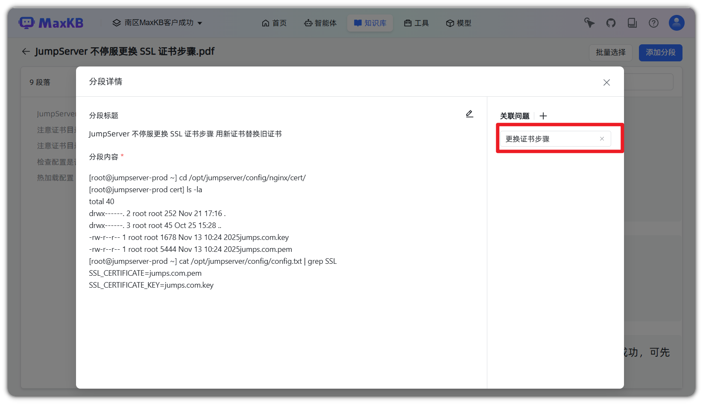
   
!!! Abstract ""
    点击【开始导入】后，系统后台会对文档进行自动分段 -> 存储 -> 向量化操作，处理结束后，文件状态将显示为完成。
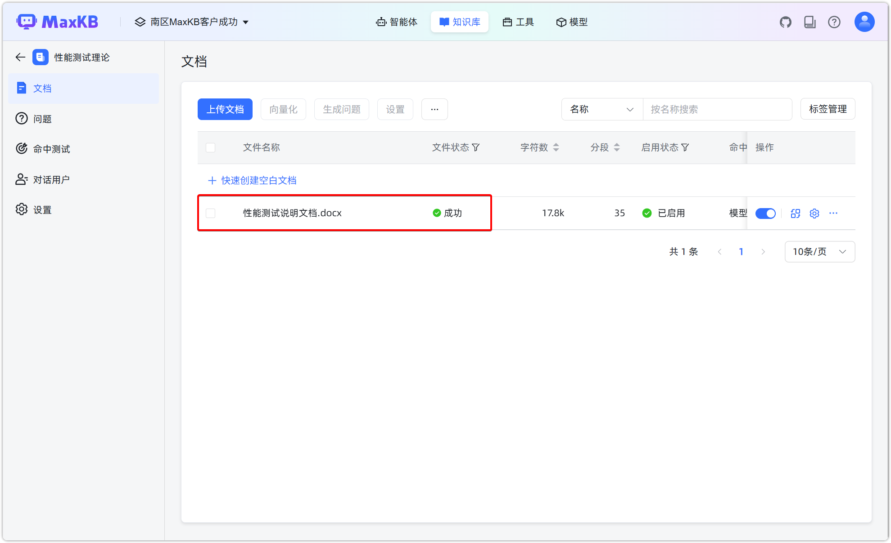

### 1.2 Web 站点知识库

!!! Abstract ""
    输入知识库名称、知识库描述，选择向量模型并设置知识库类型为 Web 站点。

    * Web 根地址：为在线静态网页站点的根节点地址，系统会自动获取 Web 根地址及子级地址的数据资料。以 DataEase V2 在线文档为例，可在 Web 根地址为：https://dataease.io/docs/v2/ 。  
    * 选择器：针对 Web 页面的数据可以设置定获取某个div内的数据，默认获取 body 数据。如 DataEase 在线文档仅获取中间内容部分，可以右键检查网页，定位到中间内部区域找到 div 为 md-content，则选择器输入为：.md-content 。

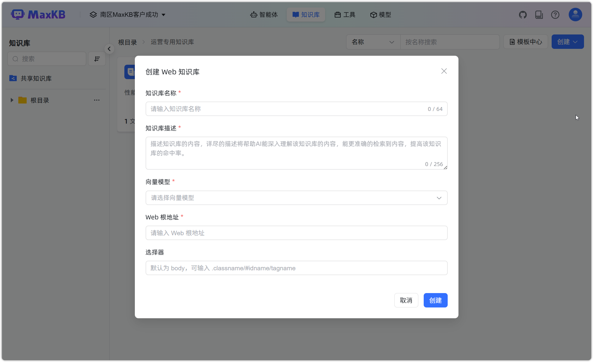

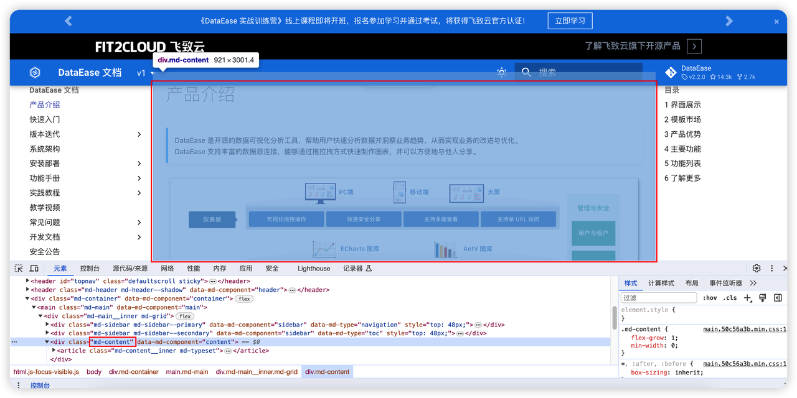
!!! Abstract ""
    点击【创建】后，跳转到文档列表页面查看当前 Web 站点下文档的详细信息，处理结束后，文件状态将显示为完成。

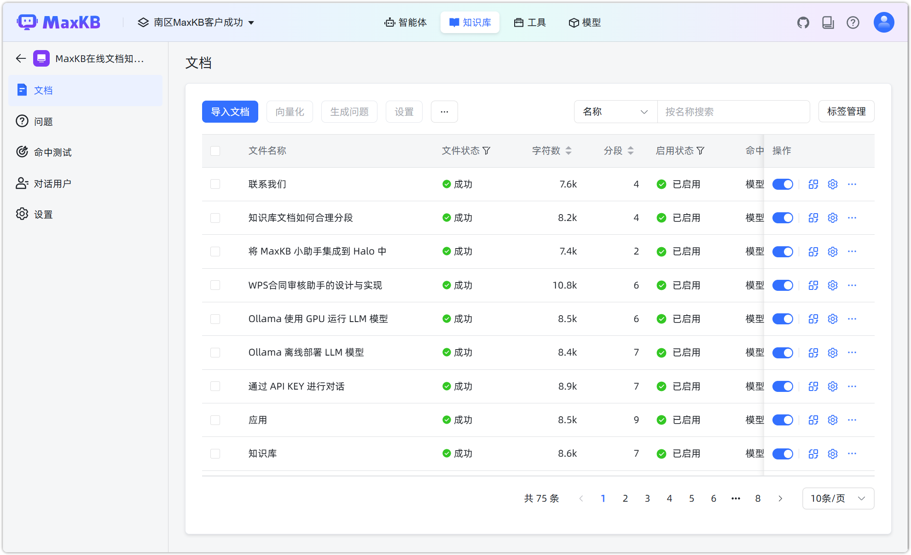

## 2 知识库操作

!!! Abstract ""
    MaxKB 知识库支持同步、重新向量化、生成问题、转移、设置、导出以及删除操作。

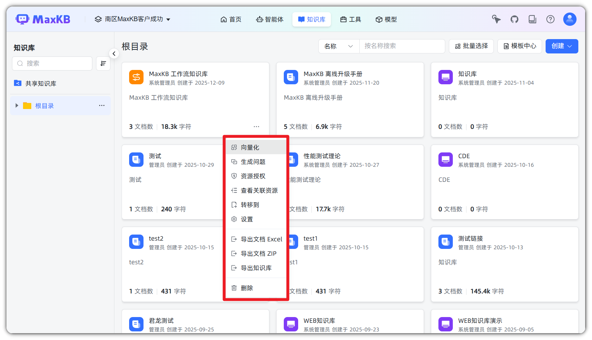

### 2.1 同步 Web 知识库

!!! Abstract ""
    对于 Web 站点类型知识库，点击知识库面板的【同步】，支持对 Web 知识库的内容进行同步更新。

    * 同步替换：重新获取 Web 站点文档，覆盖替换本地知识库中的文档。  
    * 整体同步：先删除本地知识库的所有文档，重新获取 Web 站点文档。 

### 2.2 重新向量化

!!! Abstract ""
    如果在知识库设置中选择了不同的向量模型，对于新增的文档将使用新设置的向量模型进行向量化，如果要对已有的知识库进行重新向量化，可在知识库卡片网格中，点击知识库面板的【重新向量化】，对知识库中已有的分段进行重新向量化。

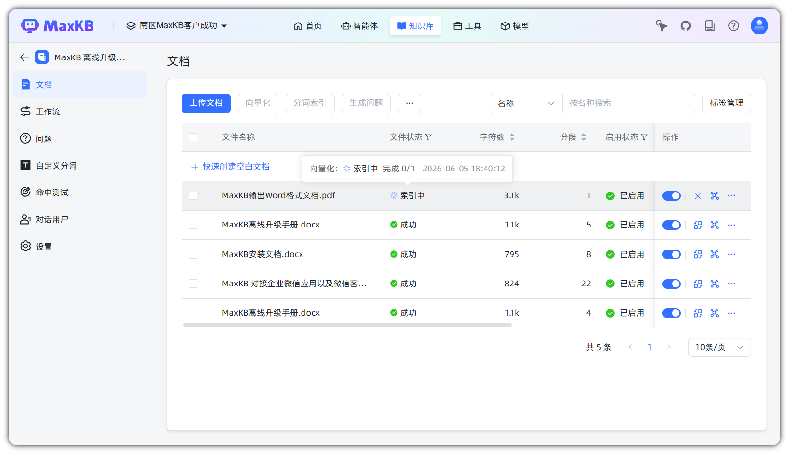

### 2.3 设置知识库

!!! Abstract ""
    在知识库列表，点击知识库面板的【设置】进入知识库设置页面，可以对当前知识库名称、描述、向量模型等属性进行修改，所有设置保存后设置生效。
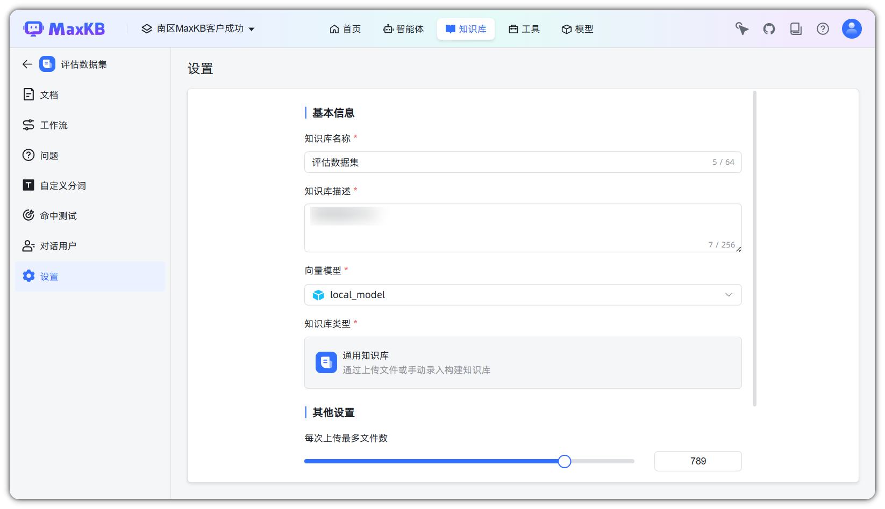

### 2.4 导出知识库

!!! Abstract ""
    在知识库列表，点击知识库面板的【导出 Excel】/【导出 ZIP】。将知识库的分段内容以 Excel 或 ZIP 文件格式导出。  
    每个文档为 Excel 文件的一个 Sheet，Sheet 每一行展示一个分段。导出 ZIP 文件时，会将引用的图片一起导出，且以 guid 的方式进行命名，且没有格式扩展名。

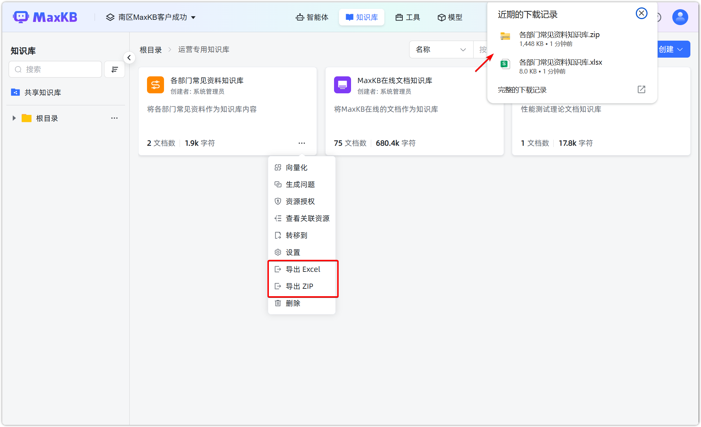
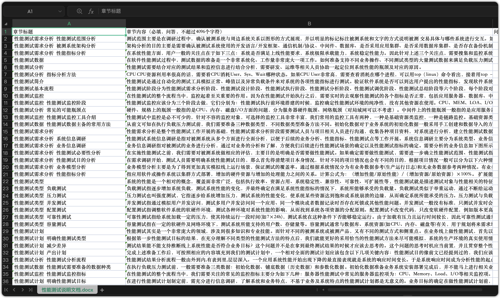

### 2.5 删除知识库

!!! Abstract ""
    在知识库列表，点击知识库面板的【删除】对知识库进行删除操作。

    **注意**：知识库删除后无法恢复，请谨慎操作。
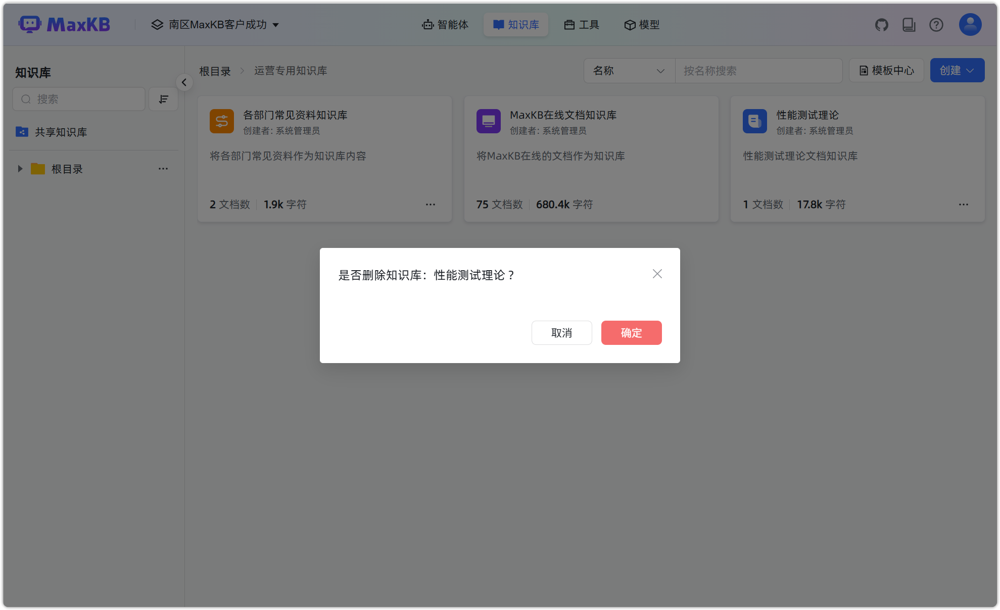

