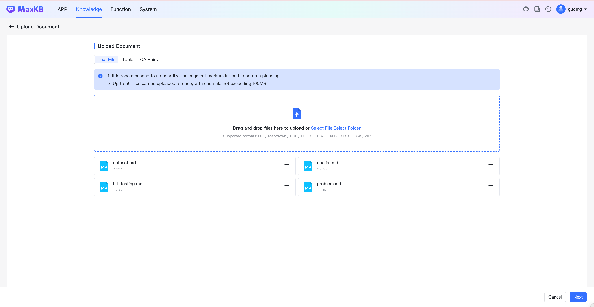
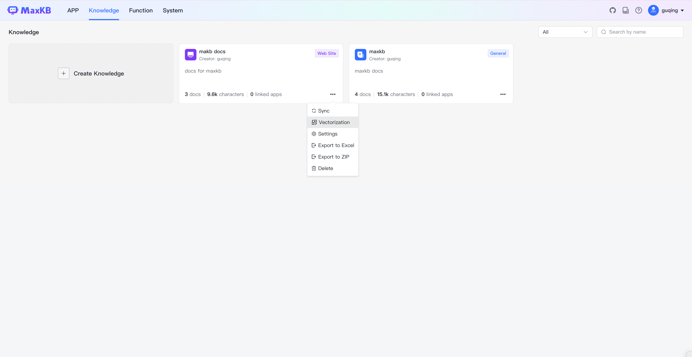

# Knowledge Base

!!! Abstract ""
    Enterprise private professional knowledge base contains various types of data and serves as the knowledge source for answering user questions in Q&A dialogues. MaxKB's knowledge bases are divided into two types: General Knowledge Base and Web Site Knowledge Base.

    * **General Knowledge Base**: For offline document, supporting text files, tables and Q&A pairs.
    * **Web Site Knowledge Base**: For online static text data, automatically synchronizing text data from root URL and sub-URLs after inputting the root web address.
    
    MaxKB supports knowledge base creation, re-vectorization, settings, synchronization, export, deletion, etc.

## 1 Create Knowledge Base

!!! Abstract ""
    Open the Knowledge  page, click Create Knowledge.
    

### 1.1 General Knowledge Base

!!! Abstract ""
    Enter the knowledge base name, description, select vector model and set knowledge base type as general, then upload offline documents by dragging and dropping or selecting files.
    Document  requirements:

    * Text files: Markdown, TXT, PDF, DOCX, HTML, XLS, XLSX, CSV, ZIP;
    * Tables: XLS, XLSX, CSV, ZIP;
    * QA pairs: XLS, XLSX, CSV, ZIP;
    * Maximum 50 files per upload;
    * Each file not exceeding 100 MB;
    * Support selecting folders to upload files meeting format requirements.
        
!!! Abstract ""
    **Note:** ZIP files include two forms:

    * Markdown documents and images referenced in the Markdown documents, packaged together in ZIP.
    * XLS/XLSX files and images referenced in the XLS/XLSX files, packaged together in ZIP.

    
!!! Abstract ""
    MaxKB currently supports two methods for document segmentation: Intelligent Segmentation and Advanced Segmentation.

    **Intelligent Segmentation**

    (1) Markdown file automatic segmentation rules 

    * Segmentation based on hierarchical titles (up to 6 levels), with maximum 4096 characters per segment;   
    * When text paragraphs under the last level exceed the set segment length, the system will look for line breaks within the segment length to split.

    (2) HTML and DOCX file automatic segmentation rules

    * Recognizes heading formats and converts them to markdown heading styles;
    * Segments hierarchically (up to 6 levels) with maximum 4096 characters per segment.

    (3) TXT and PDF file automatic segmentation rules

    * Segments by headings marker; if no headings marker exist, segments by 4096 characters;
    * Looks for line breaks within segment length to split.

!!! Abstract ""
    Document specification recommendations:    

    * **Standardized segment marker**: Offline documents should have standardized segment markers, otherwise the split paragraphs will be irregular.   
    * **Complete paragraphs**: A segment should ideally describe a complete piece of content.

!!! Abstract ""
    **Advanced Segmentation**   

    Users can customize segment delimiters, segment length and automatic cleaning based on document specifications.

    * Supported segment markers: #, ##, ###, ####, #####, ######, -, blank line, line break, space, semicolon, comma, period. Also supports manual input of other markers or regular expressions.   
    * Segment length: Length of a single segment, ranging from 50 to 4096 characters.   
    * Automatic cleaning: When enabled, the system automatically removes redundant symbols like spaces, blank lines, tabs, etc.      

!!! Abstract ""
    **Add "Releated Question" section for question-based QA pair during import**   

    When checked, all segment titles will be set as related questions for the segments.

!!! Abstract ""
    **Preview**   

    After setting segmentation rules, click [Generate Preview] to check the segmentation effect of the latest rules.

!!! Abstract ""
    You can edit unreasonable segments and delete meaningless segments in the segmentation preview.

   
!!! Abstract ""
    After clicking [Start Import], the system backend will automatically perform segmentation, storage, vectorization operations on the documents. When completed, the file status will show as complete.

### 1.2 Web Site Knowledge Base

!!! Abstract ""
    Enter the knowledge base name, description, select the vector model and set the knowledge base type as Web Site.

!!! Abstract ""
    * Web Root URL: The root node URL of the online static website. The system will automatically fetch data from the root URL and its sub-level URLs. For example, using DataEase V2 online documentation, the Web root URL would be: https://dataease.io/docs/v2/
    * Selector: You can set selectors to get data from specific div elements on the web page. By default, it gets data from the body. For example, to only get the middle content section of DataEase online documentation, you can right-click to inspect the webpage, locate the middle content area with div class "md-content", then enter the selector as: .md-content

!!! Abstract ""
    After clicking OK button, you'll be redirected to the document list page to view detailed information of documents under the current website. When processing is complete, the file status will show as complete.

## 2 Knowledge Base Operations

!!! Abstract ""
    MaxKB knowledge bases support synchronization, re-vectorization, settings configuration, export and delete operations.

### 2.1 Sync Web Knowledge Base

!!! Abstract ""
    For Web site type knowledge bases, click Sync menu on the knowledge base card grid panel to synchronize all content in the knowledge base.

    * Sync and Replace: Re-fetch web site documents and replace documents in the local knowledge base.
    * Full Sync: First delete all documents in the local knowledge base, then re-fetch web site documents.

### 2.2 Vectorization

!!! Abstract ""
    If you select a different vector model in the knowledge base settings, new documents will be vectorized using the newly set model. To re-vectorize existing knowledge base content, click Vectorization menu on the knowledge base card grid panel to re-vectorize existing segments in the knowledge base.

### 2.3 Knowledge Base Configuration

!!! Abstract ""
    In the knowledge base list, click Setting menu to enter the knowledge base settings page. You can modify the current knowledge base name, description, vector model and other properties. All settings take effect after saving.

### 2.4 Export Knowledge Base

!!! Abstract ""
    In the knowledge base list, click  ExportEXCEL/ExportZIP menu to export the knowledge base segments as Excel or ZIP files.
    Each document correspond to a sheet in the Excel file, with each row showing one segment. When exporting as ZIP, referenced images are also exported, named using GUIDs without file extensions.

{ width="500px" }

### 2.5 Delete Knowledge Base

!!! Abstract ""
    In the knowledge base list, click Delete menu to delete a knowledge base.
    On the knowledge base card grid, click Delete menu to delete a knowledge base.

    **Note**: Knowledge base deletion cannot be undone, please proceed with caution.

