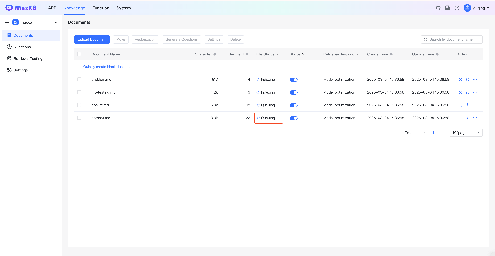
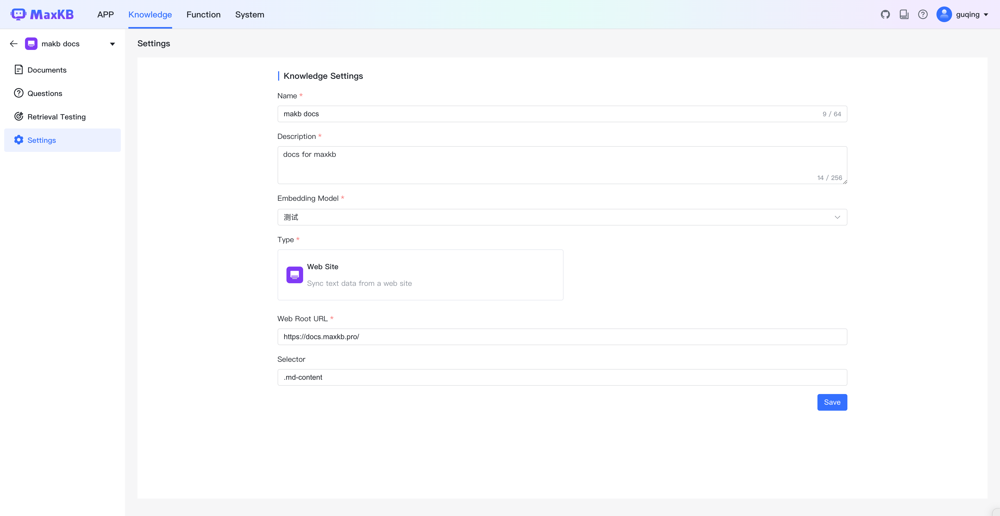
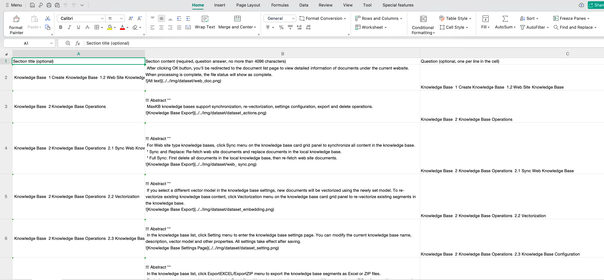
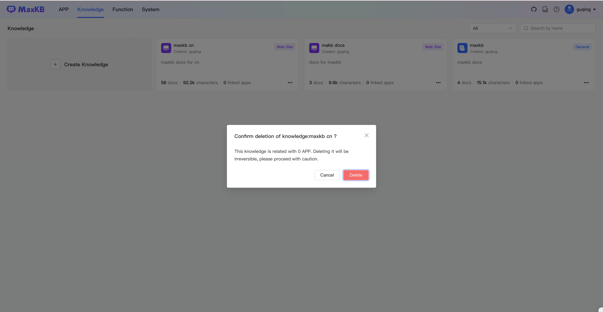

# 知识库

!!! Abstract ""
    企业私有的专业知识库，包含各种类型的数据，是问答对话中回答用户问题的知识来源。MaxKB 中知识库分为通用型知识库和 Web 站点知识库两种类型。

    * **通用型知识库**：对离线文档上传管理，支持的文本文件、表格以及 QA 问答对。   
    * **Web 站点知识库**：用于获取在线静态文本数据管理，输入 Web 根地址后自动同步根地址及子级地址的文本数据。
    
    MaxKB 支持知识库创建、重新向量化、设置、同步、导出、删除等功能。

## 1 创建知识库

!!! Abstract ""
    打开【知识库】页面，点击【创建知识库】，进入创建知识库页面。
    

###  1.1 通用型知识库

!!! Abstract ""
    输入知识库名称、知识库描述，选择向量模型并设置知识库类型为通用型，然后将离线文档通过拖拽或选择文件方式进行上传。
    上传文档要求：

    * 文本文件:：Markdown、TXT、PDF、DOCX、HTML、XLS、XLSX、CSV、ZIP；
    * 表格：XLS、XLSX、CSV、ZIP;
    * QA 问答对：XLS、XLSX、CSV、ZIP；  
    * 每次最多上传 50 个文件；   
    * 每个文件不超过 100 MB；
    * 支持选择文件夹，上传文件夹下符合要求的文件。
        
!!! Abstract ""
    **说明：** ZIP 文件包括两种形式：

    *  MarkDown 文档 + 图片文件，MarkDown 文档中引入对应的图片，并将两者打包在 ZIP 中。
    *  XLS/XLSX 文件 + 图片文件，XLS/XLSX 文件中引入对应的图片，并将两者打包在 ZIP 中。

    
!!! Abstract ""
    对于知识库文件的分段，目前 MaxKB 支持智能分段以及高级分段两种方式。

    **智能分段**

    （1）MarkDown 类型文件智能分段规则 

    * 根据标题逐级下钻式分段（最多支持 6 级标题），每段的字符数最大为 4096 个字符；   
    * 当最后一级的文本段落字符数超过设置的分段长度时，会查找分段长度以内的回车进行截取。

    （2）HTML、DOCX 类型智能分段规则

    * 识别标题格式转换成 markdown 的标题样式；
    * 逐级下钻进行分段（最多支持 6 级标题）每段的字符数最大为 4096 个字符。

    （3）TXT和 PDF 类型文件智能分段规则

    * 按照标题# 进行分段，若没有#标题的则按照字符数4096个字符进行分段；
    * 查找分段长度以内的回车进行截取。  

!!! Abstract ""
    文档规范建议：    

    * **分段标识规范**：离线文档的分段标识要有一定规范，否则拆分出来的段落不规整。   
    * **段落完整**：在一个分段中集中描述一个完整的内容。

!!! Abstract ""
    **高级分段**   

    用户可以根据文档规范自定义设置分段标识符、分段长度及自动清洗。

    * 分段标识支持：#、##、###、####、#####、######、-、空行、回车、空格、分号、逗号、句号，并支持手动输入其它分段标识符或正则表达式。   
    * 分段长度：单个分段的长度，范围 50 至 4096 个字符。   
    * 自动清洗：开启后系统会自动去掉重复多余的符号如空格、空行、制表符等。      

!!! Abstract ""
    **导入时添加分段标题为关联问题**   

    勾选后会把所有分段的标题设置为分段的关联问题。

!!! Abstract ""
    **预览**   

    分段规则设置完成后，需要点击【生成预览】才能查看最新规则的分段效果。

!!! Abstract ""
    在分段预览中对不合理的分段进行再次编辑以及删除无意义分段。

   
!!! Abstract ""
    点击【开始导入】后，系统后台会对文档进行自动分段 -> 存储 -> 向量化操作，处理结束后，文件状态将显示为完成。

### 1.2 Web站点知识库

!!! Abstract ""
    输入知识库名称、知识库描述，选择向量模型并设置知识库类型为 Web 站点。

!!! Abstract ""
    * Web 根地址：为在线静态网页站点的根节点地址，系统会自动获取 Web 根地址及子级地址的数据资料。以DataEase V2在线文档为例，可在 Web 根地址为：https://dataease.io/docs/v2/ 。  
    * 选择器：针对 Web 页面的数据可以设置定获取某个div内的数据，默认获取 body 数据。如 DataEase 在线文档仅获取中间内容部分，可以右键检查网页，定位到中间内部区域找到 div 为 md-content，则选择器输入为：.md-content 。

!!! Abstract ""
    点击【创建并导入】后，跳转到文档列表页面查看当前 Web 站点下文档的详细信息，处理结束后，文件状态将显示为完成。

## 2 知识库操作

!!! Abstract ""
    MaxKB 知识库支持同步、重新向量化、设置、导出以及删除操作。

### 2.1 同步 Web 知识库

!!! Abstract ""
    对于 Web 站点类型知识库，在知识库卡片网格中，点击知识库面板的【…】->【同步】，对知识库中所有内容进行同步。

    * 同步替换：重新获取 Web 站点文档，覆盖替换本地知识库中的文档。  
    * 整体同步：先删除本地知识库的所有文档，重新获取 Web 站点文档。  

### 2.2 重新向量化

!!! Abstract ""
    如果在知识库设置中选择了不同的向量模型，对于新增的文档将使用新设置的向量模型进行向量化，如果要对已有的知识库进行重新向量化，可在知识库卡片网格中，点击知识库面板的【…】->【重新向量化】，对知识库中已有的分段进行重新向量化。

### 2.3 设置知识库

!!! Abstract ""
    在知识库列表，点击知识库面板的【…】->【设置】进入知识库设置页面，可以对当前知识库名称、描述、向量模型等属性进行修改，所有设置保存后设置生效。

### 2.4 导出知识库

!!! Abstract ""
    在知识库列表，点击知识库面板的【…】->【导出EXCEL】/【导出ZIP】。将知识库的分段内容以Excel或ZIP文件格式导出。  
    每个文档为 Excel 文件的一个 sheet，sheet 每一行展示一个分段。导出 ZIP 文件时，会将引用的图片一起导出，且以 guid 的方式进行命名，且没有格式扩展名。

{ width="500px" }

### 2.5 删除知识库

!!! Abstract ""
    在知识库列表，点击知识库面板的【…】->【删除】对知识库进行删除操作。
    在知识库卡片网格中，点击知识库面板的【…】->【删除】，对知识库进行删除操作。

    **注意**：知识库删除后无法恢复，请谨慎操作。

