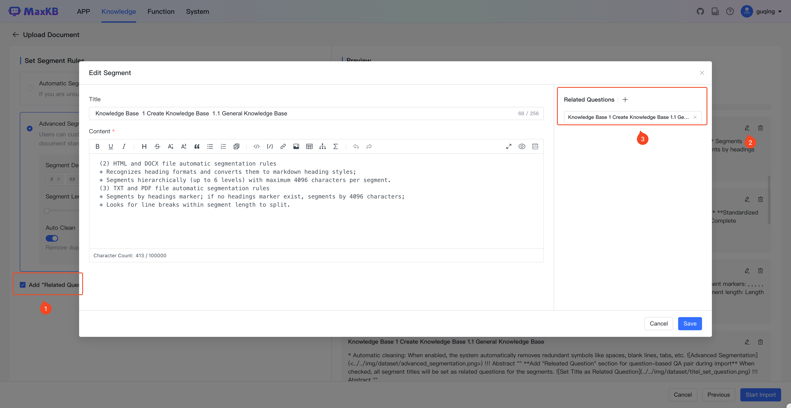
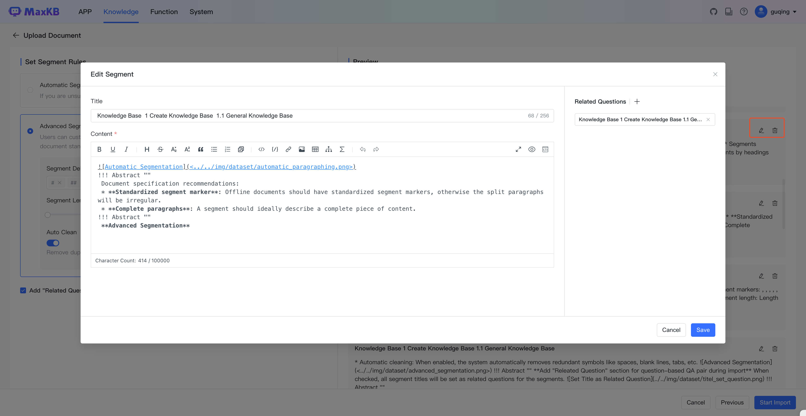

# 知识库
!!! Abstract ""
    企业私有的专业知识库，包含各种类型的数据，是问答对话中回答用户问题的知识来源。      
    MaxKB 知识库分为通用型知识库和 Web 站点知识库两种类型。   
    **通用型知识库：** 对离线文档上传管理，支持的文本文档格式为 Markdown、TXT、PDF、DOCX、HTML；支持 QA 问答对格式为：Excel、CSV。       
    **Web 站点知识库：** 用于获取在线静态文本数据管理，输入 Web 根地址后自动同步根地址及子级地址的文本数据。   
!!! Abstract ""
    点击【知识库】菜单，进入知识库列表页面，该页面支持知识库创建、重新向量化、设置、同步、导出、查询、删除等功能。

## 1 创建通用型知识库
!!! Abstract ""
    打开【知识库】页面，点击【创建知识库】，进入创建知识库页面。 输入知识库名称、知识库描述、选择通用型知识库类型。      
    然后将离线文档通过拖拽方式或选择文件上传方式进行上传。 

- **上传文档** 
!!! Abstract ""
    上传文档要求：  
    支持文本文件格式为：Markdown、TXT、PDF、DOCX、HTML；      
    支持 QA 问答对格式为：Excel、CSV；  
    每次最多上传 50 个文件；   
    每个文件不超过 100 MB；
    支持选择文件夹，上传文件夹下符合要求的文件。
        
    文档规范建议：    
    1、规范分段标识：离线文档的分段标识要有一定规范，否则拆分出来的段落会不规整。   
    2、段落要完整：一个分段中最好能描述一个完整的功能点或问题。  

- **设置分段规则**   
!!! Abstract "" 
    当前支持智能分段和高级分段两种分段方式。   
    **智能分段**  
    MarkDown 类型的文件分段规则为：根据标题逐级下钻式分段（最多支持 6 级标题），每段的字符数最大为 4096 个字符；   
                            当最后一级的文本段落字符数超过设置的分段长度时，会查找分段长度以内的回车进行截取。     
    HTML、DOCX 类型的分段规则为：识别标题格式转换成 MarkDown 的标题样式，逐级下钻进行分段（最多支持 6 级标题）每段的字符数最大为 4096 个字符；
    TXT和 PDF 类型的文件分段规则为：按照标题# 进行分段，若没有#标题的则按照字符数4096个字符进行分段，会查找分段长度以内的回车进行截取。  
      

!!! Abstract ""
    **高级分段**     
    用户可以根据文档规范自定义设置分段标识符、分段长度及自动清洗。   
    分段标识支持： #、##、###、####、#####、######、-、空行、回车、空格、分号、逗号、句号，若可选项没有还可以自定义输入分段标识符。   
    分段长度： 支持最小 50个字符，最大 4096 个字符。   
    自动清洗： 开启后系统会自动去掉重复多余的符号如空格、空行、制表符等。     

!!! Abstract ""
    **导入时添加分段标题为关联问题**         
    勾选后会把所有分段的标题设置为分段的关联问题。

!!! Abstract ""
    **预览**   
    分段规则设置完成后，需要点击【生成预览】查看最新规则的分段效果。

!!! Abstract ""
    用户可在分段预览中对不合理的分段进行编辑和删除。

- **创建完成**  
!!! Abstract ""
    点击【创建并导入】后，系统会对文档进行自动分段 -> 存储 -> 向量化处理操作。    
    在创建完成页面可以看到导入的文档数量、分段数量和字符数。   

!!! Abstract ""   
    点击【返回知识库列表】回到知识库列表页面。   
    点击【前往文档】进入该知识库的【文档】列表页面。  

## 2 创建Web站点知识库
!!! Abstract ""
    点击【创建知识库】，进入创建知识库页面，用户需要输入知识库名称、知识库描述、选择通用型知识库类型。

!!! Abstract ""
    Web根地址： 为在线静态网页站点的根节点地址，系统会自动获取 Web 根地址及子级地址的数据资料。以DataEase V2在线文档为例，可在 Web 根地址为：https://dataease.io/docs/v2/ 。  
    选择器： 是针对Web页面的数据可以设置定获取某个div内的数据，默认获取 body数据。如 DataEase在线文档仅获取中间内容部分，可以右键检查网页，定位到中间内部区域找到 div为 md-content，则选择器输入为：.md-content 。

!!! Abstract ""
    点击【创建并导入】后，跳转到文档列表页面查看当前 Web站点下文档的导入状态，导入完成后，文件状态变为成功状态，导入失败的则文件状态为失败。 

## 3 删除知识库
!!! Abstract ""
    在知识库列表，点击知识库面板的【…】-》【删除】对知识库进行删除操作。

## 4 设置知识库
!!! Abstract ""
    在知识库列表，点击知识库面板的【…】-》【设置】进入知识库设置页面。

!!! Abstract ""
    进入【设置】菜单，可以对当前知识库名称、描述、WEB跟地址、选择器等属性进行修改。
    所有设置保存后设置生效。

## 5 重新向量化
!!! Abstract ""
    在知识库列表，点击知识库面板的【…】-》【重新向量化】，可以对知识库中所有的分段进行重新向量化。

## 6 导出知识库
!!! Abstract ""
    在知识库列表，点击知识库面板的【…】-》【导出】，可以导出知识库中文档和分段内容。

