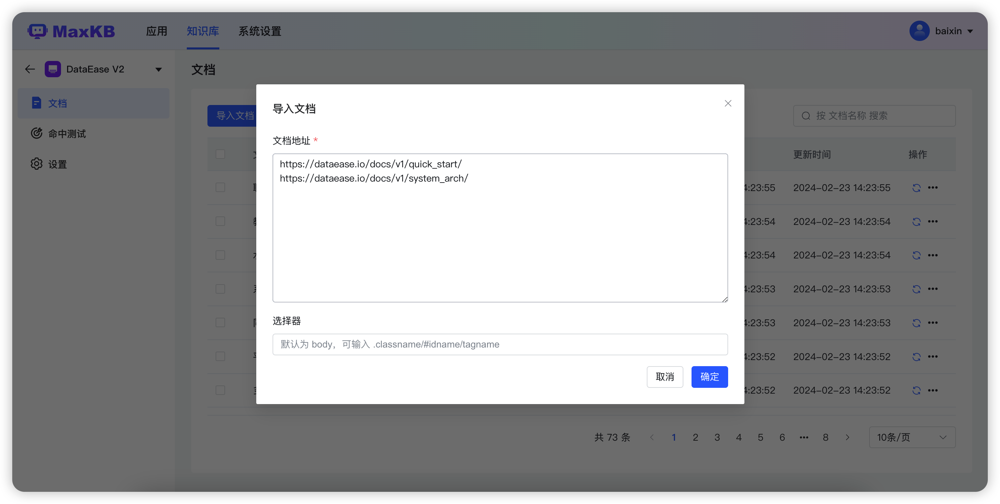

# 文档
!!! Abstract ""
    不同知识库类型的文档属性不同，功能不同，但最终的分段数据会统一一致。

## 1 通用型知识库文档

!!! Abstract ""
    点击通用型知识库面板，进入通用型知识库的【文档】页面。
    在文档列表页面进行文档上传、快速创建空白文档、文档重命名、迁移、设置、删除、启用/禁用等操作。当文档禁用后，当用户提问时不会对该文档下的分段内容进行查询。 

### 1.1 上传文档 
!!! Abstract ""
    点击【上传文档】进入上传文档页面，通过文件拖拽、选择文件夹或选择文件进行上传文档。

!!! Abstract ""
    点击下一步进入【设置分段规则】，可以对上传文档选择分段规则，默认为智能分段。分段规则变更后需要点击【生成预览】，分段预览中将按照最新规则进行分段展示。

!!! Abstract ""
    点击【开始导入】后，系统会对文档进行自动分段 -> 存储 -> 向量化处理操作。

## 2 Web 站点知识库文档
!!! Abstract "" 
    在知识库列表点击【知识库面板】，进入Web站点知识库的【文档】页面。

### 2.1 导入文档    
!!! Abstract ""
    支持单独导入在线文档，点击【导入文档】打开对话框，需要用户输入文档链接和选择器，支持同时导入多个文档，输入文档地址时一行一个。

### 2.2 同步知识库
!!! Abstract ""
    支持对Web站点知识库进行同步更新操作，同步方式分为替换同步和完全同步。
    替换同步：重新获取 Web站点文档，替换本地知识库中地址相同的文档。
    整体同步：先删除本地知识库中所有文档，重新获取 Web站点下的文档数据。

### 2.3 启用/禁用
!!! Abstract ""    
    文档禁用后，当用户提问时不会系统不会检索该文档下的分段内容，只有启用后系统才会检索。   
### 2.4 同步文档 
!!! Abstract ""     
    支持对文档进行单独同步和批量同步操作，同步时会先删除当前文档下的所有分段，重新获取文档地址的文本数据。   

  

### 2.5 文档设置
!!! Abstract ""      
    支持设置文档的命中处理方式。     
    直接返回：指提问时命中该文档下面的分段后，若相似度符合设置会直接返回分段内容。（注意：分段标题不返回）建议图片、链接比较重要的把分段内容维护规范后使用该方式。     
    模型优化：指提问时命中该文档下面的分段后，会按照应用的提示词生成 prompt 发送给模型优化后返回答案。   

### 2.6 文档迁移 
!!! Abstract ""  
    支持对文档进行单独迁移和批量迁移操作。

### 2.7 文档删除 
!!! Abstract ""  
    支持对文档进行单独删除和批量删除操作。

## 3 分段管理
!!! Abstract ""
    导入文档后，系统会进行智能分段操作，点击文档列表中的文档记录，进入到文档的分段管理页面。       
    分段管理功能支持对添加、编辑、迁移、删除、启用/禁用分段以及为分段添加关联问题。      
    **说明：** 分段禁用后，当用户提问时不会匹配禁用的分段。 

### 3.1 添加分段 
!!! Abstract "" 
    点击【添加分段】，弹出添加分段对话框，用户需填写分段标题、分段内容（支持 markdown 样式编辑分段内容。）和关联问题，点击【提交】后则新增一个分段。           
    **建议：** 为了能准确匹配到分段，建议为分段设置关联问题。（当用户提问时系统会优先匹配关联问题，再映射到分段。）      

### 3.2 编辑分段
!!! Abstract ""    
    点击【分段面板】，打开分段详情，在分段详情页面可以对分段进行编辑和关联问题操作。

### 3.3 迁移分段
!!! Abstract ""  
    在分段面板中可以对分段进行迁移操作。

### 3.4 删除分段
!!! Abstract ""  
    在分段面板中可以对分段进行单个删除和批量操作。

