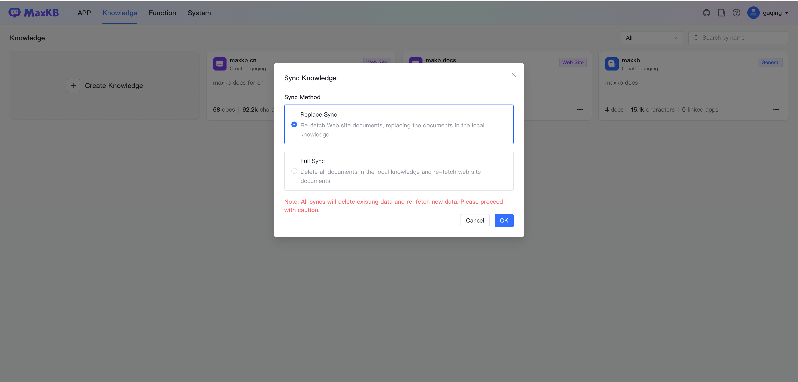
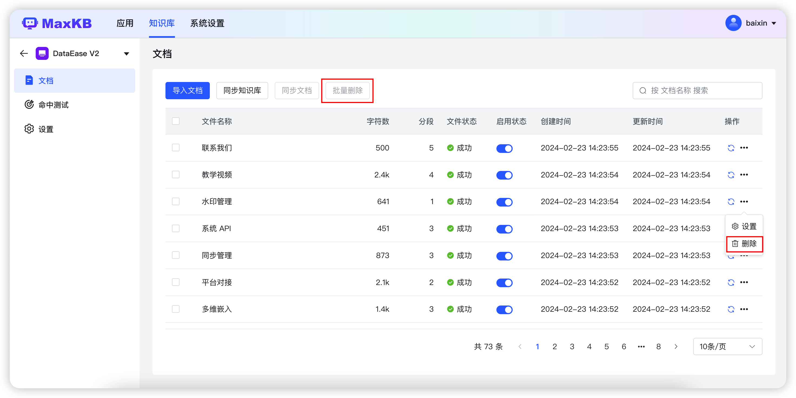

# 文档

## 1 通用型知识库文档

!!! Abstract ""
    点击通用型知识库面板，进入通用型知识库的【文档】页面。
    在文档列表页面可以上传文档、快速创建空白文档，对文档重命名、迁移、设置、删除、启用/禁用等操作。

### 1.1 上传文档 

!!! Abstract ""
    点击【上传文档】进入上传文档页面，通过文件拖拽或者选择文件/文件夹进行上传文档。

!!! Abstract ""
    点击下一步进入【设置分段规则】，可以对上传文档选择分段规则，默认为智能分段。分段规则变更后可以点击【生成预览】后将按照最新规则进行分段展示。

!!! Abstract ""
    点击【开始导入】后，系统会在后台对文档按照自动分段 -> 存储 -> 向量化流程处理。

## 2 Web 站点知识库文档

!!! Abstract "" 
    在知识库列表点击【知识库面板】，进入Web站点知识库的【文档】页面。

### 2.1 导入文档 

!!! Abstract ""
    支持单独导入在线文档，点击【导入文档】打开对话框，需要用户输入文档链接和选择器，支持同时导入多个文档，输入文档地址时一行一个。

### 2.2 同步知识库

!!! Abstract ""
    Web 站点知识库支持同步更新操作，同步方式分为替换同步和完全同步。

    * 替换同步：重新获取 Web 站点文档，替换本地知识库中地址相同的文档。
    * 整体同步：先删除本地知识库中所有文档，重新获取 Web站点下的文档数据。

### 2.3 启用/禁用

!!! Abstract ""    
    文档禁用后，当用户提问时系统不会检索该文档下的分段内容，只有启用后系统才会检索。  

### 2.4 同步文档 

!!! Abstract ""     
    支持对文档进行单独同步和批量同步操作，同步时会先删除当前文档下的所有分段，并重新获取文档地址的文本数据。   

  

### 2.5 文档设置

!!! Abstract ""      
    支持设置文档的命中处理方式。

    * 模型优化：提问时命中该文档下面的分段后，会按照应用的提示词生成 prompt 发送给模型优化后返回答案。
    * 直接返回：提问时命中该文档下面的分段后，若相似度符合设置则直接返回分段内容。对于需要将图片、链接等信息返回的回答要求，建议使用该方式。     
       

### 2.6 文档迁移

!!! Abstract ""  
    选中文档，点击迁移按钮或执行迁移操作，对选中文档迁移到其它知识库。

### 2.7 文档删除

!!! Abstract ""  
    选中文档，点击删除按钮或执行删除操作，对选中文档进行删除。

## 3 分段管理

!!! Abstract ""
    导入文档后，系统根据分段规则进行分段操作，点击文档列表中的文档记录，进入文档的分段管理页面，可添加、编辑、迁移、删除、启用/禁用分段以及为分段添加关联问题。 

### 3.1 添加分段 

!!! Abstract "" 
    点击【添加分段】，弹出添加分段对话框，填写分段标题、分段内容（支持 markdown 样式编辑分段内容。）和关联问题，点击【提交】后则新增一个分段。           
    **建议：** 为了能准确匹配到分段，建议为分段设置关联问题。（当用户提问时系统会优先匹配关联问题，然后再映射分段内容。） 

### 3.2 编辑分段

!!! Abstract ""    
    点击【分段面板】，在分段详情页面对分段进行编辑和关联问题操作。

### 3.3 迁移分段

!!! Abstract ""  
    在分段面板中可以对分段进行迁移操作。

### 3.4 删除分段

!!! Abstract ""  
    在分段面板中可以对分段进行单个删除和批量操作。

