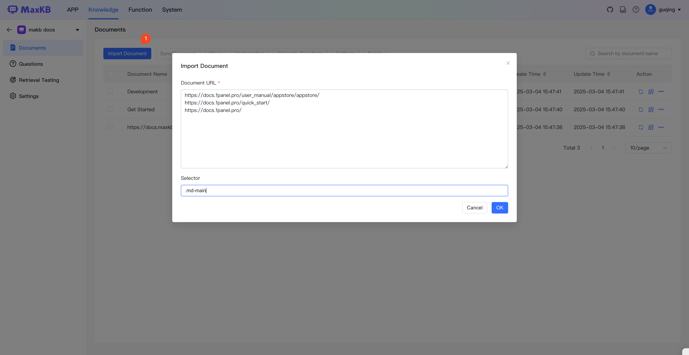
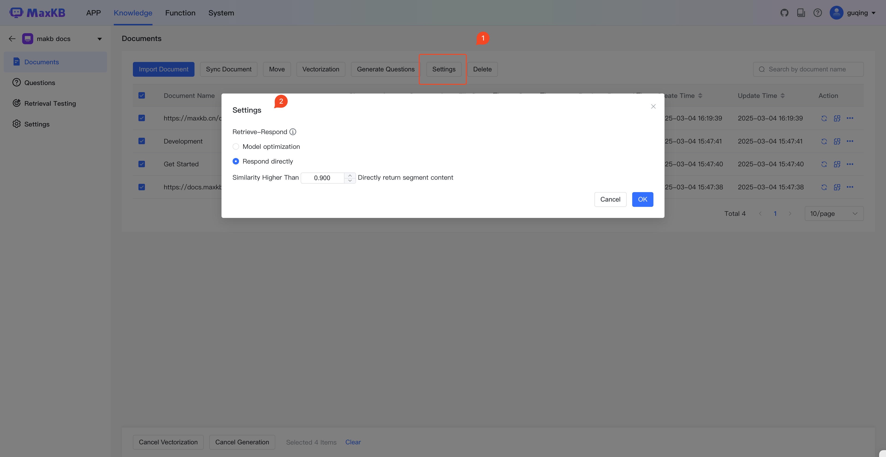
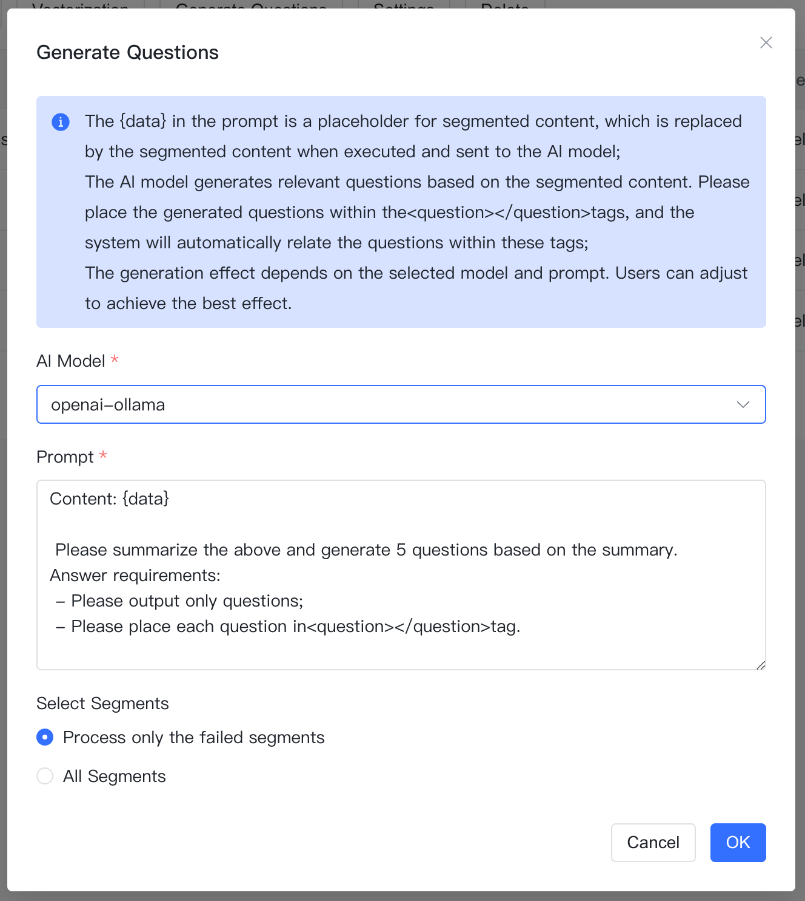
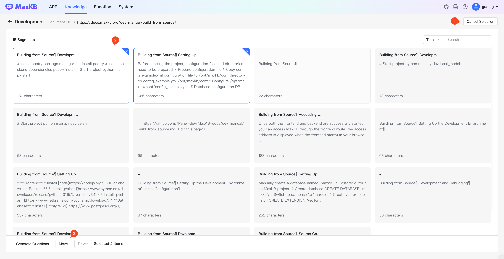

## 1 Document Upload

!!! Abstract ""
    For general knowledge bases, click Upload Document button to enter the document upload page. You can drag and drop files or select files/folders to upload. Supported file formats include: TXT, Markdown, PDF, DOCX, HTML, XLS, XLSX, CSV, ZIP. When selecting folders, files will be automatically filtered by extension. Maximum 50 files can be uploaded at once, with each file not exceeding 100 MB.

!!! Abstract ""
    Click Next to set segmentation rules. You can select segmentation rules for uploaded documents, with intelligent segmentation as the default. After changing segmentation rules, click Apply button to display segmentation according to the latest rules. After clicking Start Import button, the system will process documents in the background following the workflow: automatic segmentation, storage, vectorization.

!!! Abstract ""
    For Web site knowledge bases, click Import Document button to open a dialog box where you can enter document links and selectors. Multiple online Web documents can be entered line by line.

## 2 Sync Knowledge Base

!!! Abstract ""
    Web site knowledge bases support synchronization updates in two ways:

    * Sync and Replace: Re-fetch web site documents and replace documents with matching addresses in the local knowledge base.
    * Full Sync: First delete all documents in the local knowledge base, then re-fetch all documents from the web site.

## 3 Document Synchronization

!!! Abstract ""
    Web site knowledge bases support synchronization of selected documents. During synchronization, all segments under the current document will be deleted, and text data will be re-fetched from the document address and re-segmented.

## 4 Hit Processing Settings

!!! Abstract ""
    Currently, the document settings support various ways of processing document hits:

    * Model Optimization: When segments under this document are matched during questioning, prompts will be generated according to the application's prompt templates and sent to the model for optimization before returning answers.
    * Direct Answer: When segments under this document are matched during questioning and similarity meets the threshold, segment content is returned directly. This method is recommended when images, links and other information need to be returned.

## 5 Generate Questions

!!! Abstract ""
    Select files and click Generate Questions button or execute generate questions operation. The AI model will summarize the file content to generate corresponding questions and automatically associate them.

## 6 Moving documents

!!! Abstract ""
    Select documents and click [Move] button to move documents to other knowledge bases.

## 7 Export EXCEL/ZIP

!!! Abstract ""
    Select documents and execute Export Excel/Export Zip operation to download documents to local client.

## 8 Delete Document

!!! Abstract ""
    Select documents and click delete button or execute delete operation to delete selected documents.

## 9 Enable and Disable Documents

!!! Abstract ""
    In the status column of the document list, you can enable or disable documents. When a document is disabled, the system will not search segments under that document when users ask questions. The system will only search after re-enabling.

## 10 Segment Management

!!! Abstract ""
    After importing, the system segments them according to segmentation rules. Click a document in the document list to enter the document segment management page, where you can add, edit, migrate, delete, enable/disable segments and add related questions to segments.

### 10.1 Add Segment

!!! Abstract ""
    Click Add Segment button to open the add segment dialog box. Fill in segment title, segment content (supports markdown style editing) and related questions, then click Submit button to add a new segment.
    **Recommendation:** To accurately match segments, it's recommended to set related questions for segments. This will prioritize matching related questions before mapping segment content, thereby improving matching efficiency and accuracy.

### 10.2 Edit Segment

!!! Abstract ""
    Click the segment panel to edit segment information and related questions on the segment details page.

### 10.3 Moving section

!!! Abstract ""
    In the segment panel, you can move selected segments to documents in other knowledge bases.

### 10.4 Delete Segment

!!! Abstract ""
    In the segment panel, you can delete selected segments.

