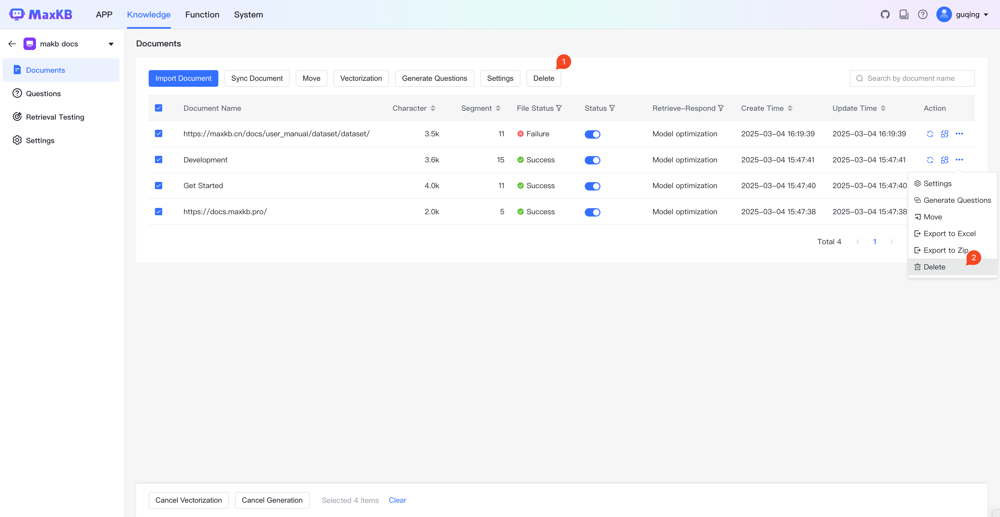
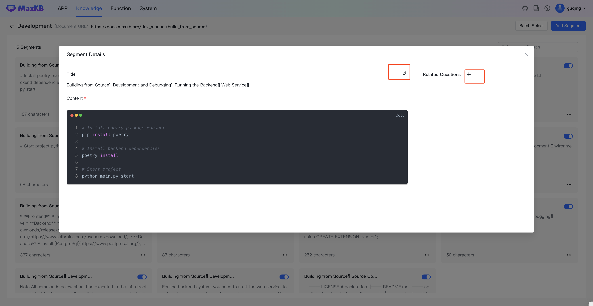

# 文档

## 1 文档上传与导入 

!!! Abstract ""
    对于通用型知识库，点击【上传文档】进入上传文档页面，可以拖拽文件或选择文件/文件夹进行上传，支持的文件格式包括：TXT、Markdown、PDF、DOCX、HTML、EXCEL、CSV。如果选择文件夹，将通过文件后缀进行自动过滤。每次最多上传 50 个文件，单个文件不超过 100 MB。

!!! Abstract ""
    点击下一步进入【设置分段规则】，可以对上传文档选择分段规则，默认为智能分段。分段规则变更后可以点击【生成预览】后将按照最新规则进行分段展示。点击【开始导入】后，系统会在后台对文档按照自动分段 -> 存储 -> 向量化流程处理。

!!! Abstract "" 
    对于 Web 站点知识库，点击【导入文档】打开对话框，输入文档链接和选择器。以分行输入的方式输入多个在线 Web 文档。

## 2 同步知识库

!!! Abstract ""
    Web 站点知识库支持同步更新操作，同步方式分为替换同步和完全同步。

    * 替换同步：重新获取 Web 站点文档，替换本地知识库中地址相同的文档。
    * 整体同步：先删除本地知识库中所有文档，重新获取 Web站点下的文档数据。

## 3 文档同步 

!!! Abstract ""     
    Web 站点知识库支持对选中文档进行同步操作。同步时会先删除当前文档下的所有分段，并重新获取文档地址的文本数据后重新分段。   

  

## 4 文档迁移

!!! Abstract ""  
    选中文档，点击【迁移】按钮，可以将文档迁移到其它知识库。

## 5 文档设置

!!! Abstract ""      
    文档设置目前支持文档的命中处理方式。

    * 模型优化：提问时命中该文档下面的分段后，会按照应用的提示词生成 prompt 发送给模型优化后返回答案。
    * 直接回答：提问时命中该文档下面的分段后，若相似度符合设置则直接返回分段内容。对于需要将图片、链接等信息返回要求，建议使用此方式。     
       

## 6 文档删除

!!! Abstract ""  
    选中文档，点击删除按钮或执行删除操作，对选中文档进行删除。

## 7 文档启用与禁用

!!! Abstract ""    
    在文档列表中的其中状态列，可对文档执行启用或禁用操作。文档禁用后，当用户提问时系统不会检索该文档下的分段内容，需要重新启用后系统才会检索。  

## 8 分段管理

!!! Abstract ""
    导入文档后，系统根据分段规则进行分段操作。点击文档列表中的文档，进入文档分段管理页面，可添加、编辑、迁移、删除、启用/禁用分段以及为分段添加关联问题。 

### 8.1 添加分段 

!!! Abstract "" 
    点击【添加分段】，弹出添加分段对话框，填写分段标题、分段内容（支持 markdown 样式编辑分段内容）和关联问题，点击【提交】后则新增一个分段。           
    **建议：** 为了能准确匹配到分段，建议为分段设置关联问题，这样会优先匹配关联问题，然后再映射分段内容，从而提高匹配效率和准确度。 

### 8.2 编辑分段

!!! Abstract ""    
    点击分段面板，在分段详情页面对已分段的信息进行编辑和关联问题操作。

### 8.3 迁移分段

!!! Abstract ""  
    在分段面板中可以对选中分段迁移到其它知识库的文档中。

### 8.4 删除分段

!!! Abstract ""  
    在分段面板中可以对选中分段进行删除。

