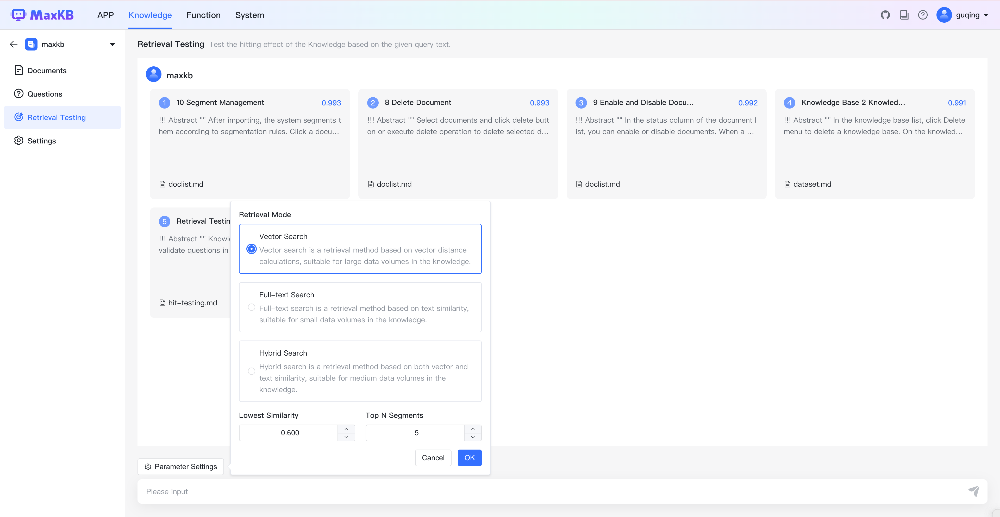

# Retrieval Testing

!!! Abstract ""  
    Knowledge base hit testing is used to validate questions in advance. Click Retrieval Testing, enter a test question, and the system will perform vector retrieval in the current knowledge base to find segments related to the question, then return hit results based on parameters like similarity and Top N segments. Knowledge base administrators can review the returned segments and edit them or add related questions to further improve and optimize answer quality.

!!! Abstract ""
    **Parameter Settings**

    * **Retrieval Mode**: Currently supports 3 retrieval modes - vector retrieval, full-text retrieval and hybrid retrieval. 
    (1) Vector Retrieval: Uses vector models to calculate text segments most similar to user questions through vector distance.     
    (2) Full-text Retrieval: Uses keyword search to return text segments containing the most keywords.    
    (3) Hybrid Retrieval: Performs both full-text and vector retrieval, then reranks to select the best matching results from both query types.
    * **Similarity**: Higher similarity indicates stronger relevance between questions and segments.    
    * **Top N References**: Returns the Top N segments meeting the criteria.    