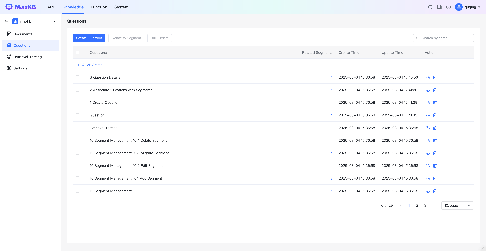
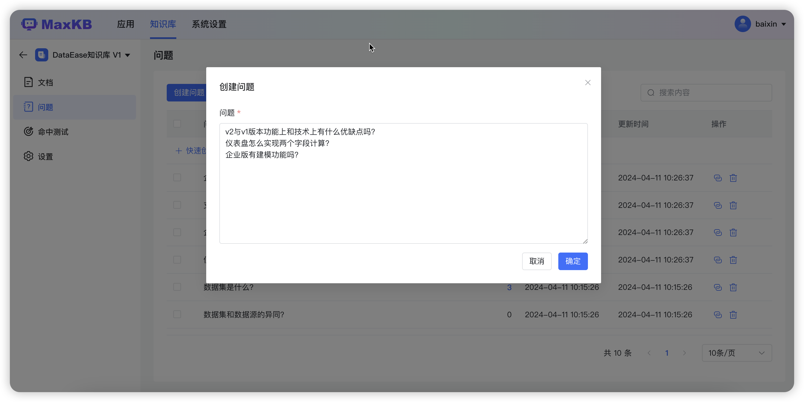
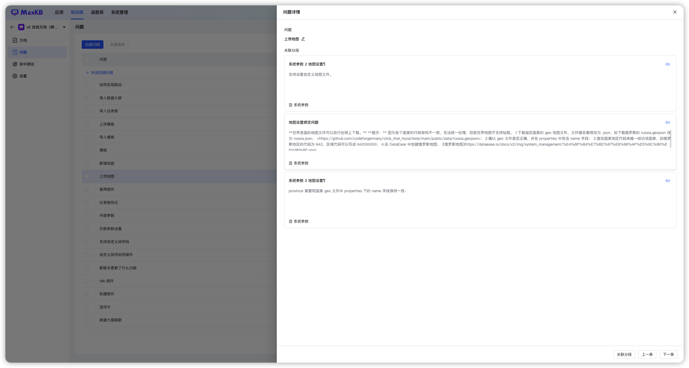

# 问题

!!! Abstract ""  
    MaxKB 知识库管理员可以收集用户可能提出的相关问题，创建问题并关联知识库文档中的内容，维护知识库常见问题列表，以提高问答的准确度。

## 1 创建问题

!!! Abstract ""  
    点击【创建问题】，分行输入问题列表。

## 2 问题关联分段

!!! Abstract ""  
    问题添加完成后，可以与文档中的分段进行关联，当用户提问时会优先匹配问题库来查询相关的分段。

## 3 问题详情

!!! Abstract ""  
    点击问题查看详情，可对分段内容进行修改或取消关联关系。

