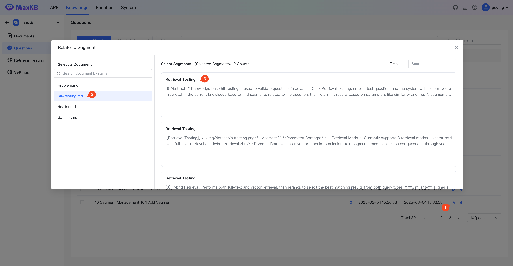
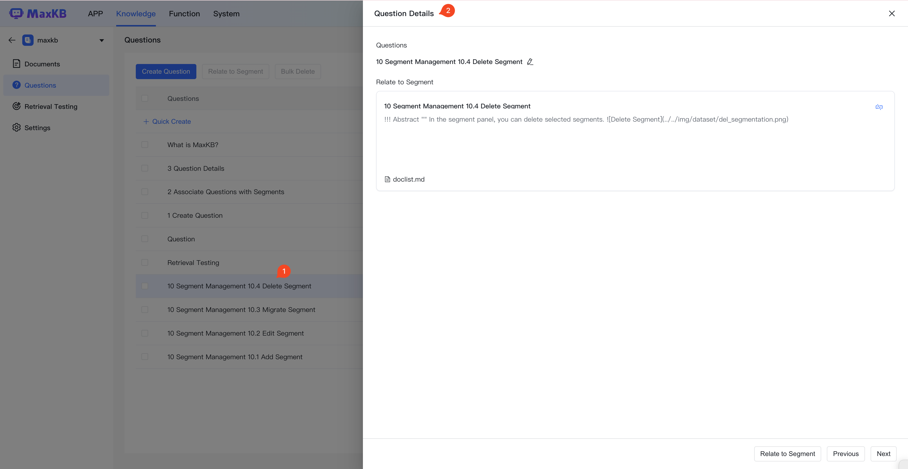

# 问题

!!! Abstract ""  
    MaxKB 知识库管理员可以收集用户可能提出的相关问题添加到问题库中进行维护，并将问题关联文档中的知识点，以提高问答的准确度。     
    问题按知识库进行分类管理，当前知识库的问题仅关联当前知识库中的分段内容。

## 1 创建问题

!!! Abstract ""  
    点击【创建问题】，分行输入问题列表。

## 2 问题关联分段

!!! Abstract ""  
    问题添加完成后，可以与文档中的分段进行关联，当用户提问时会优先匹配问题库来查询相关的分段。

## 3 问题详情

!!! Abstract ""  
    点击问题查看详情，可对分段内容进行修改或取消关联关系。

