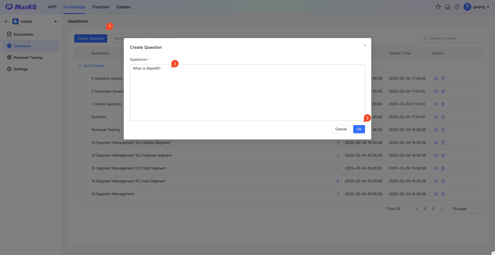

# 问题
!!! Abstract ""  
    支持问题管理，维护知识库的用户可以收集用户可能提出的相关问题添加到问题库中进行维护。并将问题关联文档中的知识点，提高问答的准确度。     
    问题按知识库进行分类管理，当前知识库的问题仅能关联当前知识库中的分段内容。   
    问题不可重复添加。    

## 1 创建问题
!!! Abstract ""  
    用户可以快速创建单个问题，也可以批量创建多个问题。

## 2 问题关联分段
!!! Abstract ""  
    问题添加完成后，可以关联文档中的分段，当用户提问时会优先匹配问题库来查询相关的分段。

## 3 问题详情

!!! Abstract ""  
    点击问题记录可以打开问题详情，查看问题关联的分段内容，支持对分段内容进行修改或取消关联关系。

