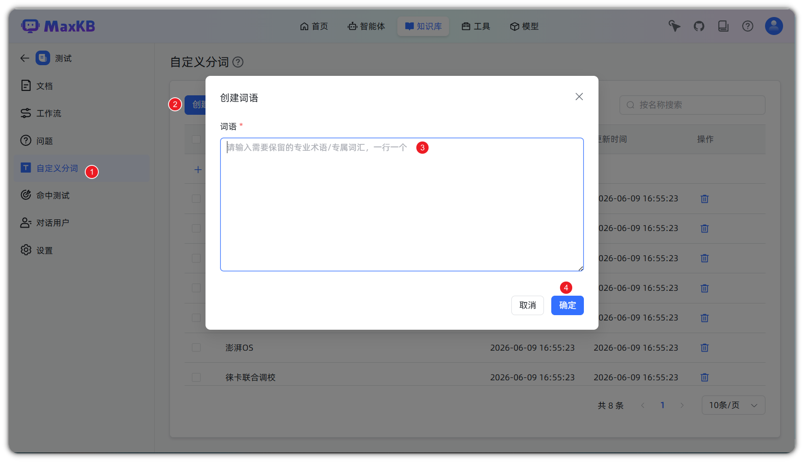
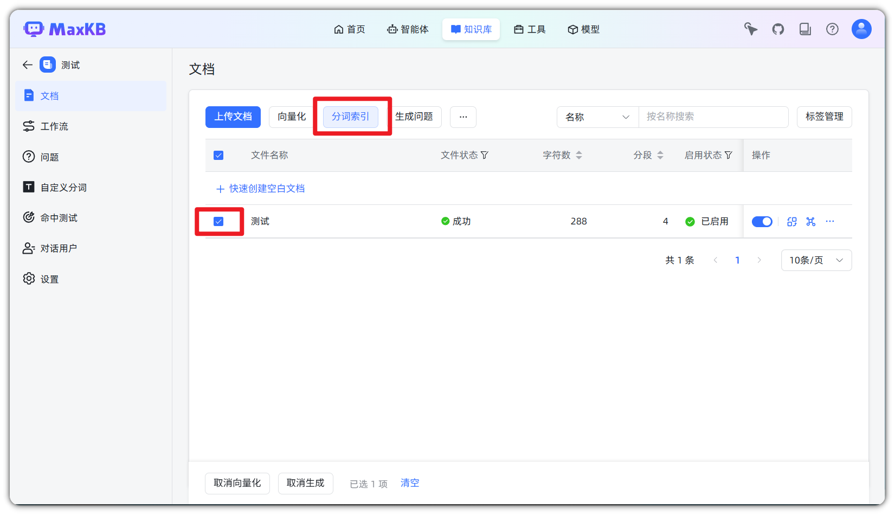

# 自定义分词


## 功能概述


!!! Abstract ""  

    自定义分词功能允许管理员为知识库添加专业术语词典，避免专业术语在检索时被错误拆分，从而提升全文检索和混合检索的精准度与召回率。

## 功能价值

### 核心问题

在中文分词中，专业术语常常被错误拆分：

| 术语   | 错误拆分  | 正确处理       |
|------|-------|------------|
| 小米手机 | 小米、手机 | 小米手机（作为整体） |
| 苹果手机 | 苹果、手机 | 苹果手机（作为整体） |
| 人工智能 | 人工、智能 | 人工智能（作为整体） |

### 应用价值

- **精准匹配**：确保专业术语作为完整单元进行检索
- **召回率提升**：避免因术语拆分导致的漏检
- **行业适配**：支持企业自定义行业术语词典


## 操作指南


### 1. 创建词语

!!! Abstract ""

    点击「创建词语」按钮，输入需要保留的专业术语，支持快速创建多个词语（一行一个）。


### 2. 执行分词索引

!!! Abstract ""

    添加术语后，点击「分词索引」按钮，系统将重新生成文档的分词索引。



### 注意事项

- 自定义词语生效范围：仅对**全文检索**和**混合检索**生效
- 添加新术语后需重新执行分词索引才能生效
- 词语支持范围：建议使用纯中文术语，避免包含空格、特殊字符

## 技术原理

### 检索流程

```
用户提问 → 读取术语库 → 配置分词器 → 分词处理 → 匹配检索
```

### 缓存机制

系统会缓存已配置的分词器实例（有效期1小时），避免重复创建，提升检索性能。

### 适用检索模式

| 检索模式 | 是否生效 | 说明 |
|---------|---------|------|
| 全文检索 | ✓ | 基于关键词匹配，使用分词器 |
| 混合检索 | ✓ | 全文检索部分使用分词器 |
| 向量检索 | ✗ | 基于语义相似度，不使用分词 |

