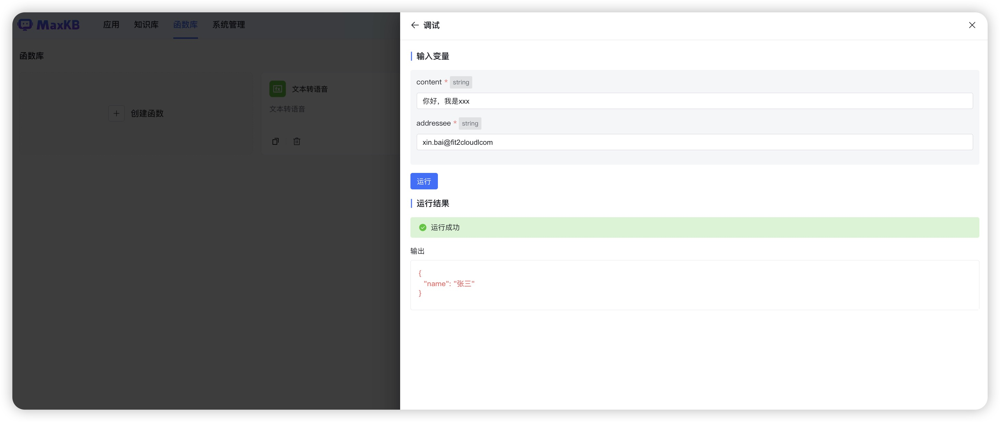
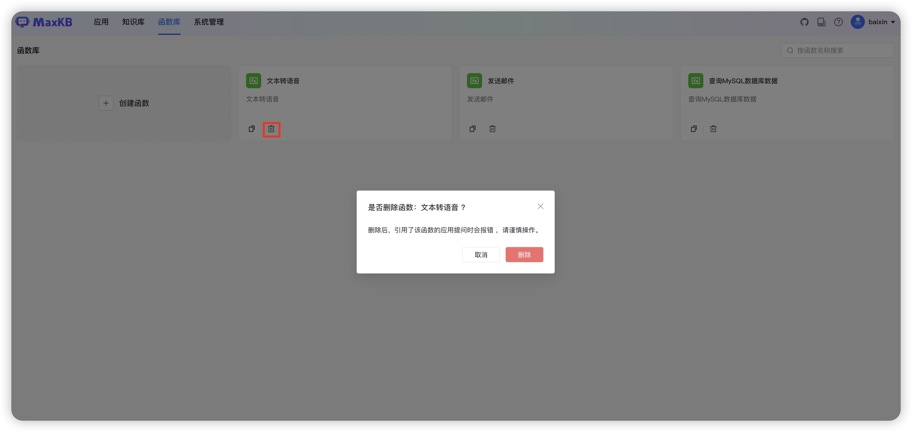
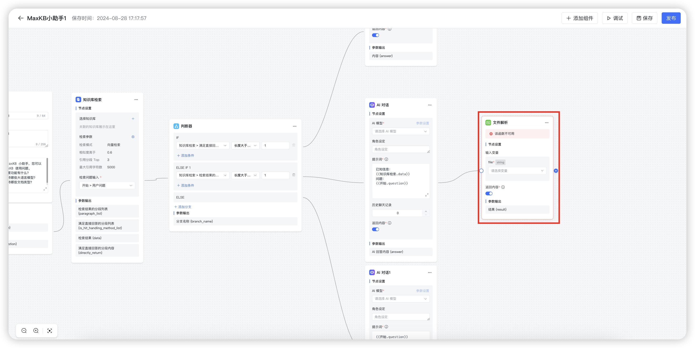

# 函数库

!!! Abstract ""
    MaxKB 知识库问答系统支持了函数库功能。用户可以根据自身的业务需求，在函数库中创建特定的函数脚本，例如数据处理、逻辑判断、信息提取或其它任何满足实际工作场景的操作。       
    函数创建完成后，在应用编排时以添加组件的方式调用这些函数，从而更好地满足各种复杂的业务需求。这种组件化的设计不仅提高了工作效率，还使得整个系统更加模块化，便于维护和扩展。      


## 1.函数依赖包安装

!!! Abstract ""
    如果函数实现需要安装第三方依赖包，可在 maxkb 容器中使用 pip 命令进行安装。

    ```
    # 进入 maxkb 容器中
    docker exec -it maxkb bash

    # pip安装第三方依赖，如 pymysql，执行下面命令
    pip install pymysql 
    ```


## 2.创建函数


!!! Abstract ""
    点击【创建函数】，打开创建函数对话框。

    - 函数名称：函数的调用标识，创建成功后显示在高级编排应用的组件列表中。       
    - 描述：函数详细说明以及使用注意事项，会显示在高级编排应用的组件列表中。       
    - 输入变量：函数的输入变量，变量的数据类别包括：string、int、float、array，来源分为自定义赋值和引用前置节点的变量值。
        在高级编排应用配置函数节点对应的输入变量。    
    - Python 代码：自定义编写 Python 函数代码，可以引用输入变量。  
    - 输出变量：Python 代码执行返回的结果。


!!! Abstract ""
    Python 代码编写完成后，点击【调试】进行代码功能的验证。调试完成后，点击【创建】，即完成函数的创建。  


!!! Abstract ""
    创建成功的函数，可以在【高级编排应用】的设置中，点击【添加组件】->【函数库】中，以添加组件的方式调用这些函数。


## 3.复制函数

!!! Abstract ""
    在函数列表，点击函数面板的【复制】按钮，打开复制函数对话框，用户可以编辑对复制内容编辑后，点击【创建】即可创建一个新函数。


## 4.删除函数

!!! Abstract ""
    在函数列表，点击函数面板的【删除】按钮。


!!! Abstract ""
    注意：函数删除后，若在应用中引用了该函数，那么在应用的编排页面会显示`该函数不可用`，且用户提问会报错。 


