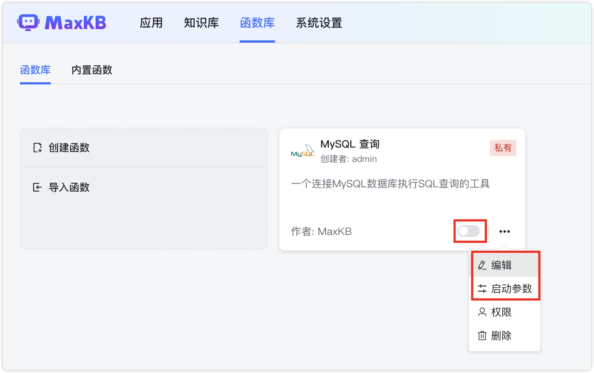
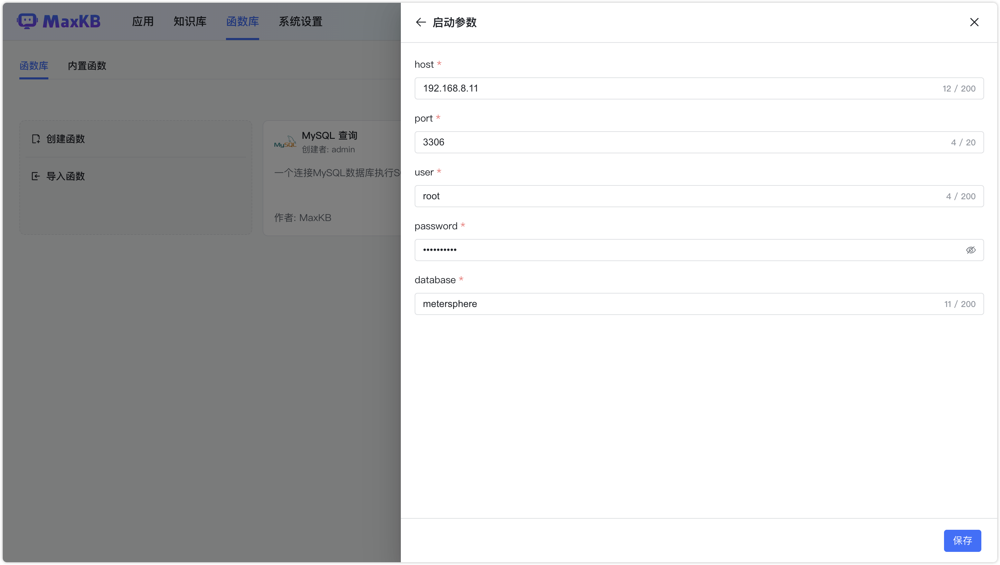

# 函数库

!!! Abstract ""
    MaxKB 支持用户根据自身的业务需求，通过内置函数或自定义函数对获取和查询数据，逻辑判断、信息提取或其它场景的操作。
    函数创建完成后，在应用编排时以添加组件的方式调用这些函数，从而更好地满足各种复杂的业务需求。这种组件化的设计不仅提高了工作效率，还使得整个系统更加模块化，便于维护和扩展。      


## 1.内置函数

!!! Abstract ""
    MaxKB 支持内置函数库，目前包括数据库查询以及页面搜索两种常见的类型，具体包括如下内置函数：

    - MySQL 查询
    - PostgreSQL 查询
    - 博查搜索
    - Google Search
    - LangSearch


!!! Abstract ""
    内置函数添加到函数库后，需要配置启动参数，例如数据库连接信息、API Key 等，并启用后才可以在高级编排应用中使用。

{width="800px"}


## 2.自定义函数

### 2.1 函数依赖包安装

!!! Abstract ""
    如果函数实现需要安装第三方依赖包，可在 MaxKB 容器中使用 pip 命令进行安装。

    ```
    # 进入 maxkb 容器中
    docker exec -it maxkb bash

    # pip安装第三方依赖，如 pymysql，执行下面命令
    pip install pymysql 
    ```


### 2.2 函数创建


!!! Abstract ""
    点击【创建函数】，打开创建函数对话框。

    - 函数名称：函数的 logo 以及函数名称，便于识别。函数 logo 在保存后可自定义上传。     
    - 描述：函数详细说明以及使用注意事项，会显示在高级编排应用的组件列表中。
    - 启动参数：启用参数即函数运行的必要参数，例如 API Key 等。将启动参数与输入参数分离，在工作流中仅关注输入参数，同时也避免关键信息的泄露。
    - 输入参数：函数的输入参数，参数的数据类别包括：string、int、float、array，可自定义赋值，也可引用参数。 
    - 函数内容：自定义编写 Python 函数代码，可以引用输入变量。  
    - 输出参数：Python 代码执行返回的结果。


{width="600px"}

!!! Abstract ""
    Python 代码编写完成后，点击【调试】进行代码功能的验证。调试完成后，点击【创建】，即完成函数的创建。  


!!! Abstract ""
    创建成功的函数，可以在【高级编排应用】的设置中，点击【添加组件】->【函数库】中，以添加组件的方式调用这些函数。


## 3.函数导出/导入
    
!!! Abstract ""
    函数支持导出和导入，对应的文件后缀为 `.fx`。


    

## 4.复制函数

!!! Abstract ""
    点击函数面板的【复制】按钮，打开复制函数对话框，对原函数内容进行编辑修改后点击【创建】即可快速创建一个新函数。


## 5.删除函数

!!! Abstract ""
    点击函数面板的【删除】按钮，即可对函数进行删除。


!!! Abstract ""

    **注意：** 函数删除后，如果应用引用了该函数，那么在编排页面将显示`该函数不可用`的提示信息，并且在问答时也会报错。 


