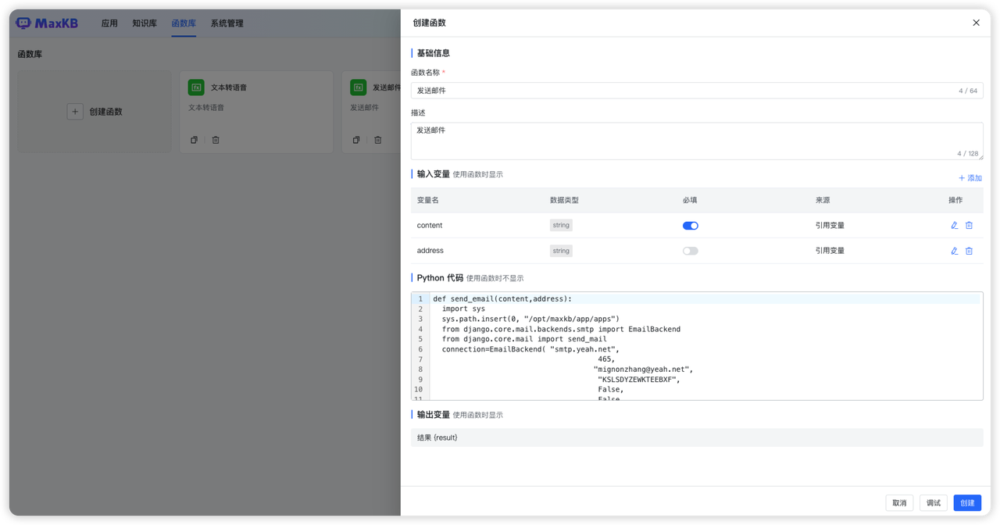
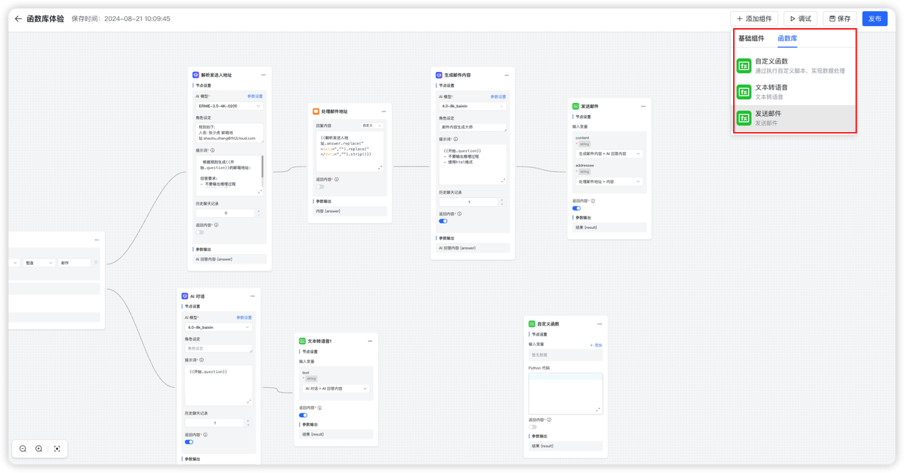

# 函数库

!!! Abstract ""
    MaxKB 知识库问答系统支持了函数库功能。     
    函数库功能的加入，意味着用户现在可以根据自身的业务需求，在函数库中创建特定的函数脚本。这些脚本可以是数据处理、逻辑判断、信息提取或其他任何满足特定工作场景的操作。       
    函数创建完成后，在应用编排时以添加组件的方式调用这些函数，从而更好地满足各种复杂的业务需求。      
    这种组件化的设计不仅提高了工作效率，还使得整个系统更加模块化，便于维护和扩展。      


## 1.函数库依赖包安装说明
!!! Abstract ""
    进入 maxkb 容器中
    ```
    docker exec -it maxkb bash
    ```
    安装第三方依赖，如 pymysql，执行下面命令：
    ```
    pip install pymysql 
    ```


## 2.创建函数


!!! Abstract ""
    点击【创建函数】，打开创建函数对话框。      
    **函数名称：** 一目了然，方便用户找到，会显示在高级编排应用的组件列表中。       
    **描述：** 对函数的详细说明和注意事项，会显示在高级编排应用的组件列表中。       
    **输入变量：** 定义函数的输入变量，支持添加多个变量，变量值的来源支持自定义输入和引用前置节点的变量。         
                 设置的输入变量，在高级编排应用的选择该函数后显示在节点设置中。    
    **Python 代码：** 编写函数的脚本，函数的入参需要有上面定义的输入变量。在高级编排应用中不显示该部分代码。  
    **输出变量：** Python代码的执行结果。    


!!! Abstract ""
    Python 代码编写完成后，可以点击【调试】进行代码调试，调试正常的代码，点击【创建】，便可以创建完成函数。  


!!! Abstract ""
    创建成功的函数，可以在【高级编排应用】的设置中，点击【添加组件】->【函数库】中，以添加组件的方式调用这些函数。



## 3.复制函数

!!! Abstract ""
    在函数列表，点击函数面板的【复制】按钮，打开复制函数对话框，用户可以编辑对复制内容编辑后，点击【创建】即可创建一个新函数。


## 4.删除函数

!!! Abstract ""
    在函数列表，点击函数面板的【删除】按钮。 

!!! Abstract ""
    注意：函数删除后，若在应用中引用了该函数，那么在应用的编排页面会显示 该函数不可用，且用户提问会报错。 

