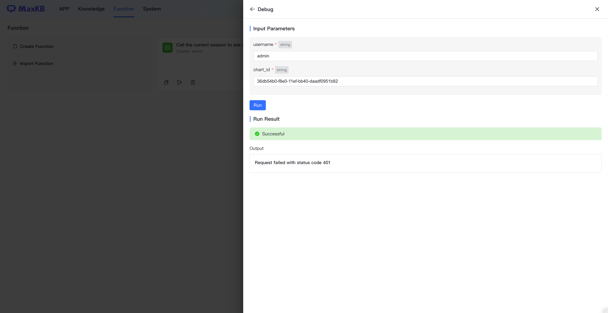

# Function Library

!!! Abstract ""
    MaxKB supports function library capabilities. Users can create specific function scripts in the function library based on their business needs, such as data processing, logical judgment, information extraction, or any other operations that meet actual work scenarios.       
    After functions are created, they can be called as components during application orchestration to better meet various complex business requirements. This componentized design not only improves work efficiency, but also makes the entire system more modular, easier to maintain and extend.      

## 1. Install Dependencies

!!! Abstract ""
    If function implementation requires third-party dependency packages, you can use pip commands in the maxkb container to install them.

    ```
    # Enter maxkb container
    docker exec -it maxkb bash

    # Use pip to install third-party dependencies, e.g. pymysql, run:
    pip install pymysql 
    ```

## 2. Create Function

!!! Abstract ""
    Click Create Function button, open the create function dialog.

    - Function Name: Function call identifier, displayed in the component list of advanced orchestration applications after creation.       
    - Description: Detailed function description and usage notes, displayed in the component list of advanced orchestration applications.       
    - Input Parameters: Parameters with data types include string, int, float, array. Sources can be custom values or referenced from preceding node variables. Configure input variables for function nodes in advanced orchestration applications.    
    - Function Content: Custom Python function code that can reference input variables.  
    - Output Parameters: Results returned from Python code execution.


!!! Abstract ""
    After writing Python code, click Debug button to verify the code functionality. After debugging, click Create button to complete function creation.  


!!! Abstract ""
    Created functions can be called as components in workflow applications.


## 3. Copy Function

!!! Abstract ""
    Click the Copy button on the function panel to open the copy function dialog, edit the original function content and click Create button to quickly create a new function.


## 4. Delete Function

!!! Abstract ""
    Click the Delete button on the function panel to delete the function.


!!! Abstract ""

    **Note:** After a function is deleted, if an application references that function, the workflow page will display a "Function Unavailable" message and Q&A will also report errors. 


