# 工作空间首页

## 1 概述

!!! Abstract ""

    工作空间首页统计功能，提供全面的资源管理和运营数据可视化。首页由 **快捷创建**、**资源概览**、**监控统计**、**使用排行榜** 四大模块组成，为管理员提供资源调度与运营决策支持。

---

## 2 页面布局
!!! Abstract ""

    首页采用模块化设计，主要包含四个核心区域：
    
    | 模块 | 功能定位 | 核心内容 |
    |-----|---------|---------|
    | **快捷创建** | 快速操作入口 | 一键创建智能体、知识库、工具、模型 |
    | **资源概览** | 资源统计展示 | 智能体、知识库、工具、模型的总量与分类 |
    | **监控统计** | 运营数据追踪 | 活跃用户、对话量、Token消耗、满意度走势 |
    | **使用排行榜** | 数据排名统计 | TOP智能体、TOP用户的Token消耗和对话次数 |

---

## 3 快捷创建

### 3.1 功能说明

!!! Abstract ""

    快捷创建模块提供常用资源的一键创建入口，支持快速创建或导入智能体、知识库、工具和模型。

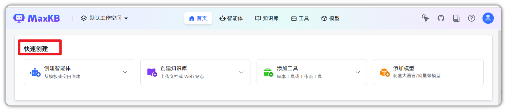

## 4 资源概览

### 4.1 功能说明

!!! Abstract ""

    资源概览模块展示工作空间内各类型资源的总量统计与分类信息，帮助管理员快速了解资源分布状况。

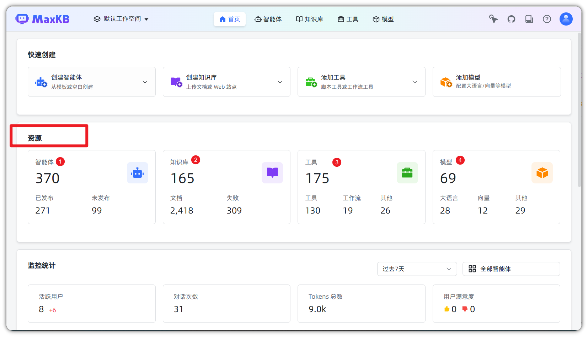

### 4.2 统计内容

## 5 监控统计

### 5.1 功能说明

!!! Abstract ""

    监控统计模块追踪工作空间的运营数据，包含活跃用户、对话量、Token消耗量以及用户满意度的走势图表。

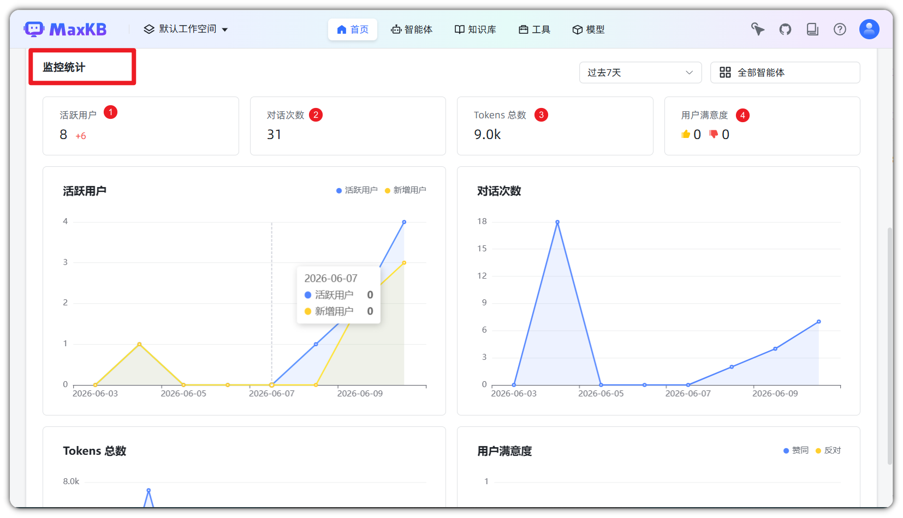
### 5.2 统计指标、趋势图表
!!! Abstract ""

    #### 核心指标卡片
    
    | 指标 | 说明 |
    |-----|------|
    | **活跃用户** | 统计周期内的活跃用户数量及环比变化 |
    | **对话次数** | 统计周期内的对话交互总次数 |
    | **Tokens 总数** | 统计周期内消耗的 Tokens 总量 |
    | **用户满意度** | 用户对对话结果的满意与不满意评价统计 |
!!! Abstract ""

    | 图表 | 展示内容 |
    |-----|---------|
    | **活跃用户趋势** | 活跃用户与新增用户的每日变化趋势 |
    | **对话次数趋势** | 每日对话次数的变化趋势 |
    | **Tokens 消耗趋势** | 每日 Tokens 消耗量的变化趋势 |
    | **用户满意度趋势** | 每日满意与不满意评价的变化趋势 |

### 5.3 时间范围选择

!!! Abstract ""

    支持选择不同的统计周期，包括过去7天、30天、90天等选项。

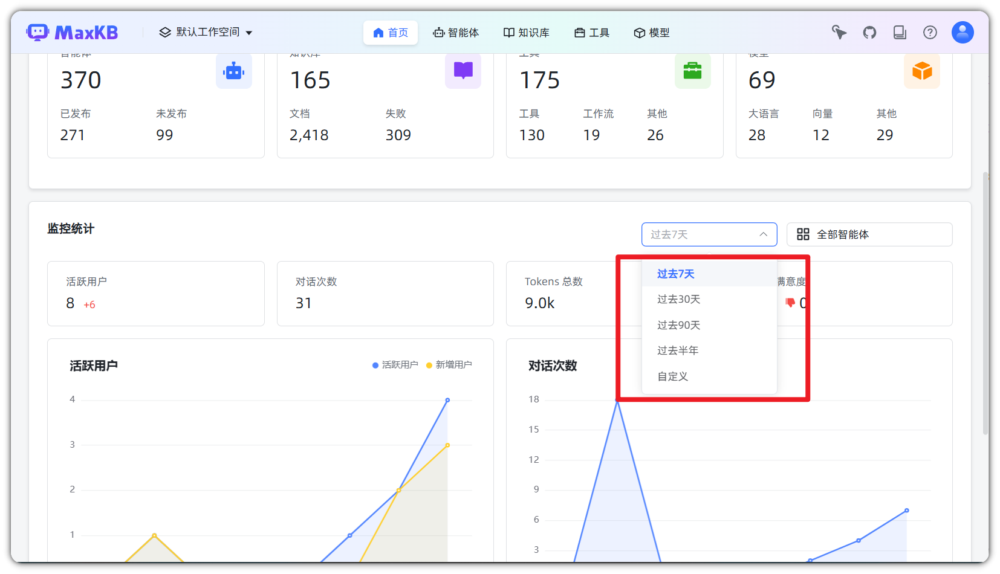
### 5.4 筛选功能

!!! Abstract ""

    支持按智能体筛选统计数据，查看特定智能体的运营情况。
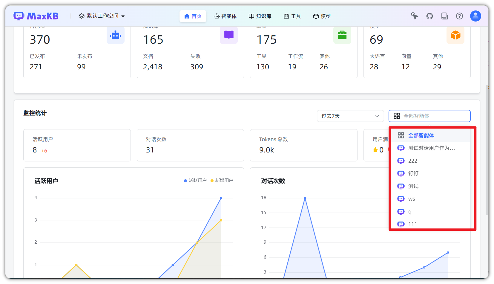
---
## 6 使用排行榜

### 6.1 功能说明

!!! Abstract ""

    使用排行榜模块按照 Token 消耗和对话次数分别统计 TOP 智能体和 TOP 用户，为管理员提供资源调度依据。

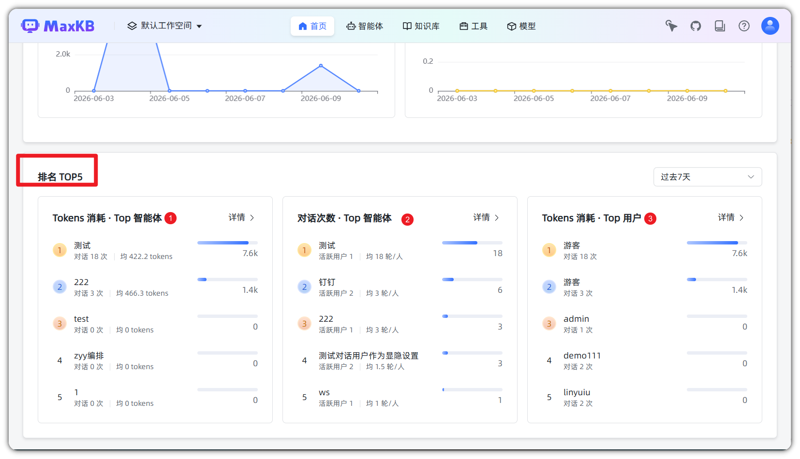

### 6.2 排名统计
!!! Abstract ""

    #### Tokens 消耗 - TOP 智能体
    
    | 排名 | 展示内容 |
    |-----|---------|
    | 排名列表 | 按 Tokens 消耗量降序排列的智能体 |
    | 消耗数值 | 每个智能体的 Tokens 消耗总量 |
    | 趋势标识 | 环比增减趋势指示 |

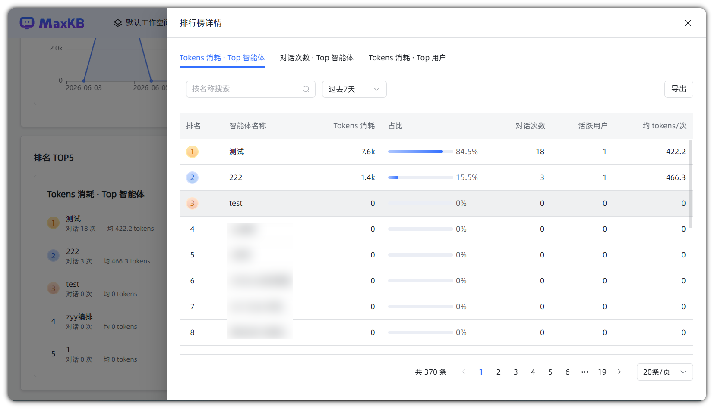

!!! Abstract ""

    #### 对话次数 - TOP 智能体
    
    | 排名 | 展示内容 |
    |-----|---------|
    | 排名列表 | 按对话次数降序排列的智能体 |
    | 对话数值 | 每个智能体的对话次数 |
    | 趋势标识 | 环比增减趋势指示 |

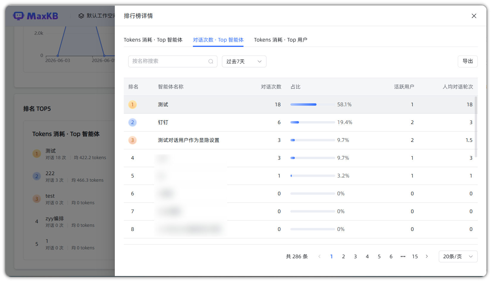

!!! Abstract ""

    #### Tokens 消耗 - TOP 用户
    
    | 排名 | 展示内容 |
    |-----|---------|
    | 排名列表 | 按 Tokens 消耗量降序排列的用户 |
    | 消耗数值 | 每个用户的 Tokens 消耗总量 |
    | 趋势标识 | 环比增减趋势指示 |
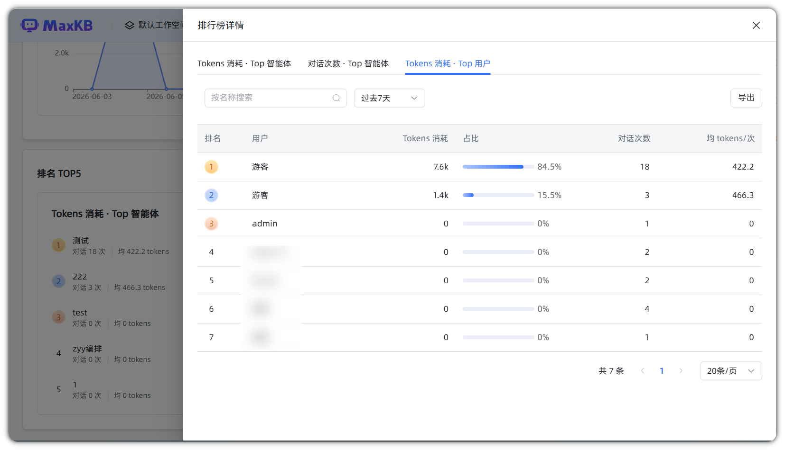

#### 6.2.1 导出
!!! Abstract ""

    排行榜详情页支持按指定时间范围筛选数据后导出全量明细 Excel 文件，导出数据包含当前筛选条件下全部分页数据，不受页面 20 条 / 页展示限制。

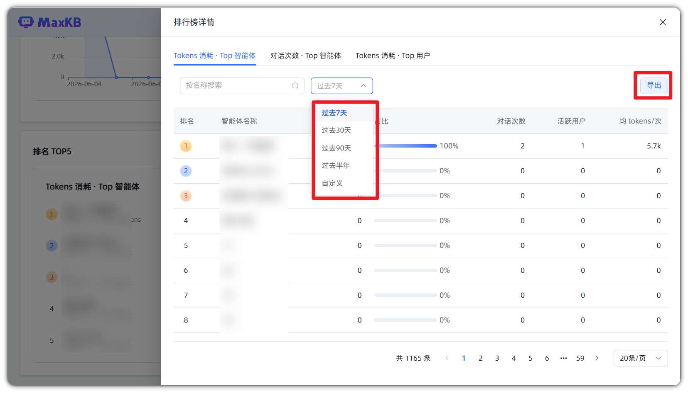
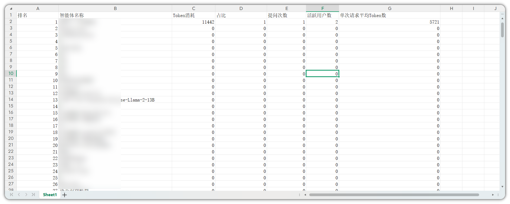

