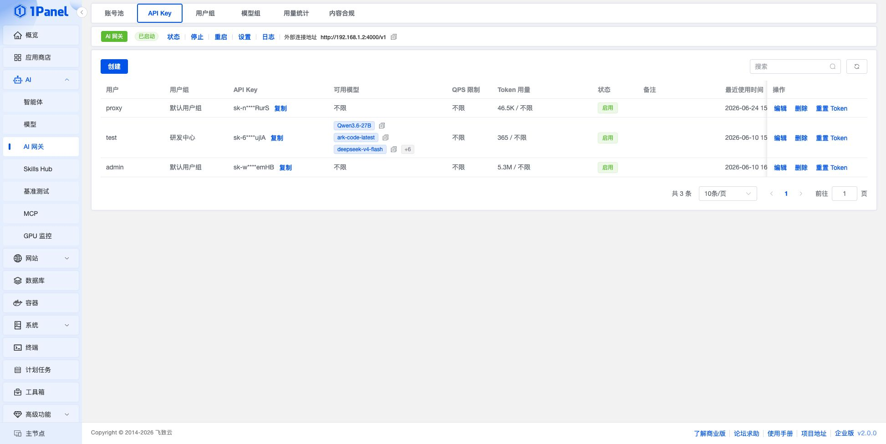
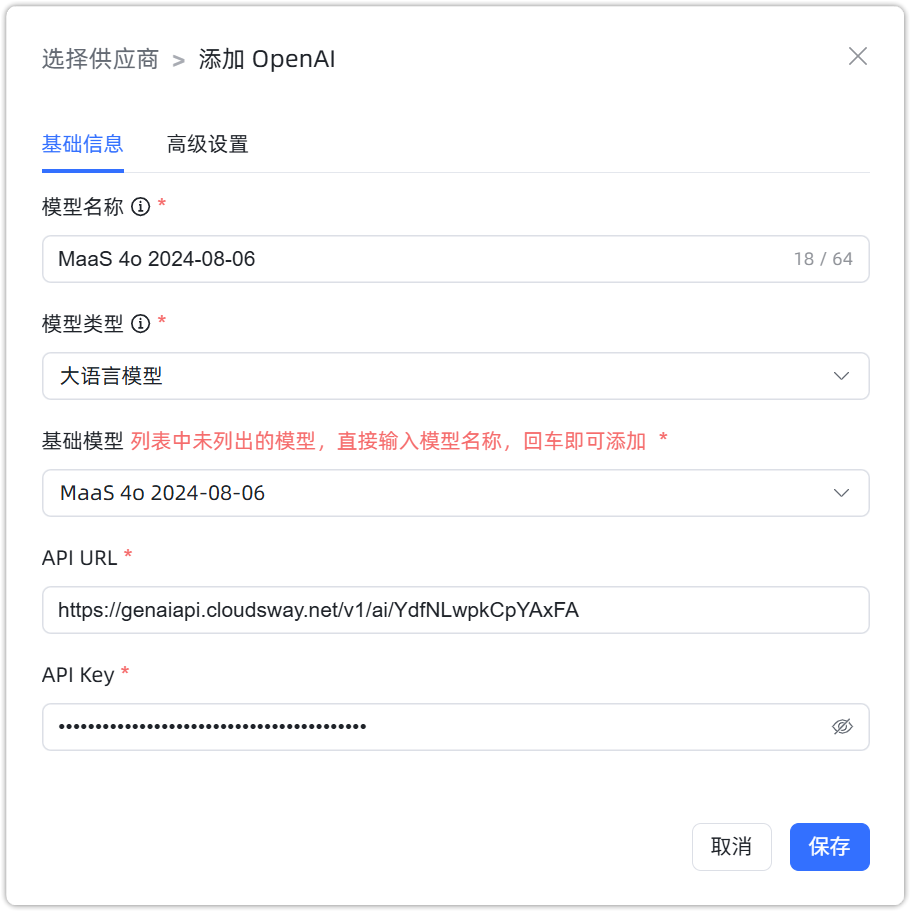

## 1 添加模型

!!! Abstract ""
    对接 1Panel AI 网关之前，需要先在 1Panel 的 `AI` > `AI 网关` > `API Key` 页面获取外部连接地址和 API Key，参考下图：

    选择模型供应商为`OpenAI`，并在模型添加对话框中输入如下必要信息：

    * 模型名称：MaxKB 中自定义的模型名称。
    * 模型类型：大语言模型。
    * 基础模型：1Panel AI 网关中可用的模型名称。
    * API 域名：1Panel AI 网关的外部连接地址，例如 `http://<1Panel 服务器 IP>:4000/v1`。
    * API Key：1Panel AI 网关 API Key 页面创建的 Key。

{ width="800px" }

## 2 配置样例

!!! Abstract ""
    OpenAI-大语言模型配置样例图示：

{ width="500px" }
