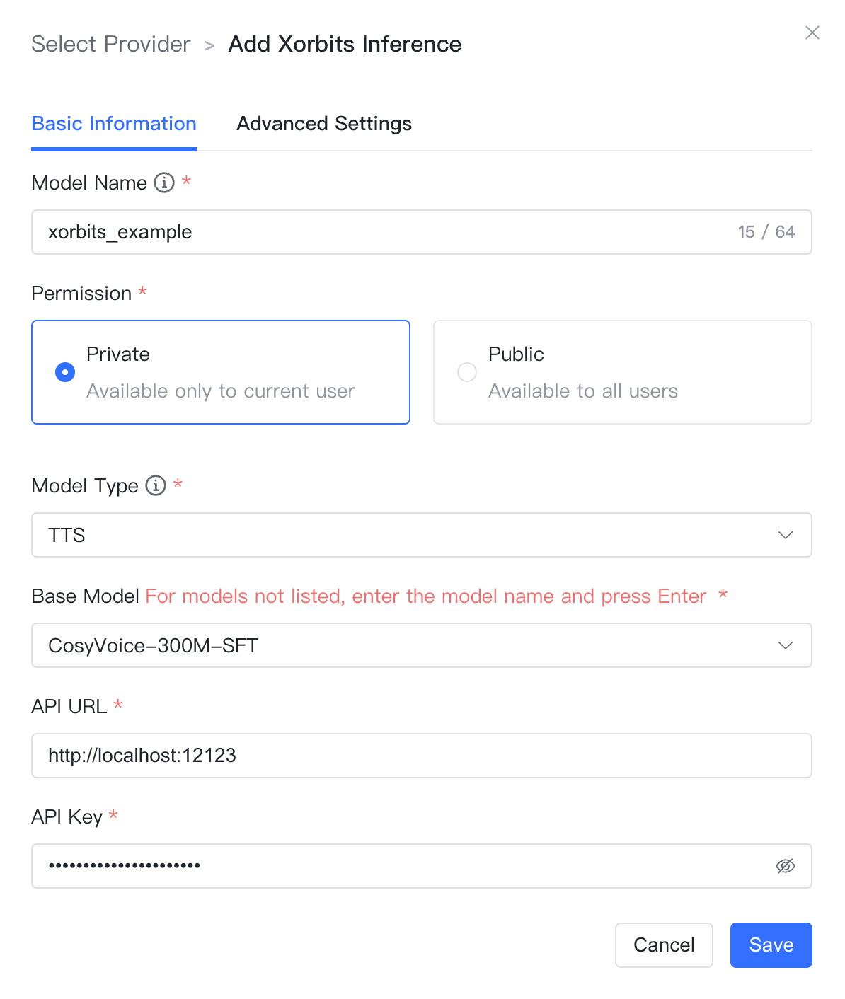

## 1 添加模型

!!! Abstract ""
    选择模型供应商为`Xorbits Inference`，并在模型添加对话框中输入如下必要信息：

    * 模型名称：MaxKB 中自定义的模型名称。    
    * 权限：分为私有和公用两种权限，私有模型仅当前用户可用，公用模型即系统内所有用户均可使用，但其它用户不能编辑和删除。    
    * 模型类型：大语言模型/向量模型/语音识别/语音合成/重排模型。   
    * 基础模型：不同类型模型下的基础模型名称，下拉选项是常用的一些基础模型名称，支持自定义输入。  

!!! Abstract "" 
    大语言模型和重排模型需要输入 API 域名和API Key，向量模型需要输入API 域名。

    * API 域名：Xorbits Inference 服务地址，例如：http://192.168.20.242:9997 。 
    * API Key：若没有 API Key，输入任意字符即可。

## 2 配置样例

!!! Abstract ""
    Xorbits Inference-大语言模型配置样例图示：
{ width="500px" }

!!! Abstract ""
    Xorbits Inference-向量模型配置样例图示：
{ width="500px" }

!!! Abstract ""
    Xorbits Inference-语音识别模型配置样例图示：
{ width="500px" }

!!! Abstract ""
    Xorbits Inference-语音合成模型配置样例图示：
{ width="500px" }

!!! Abstract ""
    Xorbits Inference-重排模型配置样例图示：
{ width="500px" }