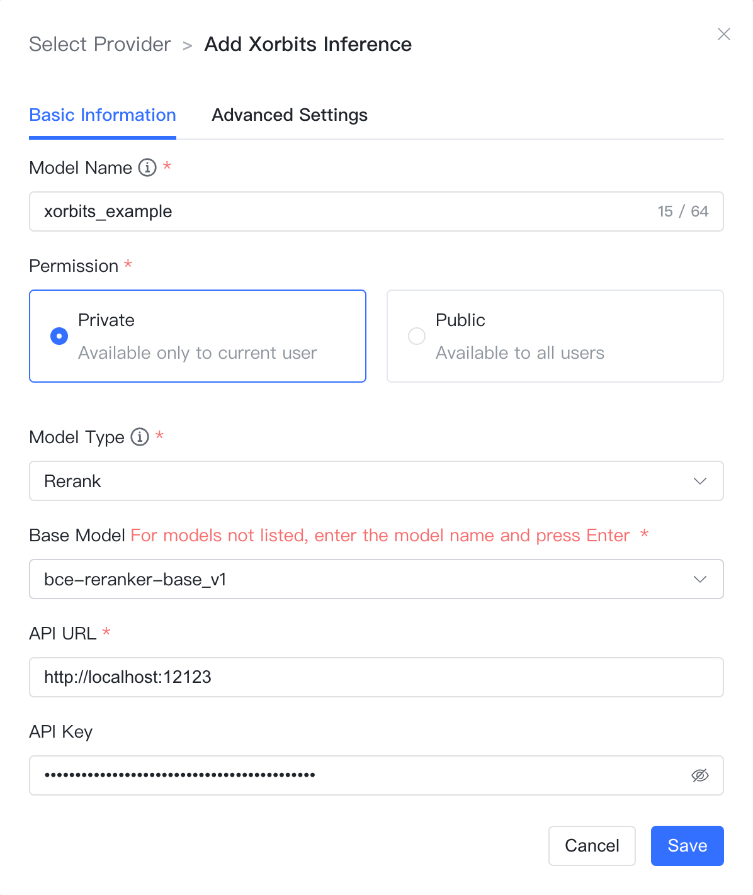

## 1 Add Model

!!! Abstract ""
    Select the model provider as `Xorbits Inference`, and enter the following necessary information in the model addition dialog box:

    * Model Name: The custom model name in MaxKB.
    * Permissions: Divided into private and public permissions. Private models are available only to the current user, while public models can be used by all users within the system, but other users cannot edit or delete them.
    * Model Type: Large Language Model / Vector Model / Rerank Model / Speech Recognition / Speech Synthesis / Image Understanding / Image Generation.
    * Base Model: The base model name under different model types. The dropdown options include some commonly used base model names, and custom input is supported.

!!! Abstract ""
    Large language models and rerank models require input of the API Domain and API Key, while vector models require input of the API Domain.

    * API Domain: Xorbits Inference service address, e.g., http://192.168.20.242:9997.
    * API Key: If there is no API Key, you can enter any characters.

## 2 Configuration Example

!!! Abstract ""
    The configuration example illustration for Xorbits Inference-Large Language Model is as follows:
{ width="500px" }

!!! Abstract ""
    The configuration example illustration for Xorbits Inference-Vector Model is as follows:
{ width="500px" }

!!! Abstract ""
    The configuration example illustration for Xorbits Inference-Rerank Model is as follows:
{ width="500px" }

!!! Abstract ""
    The configuration example illustration for Xorbits Inference-Speech Recognition Model is as follows:
{ width="500px" }

!!! Abstract ""
    The configuration example illustration for Xorbits Inference-Speech Synthesis Model is as follows:
{ width="500px" }
