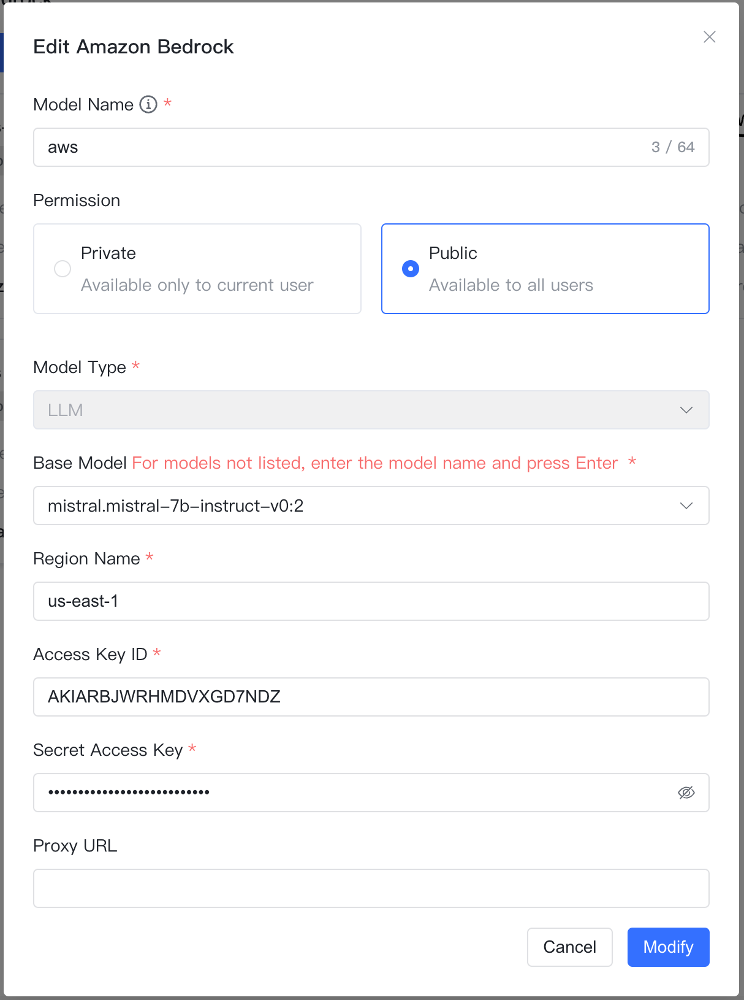
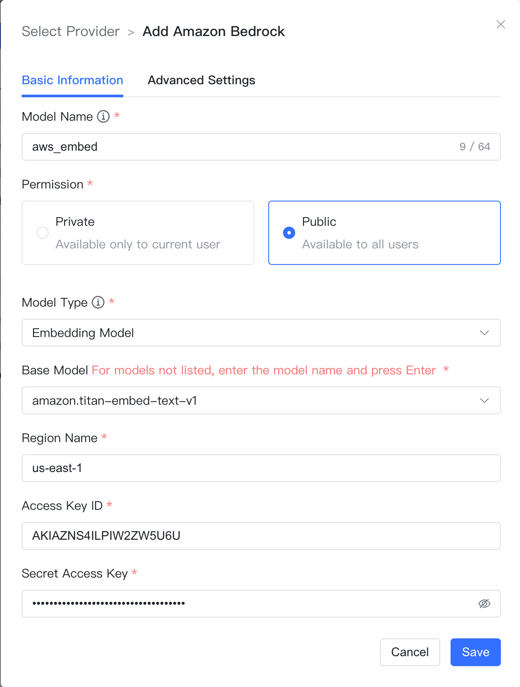

## 1 添加模型

!!! Abstract ""
    选择模型供应商为`Amazon Bedrock`，并在模型添加对话框中输入如下必要信息：

    * 模型名称：MaxKB 中自定义的模型名称。    
    * 权限：分为私有和公用两种权限，私有模型仅当前用户可用，公用模型即系统内所有用户均可使用，但其它用户不能编辑和删除。
    * 模型类型：大语言模型/向量大模型。   
    * 基础模型：Amazon Bedrock 支持的 LLM 模型名称，下拉选项是常用的一些大语言模型名称，支持自定义输入。     
    * Region Name：模型开通的区域。    
    * Access Key ID/Secret Access Key:  Access Key ID 和 Secret Access Key 是用于对 AWS 服务（包括 Amazon Bedrock）的编程访问进行身份验证的凭证。

## 2 配置样例

!!! Abstract ""
    Amazon Bedrock-大语言模型配置样例图示：

{ width="500px" }

!!! Abstract ""
    Amazon Bedrock-向量模型配置样例图示：

{ width="500px" }