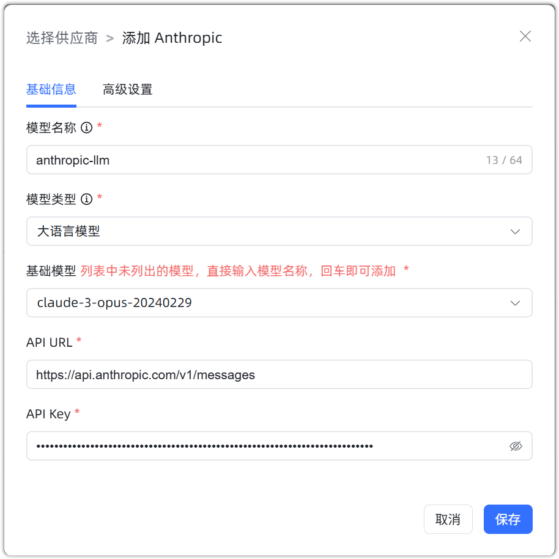

## 1 添加模型

!!! Abstract ""
    添加 Anthropic 模型之前，需要注册并在控制台中的【账户管理-API 密钥】中创建 API Key。

    选择模型供应商为`Anthropic`，并在模型添加对话框中输入如下必要信息：

    * 模型名称：MaxKB 中自定义的模型名称。    
    * 模型类型：大语言模型/视觉模型。    
    * 基础模型：Anthropic 支持的各类模型的基础模型名称，选项中显示了 Anthropic 支持的部分常用大语言模型名称，支持手动输入需要与 Anthropic 支持的模型名称保持一致，否则无法通过校验。    
    * API URL：https://api.anthropic.com/v1/messages
    * API Key：在 anthropic 控制台创建的 API Key。

## 2 配置样例

!!! Abstract ""
    Anthropic-大语言模型配置样例图示如下：

{ width="500px" }

