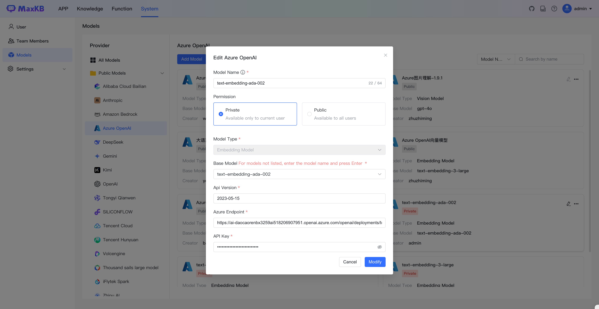

## 1 添加模型

!!! Abstract "" 
    添加 Azure OpenAI 大模型之前，需要先在 [Azure AI Studio](https://ai.azure.com/) 中注册，并获取有关API 域名、API Key、部署详细信息等内容，参考下图：

!!! Abstract "" 
    选择模型供应商为`Azure OpenAI`，并在模型添加对话框中输入如下必要信息：

    * 模型名称：MaxKB 中自定义的模型名称。   
    * 权限：分为私有和公用两种权限，私有模型仅当前用户可用，公用模型即系统内所有用户均可使用，但其它用户不能编辑和删除。    
    * 模型类型：大语言模型/向量模型/语音识别/语音合成/视觉模型/图片生成。   
    * 基础模型：具体的基础模型由部署名决定，见上图。 
    * API 版本：模型版本
    * API 域名：Azure OpenAI 项目 API 服务 URL，见上图。
    * API Key：Azure OpenAI 项目 API 服务认证验证信息，见上图。
    * 部署名：Azure AI Studio 项目操场中模型的部署名称。

## 2 配置样例

!!! Abstract "" 
    Azure OpenAI-大语言模型配置样例图示：

