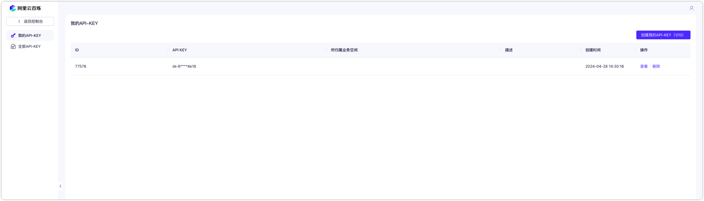
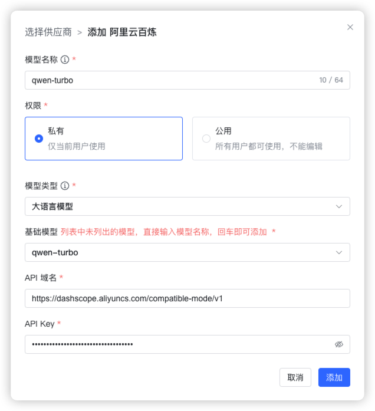
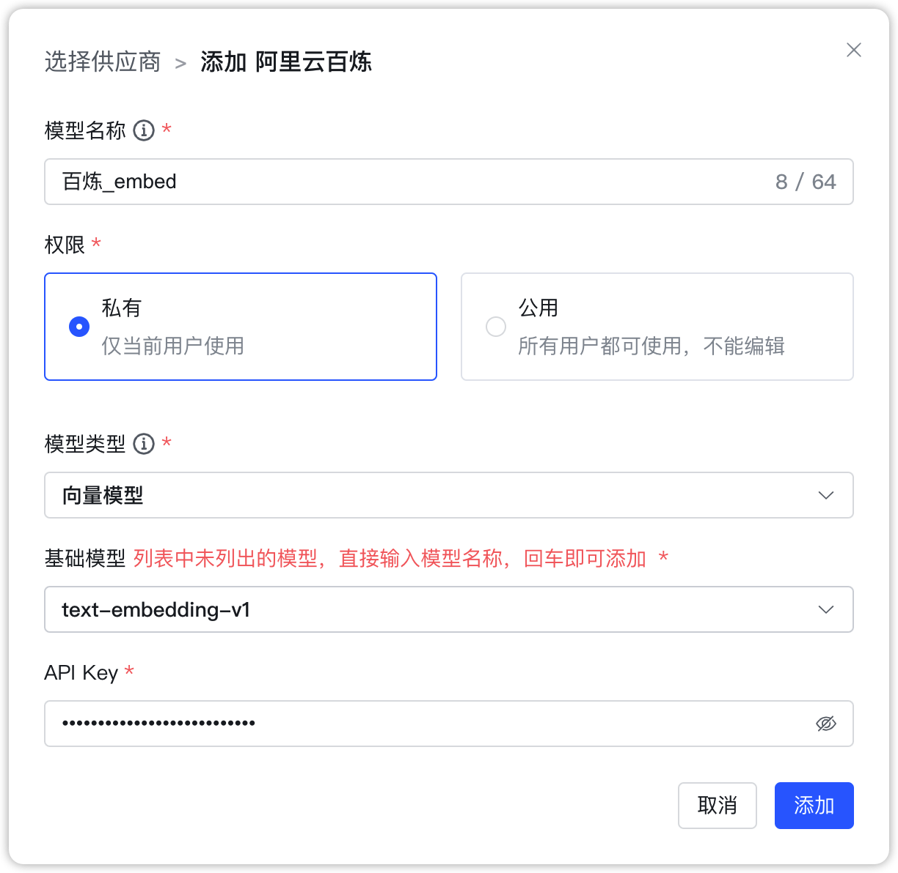
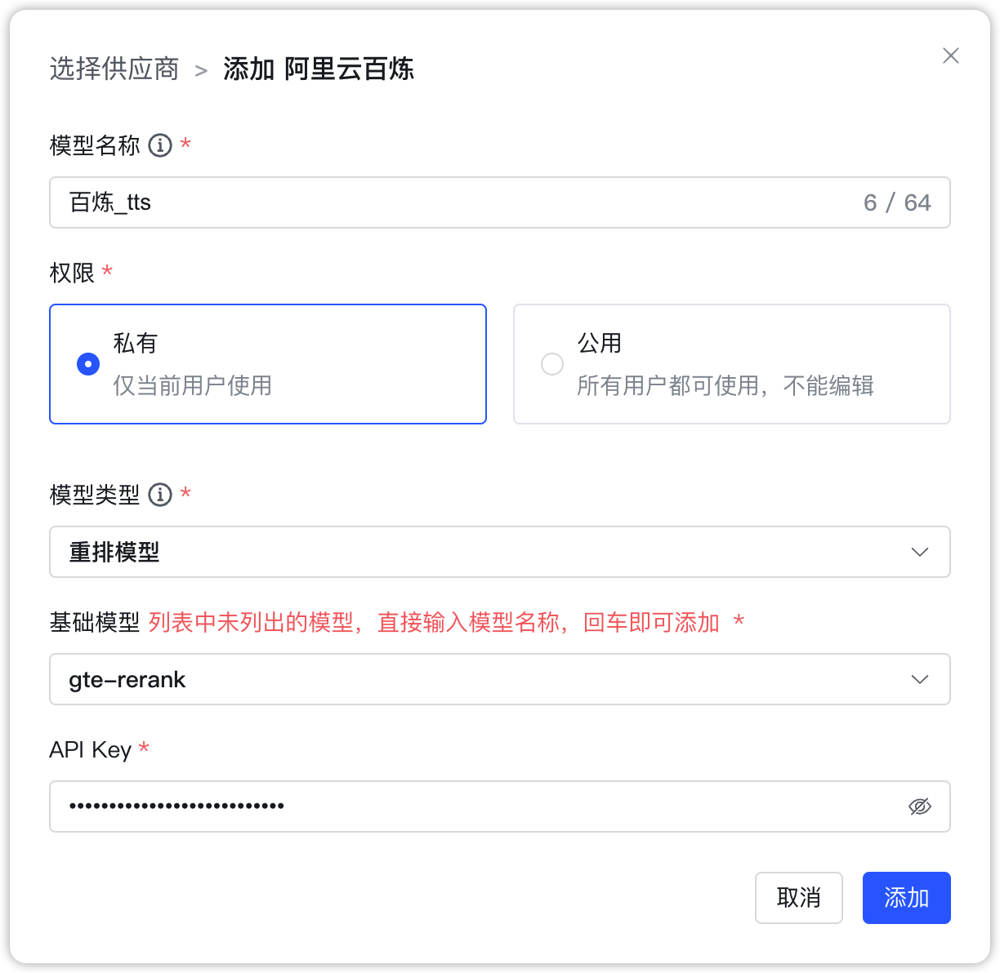
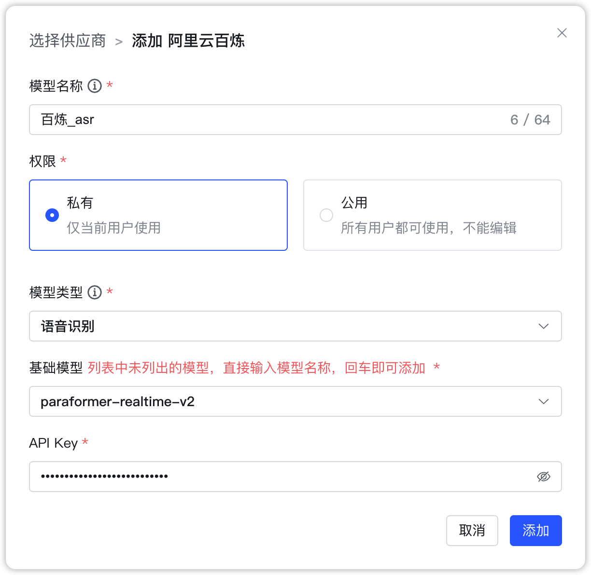
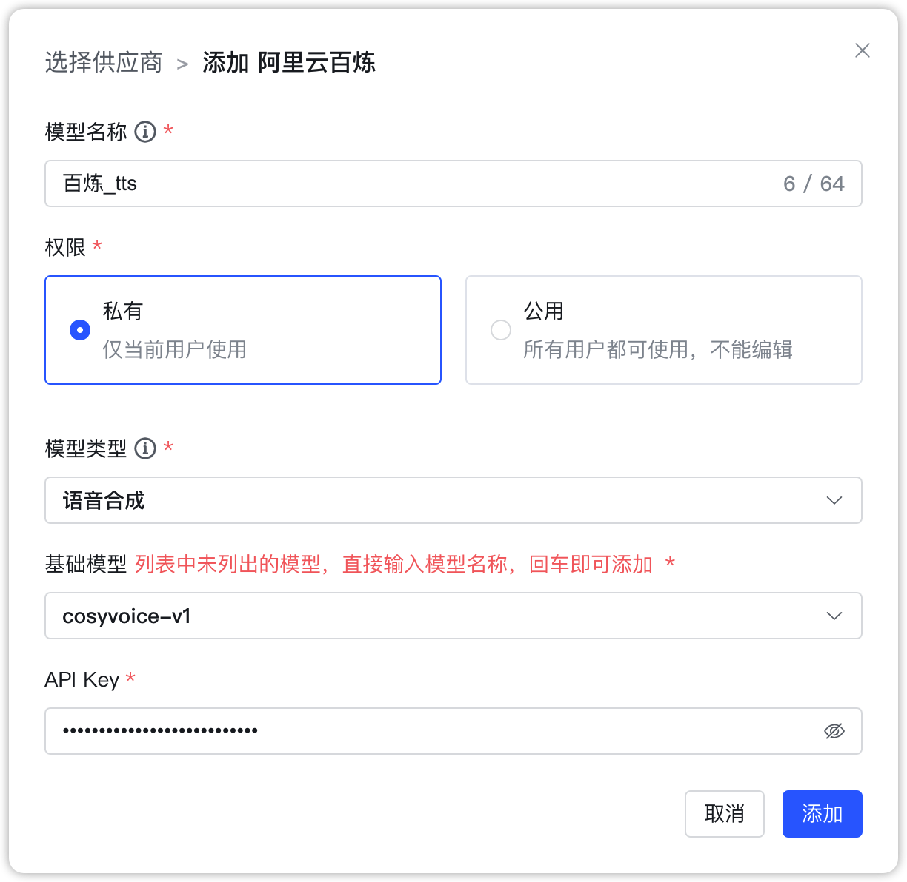
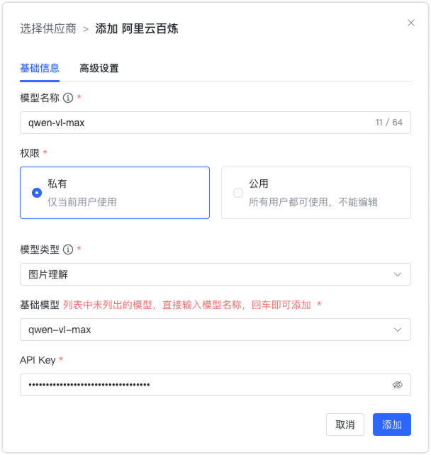
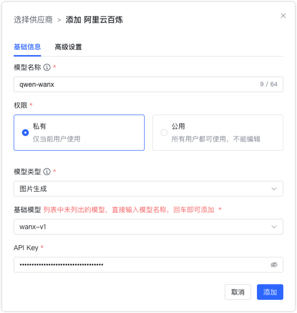
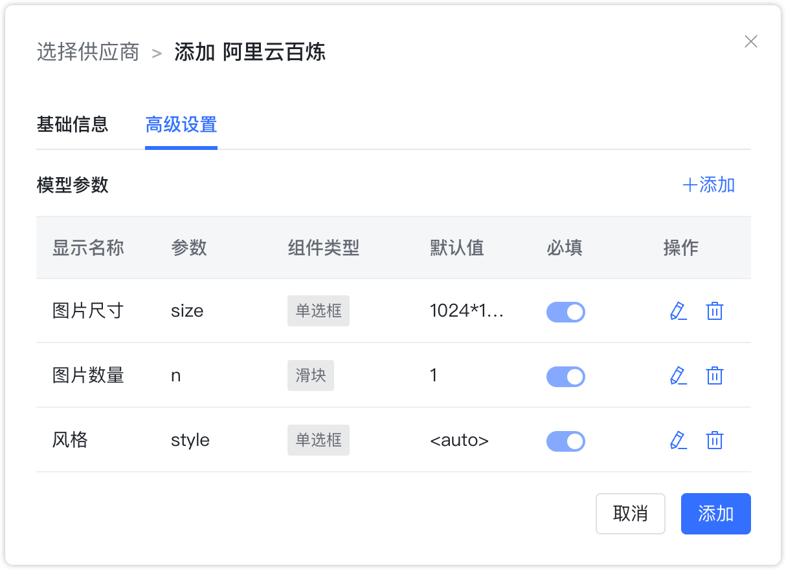

## 1 添加模型

!!! Abstract ""
    选择模型供应商为`阿里云百炼`，并在模型添加对话框中输入如下必要信息：

    * 模型名称：MaxKB 中自定义的模型名称。    
    * 权限：分为私有和公用两种权限，私有模型仅当前用户可用，公用模型即系统内所有用户均可使用，但其它用户不能编辑和删除。   
    * 模型类型：大语言模型/向量模型/重排模型/语音识别/语音合成/图片理解/图片生成。   
    * 基础模型：不同类型模型下的基础模型名称，下拉选项是常用的一些基础模型名称，支持自定义输入。
    * API 域名：模型服务 API 服务访问地址，目前当模型类型是大语言模型时需要输入。
    * API Key：模型服务 API 服务访问密钥。

## 2 配置样例

!!! Abstract ""
    阿里云百炼-大语言模型配置样例图示如下，需要说明的是：不同的大语言模型对应的 API 域名不一样，具体请查看对应基础模型的 API调用示例。

{ width="500px" }

!!! Abstract ""
    阿里云百炼-向量模型配置样例图示如下：

{ width="500px" }

!!! Abstract ""
    阿里云百炼-重排模型配置样例图示如下：
{ width="500px" }

!!! Abstract ""
    阿里云百炼-语音识别模型配置样例图示如下：
{ width="500px" }

!!! Abstract ""
    阿里云百炼-语音合成模型配置样例图示如下：
{ width="500px" }

!!! Abstract ""
    阿里云百炼-图片理解模型配置样例图示如下：
{ width="500px" }

!!! Abstract ""
    阿里云百炼-图片生成模型默认图像尺寸为 1024 * 1024，图片数量 1 张，风格为 <auto>，即由模型随机输出图像风格，配置样例图示如下：
{ width="500px" }

{ width="500px" }

