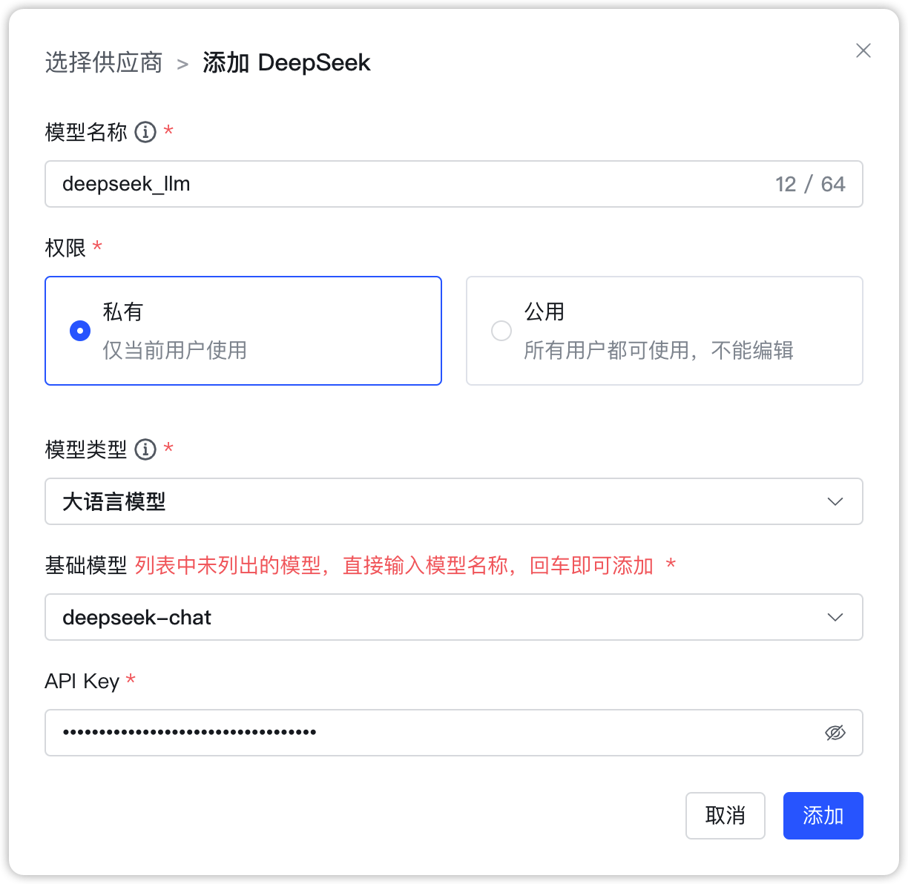

## 1 添加模型

!!! Abstract ""
    添加 DeepSeek 大模型之前，需要先在 [DeepSeek 开放平台](https://platform.deepseek.com/) 创建 API Key。

!!! Abstract ""
    选择模型供应商为`DeepSeek`，并在模型添加对话框中输入如下必要信息：

    * 模型名称：MaxKB 中自定义的模型名称。  
    * 权限：分为私有和公用两种权限，私有模型仅当前用户可用，公用模型即系统内所有用户均可使用，但其它用户不能编辑和删除。      
    * 模型类型：大语言模型。   
    * 基础模型：不同类型模型下的基础模型名称，下拉选项是常用的一些基础模型名称，支持自定义输入。  
    * API Key：在 DeepSeek 开放平台创建并查看。

## 2 配置样例

!!! Abstract ""
    DeepSeek-大语言模型配置样例图示：

{ width="500px" }