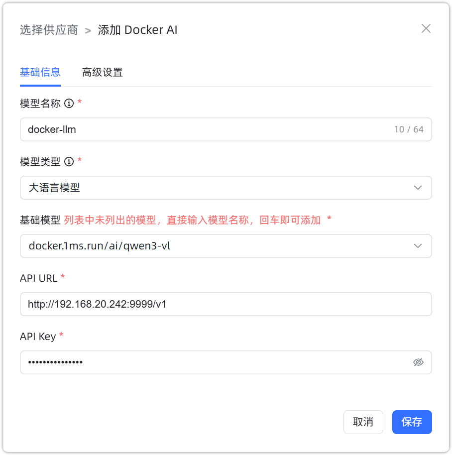
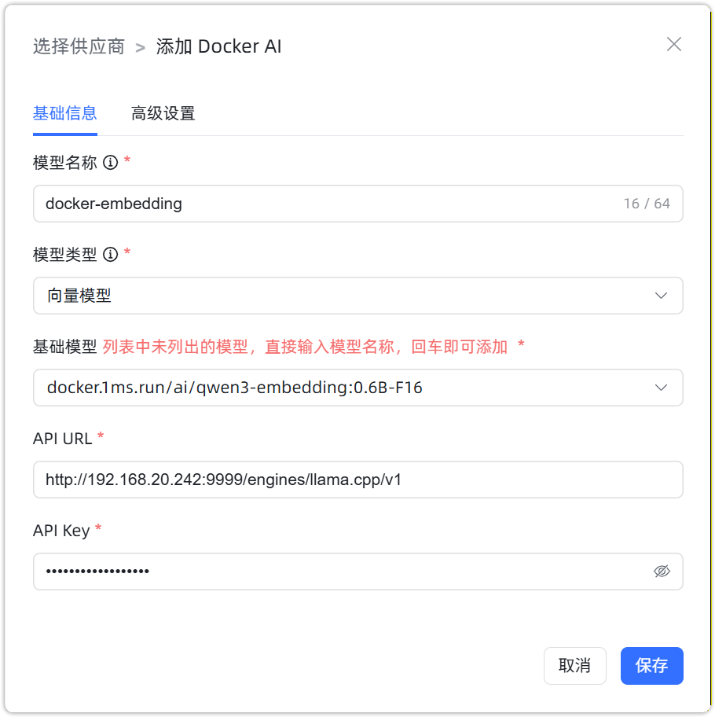
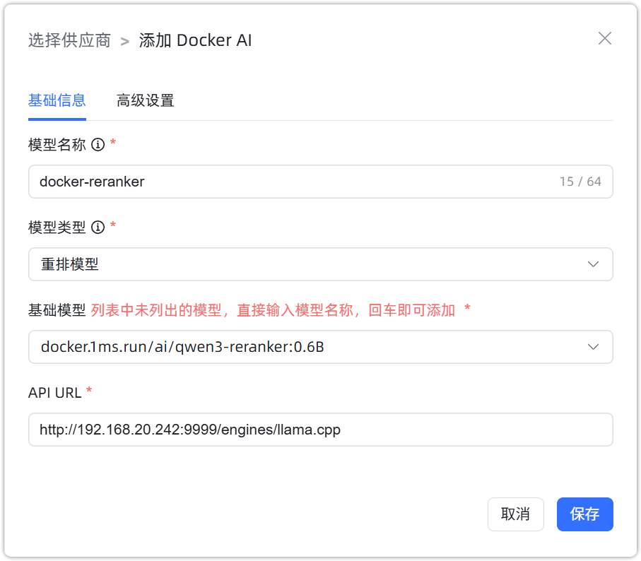

## 1 添加模型

!!! Abstract ""
    选择模型供应商为`Docker AI`，并在模型添加对话框中输入如下必要信息：

    * 模型名称：MaxKB 中自定义的模型名称。
    * 模型类型：大语言模型/向量模型/重排模型。   
    * 基础模型：不同类型模型下的基础模型名称，下拉选项是常用的一些基础模型名称，支持自定义输入。      
    * API 域名：Docker AI 服务地址， 如：http://192.168.20.242:9999/v1 。 
    * API Key：若没有 API Key，输入任意字符即可。

## 2 配置样例

!!! Abstract ""
    Docker AI-大语言模型配置样例图示如下：

{ width="500px" }

!!! Abstract ""
    Docker AI-向量模型配置样例图示如下：

{ width="500px" }

!!! Abstract ""
    Docker AI-重排模型配置样例图示如下：

{ width="500px" }