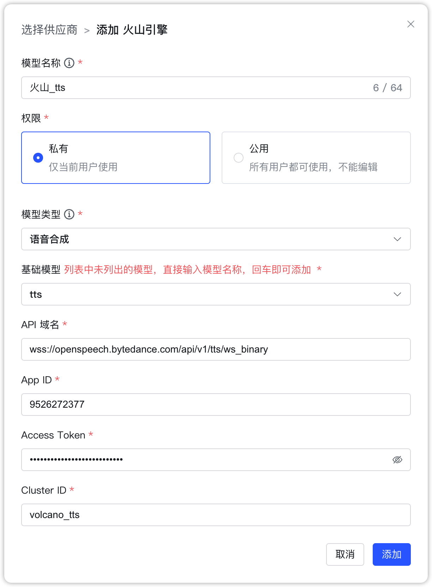

## 1 添加模型

!!! Abstract ""
    选择模型供应商为`火山引擎`，并在模型添加对话框中输入如下必要信息：

    * 模型名称：MaxKB 中自定义的模型名称。    
    * 权限：分为私有和公用两种权限，私有模型仅当前用户可用，公用模型即系统内所有用户均可使用，但其它用户不能编辑和删除。   
    * 模型类型：大语言模型/语音识别/语音合成。

!!! Abstract ""
    豆包大语言模型其它接入参数说明：

    * 基础模型：在线推理的接入点ID。        
    * API 域名：https://ark.cn-beijing.volces.com/api/v3
    * API Key：接入点-> API调用 -> 通过API Key授权 -> 选择 API Key 复制获取，如下图

!!! Abstract "" 
    语音识别和语音合成需要输入App ID、Access Token、Cluster ID。

    * App 域名：语音识别模型 API 域名为`wss://openspeech.bytedance.com/api/v2/asr`，语音合成模型 API 域名为`wss://openspeech.bytedance.com/api/v1/tts/ws_binary`
    * App ID：在火山引擎中创建的应用ID。 
    * Access Token：在火山引擎应用对应的认证信息。 
    * Cluster ID：在火山引擎应用对应的服务信息.

## 2 配置样例

!!! Abstract ""
    豆包-大语言模型配置样例图示：
{ width="500px" }

!!! Abstract ""
    豆包-语音识别模型配置样例图示：
{ width="500px" }

!!! Abstract ""
    豆包-语音合成模型配置样例图示：
{ width="500px" }
