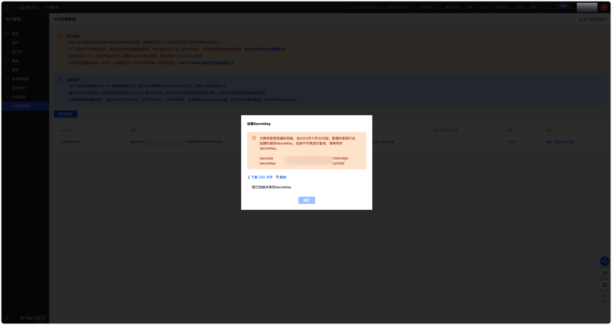
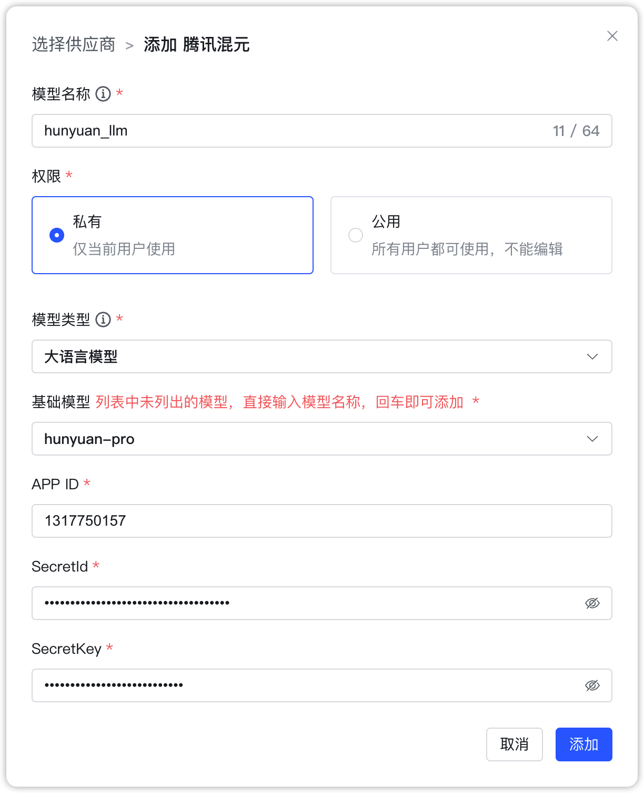
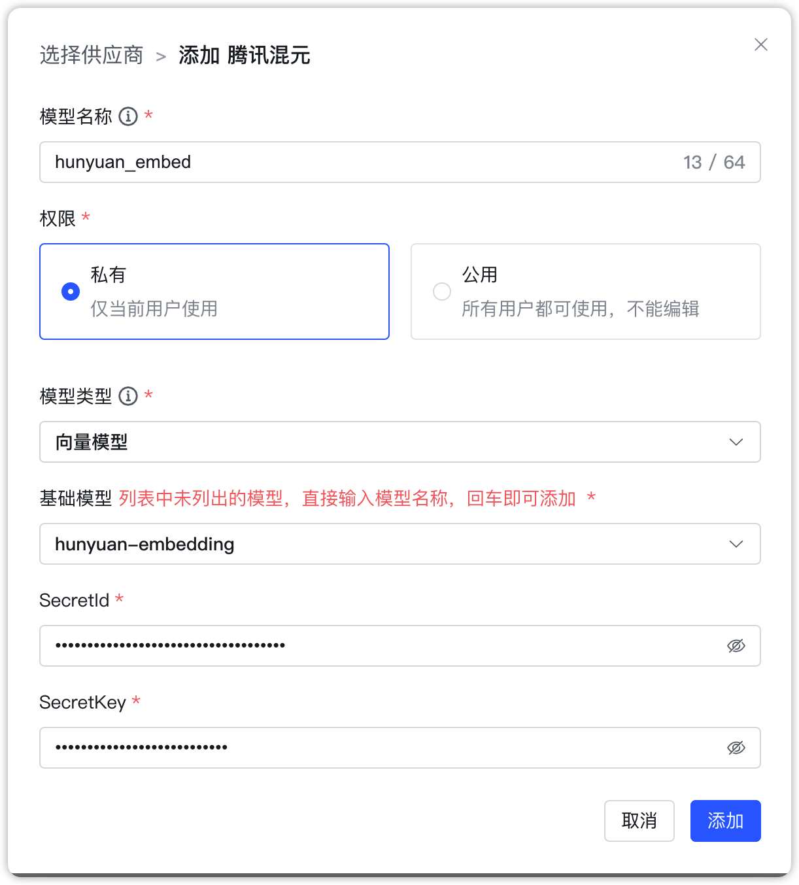
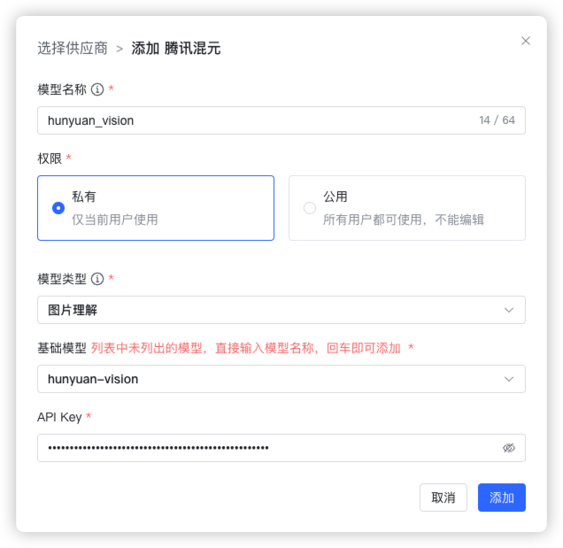

## 1 添加模型

!!! Abstract ""
    添加腾讯混元大模型之前，需要先在腾讯云开通腾讯混元服务并新建秘钥。

!!! Abstract ""
    选择模型供应商为`腾讯混元`，并在模型添加对话框中输入如下必要信息：

    * 模型名称：MaxKB 中自定义的模型名称。    
    * 权限：分为私有和公用两种权限，私有模型仅当前用户可用，公用模型即系统内所有用户均可使用，但其它用户不能编辑和删除。    
    * 模型类型：大语言模型/向量模型/图片理解模型。   
    * 基础模型：不同类型模型下的基础模型名称，下拉选项是常用的一些基础模型名称，支持自定义输入。         
    * APPID：【腾讯云-控制台-访问管理-API密钥管理】中获取。 
    * SecretId：【腾讯云-控制台-访问管理-API密钥管理】中获取。
    * SecretKey：【腾讯云-控制台-访问管理-API密钥管理】新建密钥时下载的SecretKey。 

## 2 配置样例

!!! Abstract ""
    腾讯混元-大语言模型配置样例图示：

{ width="500px" }

!!! Abstract ""
    腾讯混元-向量模型配置样例图示：
{ width="500px" }

!!! Abstract ""
    腾讯混元-图片理解模型配置样例图示：
{ width="500px" }
