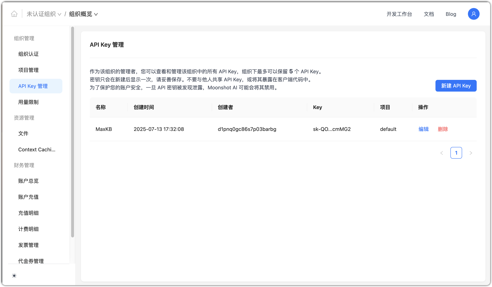
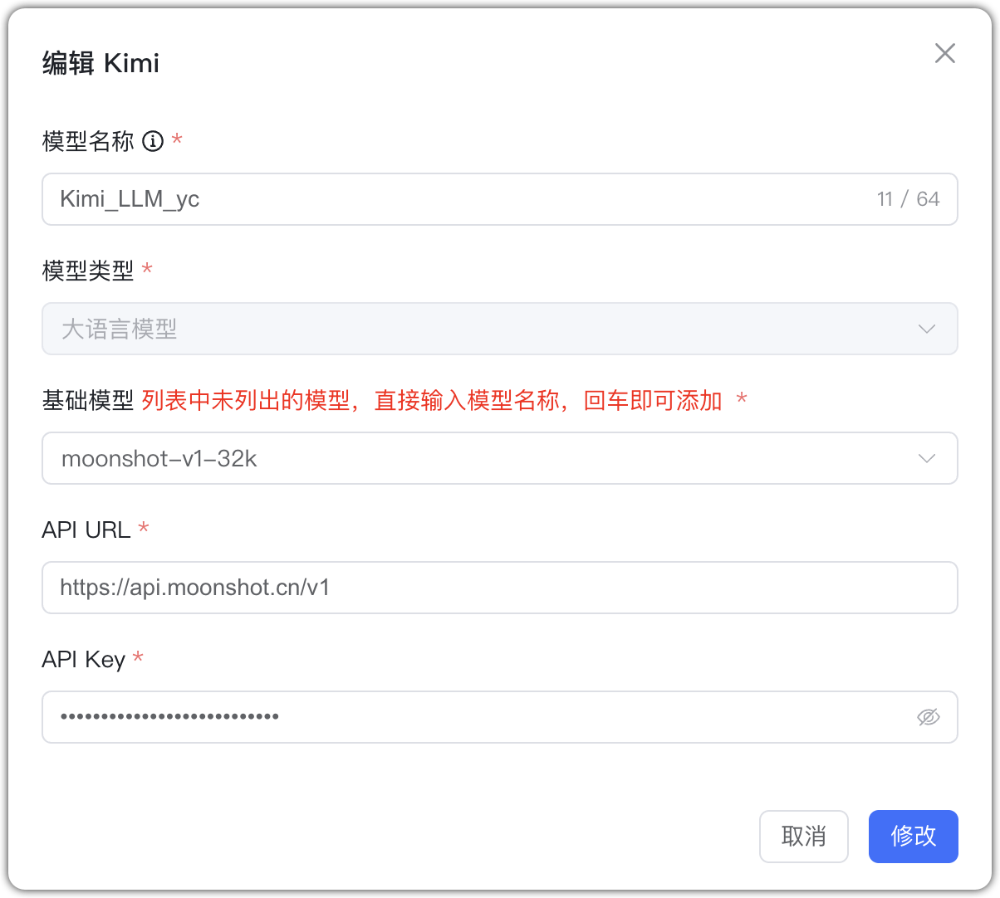

## 1 添加模型

!!! Abstract ""
    添加 Kimi 模型之前，需要先在 [Moonshot AI 开放平台](https://platform.moonshot.cn/console/account) 中注册并创建 API Key。

    选择模型供应商为`Kimi`，并在模型添加对话框中输入如下必要信息：

    * 模型名称：MaxKB 中自定义的模型名称。
    * 模型类型：大语言模型。   
    * 基础模型：不同类型模型下的基础模型名称，下拉选项是常用的一些基础模型名称，支持自定义输入。。   
    * API 域名：https://api.moonshot.cn/v1  
    * API Key：在 Kimi 账户中心的 API Key 管理中创建和查看。

## 2 配置样例

!!! Abstract ""
    kimi-大语言模型配置样例图示：

{ width="500px" }